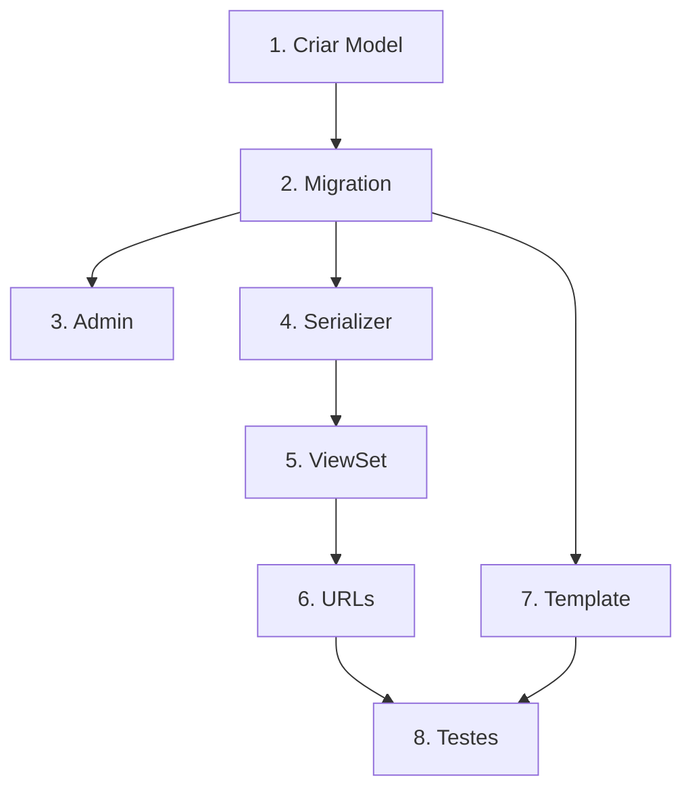

# Feature Breakdown Skill

## Quando Usar

Use este skill quando:
- Planejando nova feature
- Dividindo trabalho em tarefas menores
- Estimando escopo de implementação

## Instruções

### 1. Análise da Feature

**Perguntas a responder:**
- O que a feature deve fazer?
- Quem vai usar?
- Quais são os critérios de aceite?
- Quais dependências existem?

### 2. Identificar Componentes

```markdown
## Feature: [Nome]

### Componentes Necessários

#### Backend
- [ ] Model(s) necessário(s)
- [ ] Migration(s)
- [ ] View(s) / API endpoint(s)
- [ ] Serializer(s)
- [ ] Service(s) / Usecase(s)
- [ ] Signal(s)
- [ ] Task(s) Celery

#### Frontend
- [ ] Template(s)
- [ ] Form(s)
- [ ] JavaScript/interações

#### Integrações
- [ ] APIs externas
- [ ] Webhooks
- [ ] Sincronizações

#### Configuração
- [ ] Settings
- [ ] Environment variables
- [ ] Admin interface
```

### 3. Dividir em Tarefas

**Critérios para boa divisão:**
- Cada tarefa é independente (quando possível)
- Cada tarefa é testável
- Cada tarefa leva < 1 dia
- Dependências são explícitas

**Template de tarefa:**
```markdown
### Tarefa: [Título]

**Descrição:** [O que fazer]

**Arquivos:**
- `app/module/models.py`
- `app/module/views.py`

**Dependências:**
- Tarefa X deve estar completa

**Critérios de aceite:**
- [ ] Critério 1
- [ ] Critério 2

**Estimativa:** [P/M/G]
```

### 4. Ordenar por Dependência



### 5. Exemplo Completo

```markdown
# Feature: Notificações por Email

## Resumo
Enviar emails de notificação quando status de atendimento mudar.

## Tarefas

### 1. Criar Model de Configuração de Email
- **Arquivo:** `app/core/models.py`
- **Dependências:** Nenhuma
- **Aceite:** Model EmailConfig com campos template, subject, active

### 2. Criar Migration
- **Comando:** `uv run task makemigrations`
- **Dependências:** Tarefa 1
- **Aceite:** Migration gerada e aplicada

### 3. Configurar Admin
- **Arquivo:** `app/core/admin.py`
- **Dependências:** Tarefa 2
- **Aceite:** Pode gerenciar templates no admin

### 4. Criar Service de Email
- **Arquivo:** `modules/services/features/email_service/`
- **Dependências:** Tarefa 2
- **Aceite:** Service envia email com template

### 5. Criar Signal para Status Change
- **Arquivo:** `app/atendimentos/signals.py`
- **Dependências:** Tarefa 4
- **Aceite:** Email enviado quando status muda

### 6. Criar Task Celery
- **Arquivo:** `app/core/tasks.py`
- **Dependências:** Tarefa 4
- **Aceite:** Email é enviado assincronamente

### 7. Testes
- **Arquivo:** `tests/app/core/test_email.py`
- **Dependências:** Tarefas 1-6
- **Aceite:** Cobertura > 80%

## Ordem de Execução
1 → 2 → 3 (pode paralelo com 4) → 4 → 5 → 6 → 7
```

## Checklist

- [ ] Feature compreendida
- [ ] Componentes identificados
- [ ] Tarefas divididas
- [ ] Dependências mapeadas
- [ ] Ordem definida
- [ ] Critérios de aceite claros