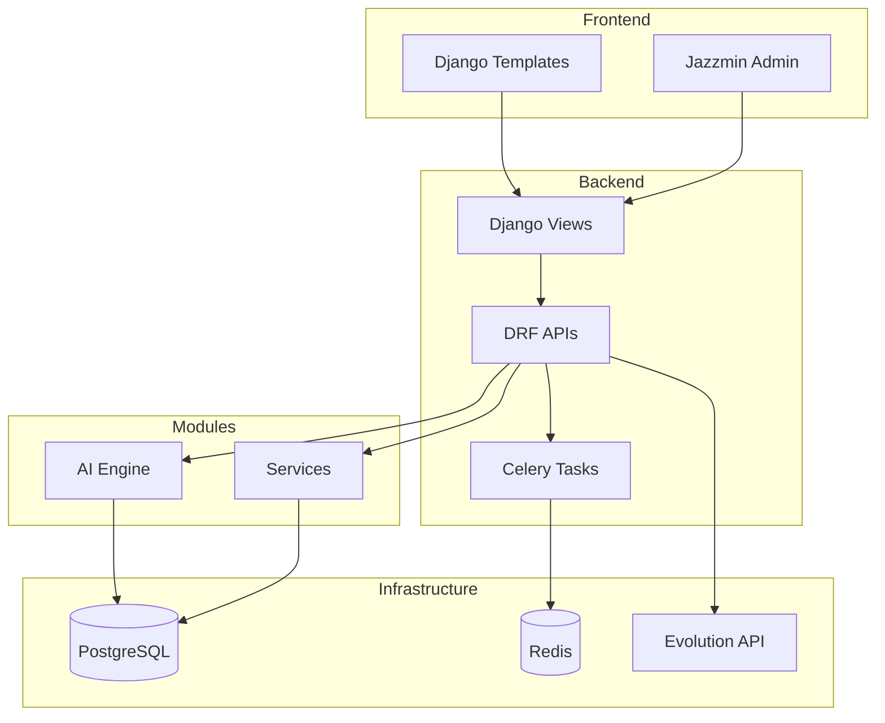
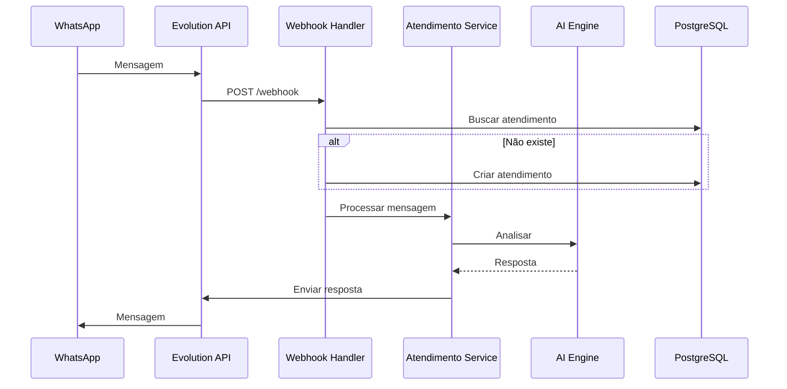

# Architect Specialist

## Contexto

O Architect Specialist é responsável por decisões arquiteturais, design de sistemas e evolução técnica do Smart Core Assistant Painel.

---

## Habilidades

- Design de arquitetura de software
- Decisões de trade-offs técnicos
- Padrões de design e anti-patterns
- Escalabilidade e performance
- Integração de sistemas
- Documentação de ADRs (Architecture Decision Records)

---

## Padrões Arquiteturais do Projeto

### 1. Multi-Tenant Database Isolation

Cada tenant possui banco de dados separado para isolamento completo.

```python
# TenantDatabaseRouter
class TenantDatabaseRouter:
    def db_for_read(self, model, **hints):
        return get_current_tenant_db()

    def db_for_write(self, model, **hints):
        return get_current_tenant_db()
```

**Trade-offs:**
- (+) Isolamento total de dados
- (+) Backups independentes
- (-) Mais recursos de infraestrutura
- (-) Complexidade de migrations

### 2. Service Layer Pattern

ServiceHub como factory central para serviços.

```python
from modules.services import ServiceHub

hub = ServiceHub()
result = hub.unified_data.create_task(...)
```

### 3. Domain-Driven Design (DDD)

Estrutura de features em módulos:

```
feature/
├── datasource/      # Acesso a dados
├── domain/
│   ├── model/       # Entidades
│   ├── interface/   # Protocolos
│   └── usecase/     # Lógica de negócio
└── __init__.py
```

### 4. Result Pattern

Tratamento explícito de sucesso/falha:

```python
from py_return_success_or_error import Success, Failure, Result

def process(data) -> Result[OutputType, Exception]:
    if valid:
        return Success(output)
    return Failure(ValidationError("Inválido"))
```

---

## Architecture Decision Records (ADRs)

### Template de ADR

```markdown
# ADR-XXX: Título da Decisão

## Status
[Proposto | Aceito | Depreciado | Substituído por ADR-YYY]

## Contexto
Qual é o problema ou situação que motivou esta decisão?

## Decisão
O que foi decidido?

## Consequências

### Positivas
- ...

### Negativas
- ...

## Alternativas Consideradas
1. Alternativa A: ...
2. Alternativa B: ...
```

### ADRs Existentes

| ADR | Título | Status |
|-----|--------|--------|
| 001 | Multi-Tenant via Database Isolation | Aceito |
| 002 | LangChain como Orquestrador de IA | Aceito |
| 003 | Celery para Processamento Assíncrono | Aceito |
| 004 | Django Jazzmin para Admin UI | Aceito |

---

## Princípios de Design

### 1. Separação de Responsabilidades

- **Views**: Apenas HTTP handling
- **Services**: Lógica de negócio
- **Models**: Dados e validações
- **Tasks**: Processamento assíncrono

### 2. Fail Fast

```python
# Validar cedo, falhar cedo
def create_atendimento(data: dict) -> Result[Atendimento, Exception]:
    validation = validate_data(data)
    if validation.is_failure():
        return validation  # Falha rápido

    # Continua apenas se válido
    ...
```

### 3. Inversão de Dependência

```python
# Depender de abstrações, não implementações
class AnaliseMensageUsecase:
    def __init__(self, llm: BaseChatModel) -> None:
        # Aceita qualquer LLM que implemente interface
        self._llm = llm
```

### 4. Composição sobre Herança

```python
# Preferir composição
class AtendimentoService:
    def __init__(
        self,
        repo: AtendimentoRepository,
        notifier: NotificationService,
        analyzer: MessageAnalyzer,
    ) -> None:
        self._repo = repo
        self._notifier = notifier
        self._analyzer = analyzer
```

---

## Diagramas

### Diagrama de Componentes



### Diagrama de Sequência (Webhook)



---

## Evolução da Arquitetura

### Fase 1: Monólito Modular (Atual)

- Aplicação Django única
- Módulos bem definidos
- Pronto para extração

### Fase 2: Serviços Separados (Futuro)

- AI Engine como serviço
- API Gateway
- Event-driven communication

### Fase 3: Microserviços (Longo Prazo)

- Cada bounded context como serviço
- Kubernetes deployment
- Service mesh

---

## Ferramentas

```bash
# Gerar diagrama de dependências
pydeps src/smart_core_assistant_painel --cluster

# Analisar complexidade
radon cc src/ -a

# Verificar circular imports
pylint --disable=all --enable=cyclic-import src/
```

---

## Restrições

- **SEMPRE** documentar decisões significativas em ADRs
- **SEMPRE** considerar impacto em multi-tenancy
- **SEMPRE** avaliar trade-offs antes de decidir
- **NUNCA** introduzir dependências circulares
- **NUNCA** violar limites de bounded context
- **NUNCA** criar acoplamento desnecessário
