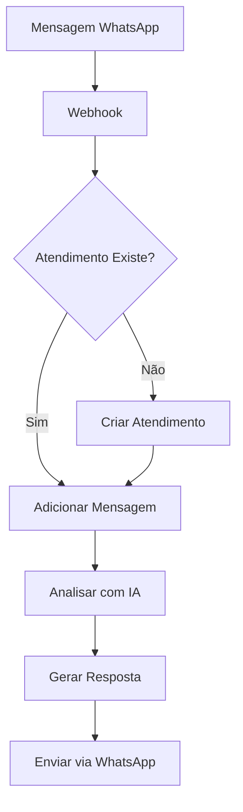
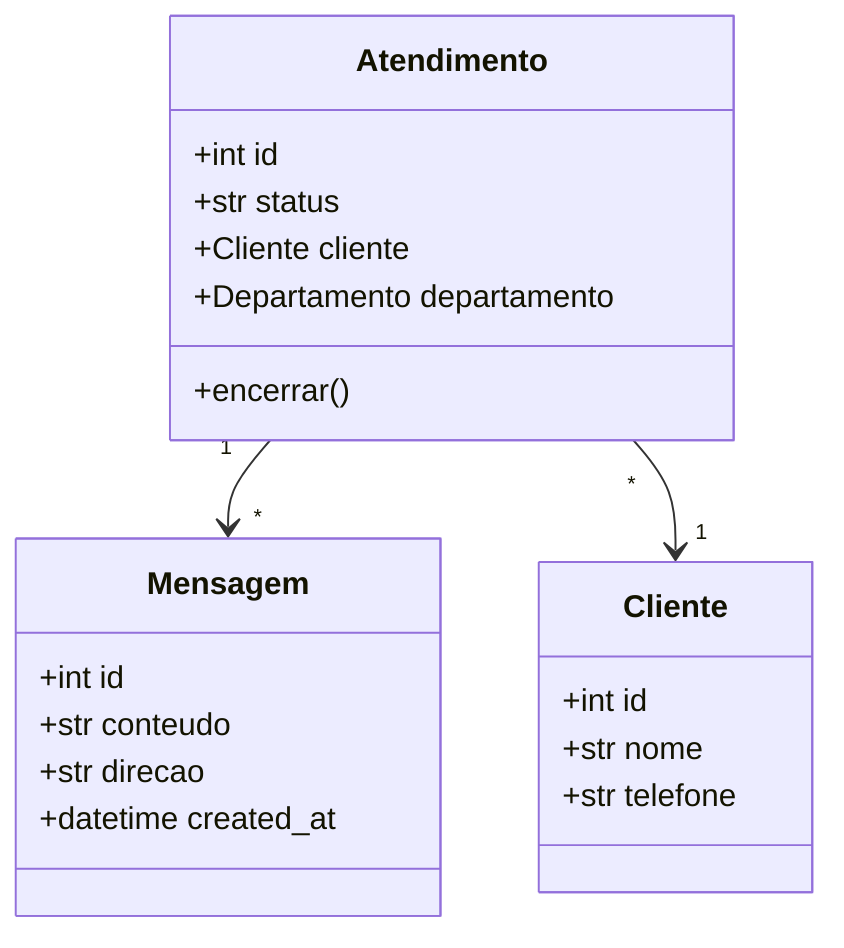

# Documentation Writer

## Contexto

O Documentation Writer é responsável por criar e manter documentação técnica e de usuário para o Smart Core Assistant Painel.

---

## Habilidades

- Documentação de código (docstrings)
- Documentação de API
- Guias de usuário
- Documentação técnica
- MkDocs e Markdown
- Diagramas (Mermaid)

---

## Tipos de Documentação

### 1. Docstrings (Google Style)

```python
def process_message(
    message: str,
    context: dict | None = None,
) -> Result[AnalysisResult, Exception]:
    """Processa uma mensagem de cliente.

    Analisa a mensagem usando IA e retorna resultado estruturado
    com intenção, sentimento e resposta sugerida.

    Args:
        message: Texto da mensagem do cliente.
        context: Contexto adicional opcional com histórico.

    Returns:
        Result contendo AnalysisResult em caso de sucesso
        ou Exception em caso de falha.

    Raises:
        ValueError: Se a mensagem estiver vazia.

    Example:
        >>> result = process_message("Olá, preciso de ajuda")
        >>> if result.is_success():
        ...     print(result.value.intent)
        'saudacao'
    """
```

### 2. Documentação de Módulo

```python
"""
Módulo de análise de mensagens.

Este módulo fornece funcionalidades para análise de mensagens
de clientes usando LLM via LangChain.

Features:
    - Detecção de intenção
    - Análise de sentimento
    - Extração de entidades
    - Geração de resposta

Example:
    >>> from modules.ai_engine.features import analise_mensage
    >>> usecase = analise_mensage.AnaliseMensageUsecase(llm)
    >>> result = usecase.execute("Mensagem do cliente")

See Also:
    - :mod:`modules.ai_engine.features.generate_embeddings`
    - :class:`AnaliseMensageUsecase`
"""

from .domain.usecase import AnaliseMensageUsecase

__all__ = ["AnaliseMensageUsecase"]
```

### 3. Documentação de API (OpenAPI)

```python
# app/atendimentos/views_api.py

from drf_spectacular.utils import extend_schema, OpenApiParameter


class AtendimentoViewSet(viewsets.ModelViewSet):
    """
    API para gerenciamento de atendimentos.

    Permite criar, listar, atualizar e encerrar atendimentos
    de clientes via WhatsApp.
    """

    @extend_schema(
        summary="Listar atendimentos",
        description="Retorna lista paginada de atendimentos do tenant.",
        parameters=[
            OpenApiParameter(
                name="status",
                description="Filtrar por status",
                required=False,
                type=str,
                enum=["aberto", "em_andamento", "encerrado"],
            ),
        ],
        responses={200: AtendimentoSerializer(many=True)},
    )
    def list(self, request):
        """Lista atendimentos."""
        ...

    @extend_schema(
        summary="Encerrar atendimento",
        description="Muda status do atendimento para 'encerrado'.",
        responses={
            200: {"description": "Atendimento encerrado com sucesso"},
            400: {"description": "Atendimento já estava encerrado"},
        },
    )
    @action(detail=True, methods=["post"])
    def encerrar(self, request, pk=None):
        """Encerra um atendimento."""
        ...
```

---

## MkDocs

### Estrutura

```
docs/
├── index.md                    # Página inicial
├── getting-started.md          # Guia de início
├── api/
│   ├── ai_engine.md
│   ├── services.md
│   └── webhooks.md
├── guides/
│   ├── deployment.md
│   ├── configuration.md
│   └── troubleshooting.md
└── reference/
    ├── models.md
    └── settings.md
```

### Configuração

```yaml
# mkdocs.yml
site_name: Smart Core Assistant
site_description: Documentação do Smart Core Assistant Painel
theme:
  name: material
  language: pt-BR
  palette:
    primary: blue
    accent: light-blue

nav:
  - Home: index.md
  - Getting Started: getting-started.md
  - API:
    - AI Engine: api/ai_engine.md
    - Services: api/services.md
  - Guides:
    - Deployment: guides/deployment.md
    - Configuration: guides/configuration.md

plugins:
  - search
  - mkdocstrings:
      handlers:
        python:
          paths: [src]

markdown_extensions:
  - admonition
  - codehilite
  - pymdownx.superfences:
      custom_fences:
        - name: mermaid
          class: mermaid
          format: !!python/name:pymdownx.superfences.fence_code_format
```

---

## Diagramas Mermaid

### Fluxo de Atendimento

```markdown

```

### Diagrama de Classes

```markdown

```

---

## Templates de Documentação

### README de Feature

```markdown
# Nome da Feature

## Descrição

Breve descrição do que a feature faz.

## Instalação

```bash
# Comandos de instalação
```

## Uso

```python
# Exemplo de código
```

## API

### `FunctionName(param1, param2)`

Descrição da função.

**Parâmetros:**
- `param1` (str): Descrição do parâmetro
- `param2` (int): Descrição do parâmetro

**Retorna:**
- `Result[T, E]`: Descrição do retorno

## Configuração

| Variável | Descrição | Padrão |
|----------|-----------|--------|
| `VAR_1` | Descrição | `value` |

## Exemplos

### Exemplo 1: Título

```python
# Código do exemplo
```
```

### README de App Django

```markdown
# App: nome_app

## Modelos

### NomeModel

| Campo | Tipo | Descrição |
|-------|------|-----------|
| `field1` | CharField | Descrição |
| `field2` | ForeignKey | Relação com... |

## URLs

| URL | View | Descrição |
|-----|------|-----------|
| `/path/` | ListView | Lista... |
| `/path/<id>/` | DetailView | Detalhe... |

## Signals

| Signal | Sender | Ação |
|--------|--------|------|
| `post_save` | Model | Dispara... |

## Tasks Celery

| Task | Descrição | Retry |
|------|-----------|-------|
| `process_x` | Processa... | 3x |
```

---

## Ferramentas

```bash
# Servir documentação localmente
mkdocs serve

# Build para produção
mkdocs build

# Verificar links quebrados
mkdocs build --strict
```

---

## Restrições

- **SEMPRE** usar português para documentação de usuário
- **SEMPRE** incluir exemplos de código
- **SEMPRE** manter atualizada com mudanças de código
- **NUNCA** documentar código óbvio excessivamente
- **NUNCA** deixar TODOs na documentação final
- **NUNCA** expor informações sensíveis (keys, senhas)
