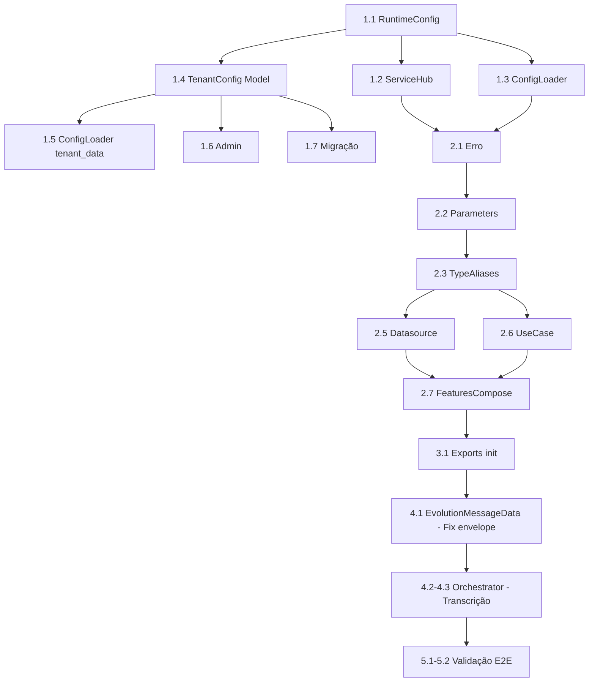

# Plano: Feature de Transcrição de Áudio (transcribe_audio)

**Status**: Concluído
**Criado**: 2026-02-12
**Concluído em**: 2026-02-12
**Release**: v1.0.3
**Responsável**: Time Engenharia
**Tipo**: Feature (AI Engine / Processamento de Áudio)
**Prioridade**: Alta

## Objetivo

Criar uma nova feature `transcribe_audio` no módulo `ai_engine` para **transcrever áudios enviados pelos clientes via WhatsApp**, seguindo a Clean Architecture e metodologia de criação de features do projeto. Inclui:
1. Nova **configuração global de LLM dedicada à transcrição** (classe e modelo separados da LLM principal de chat)
2. Feature completa `transcribe_audio` no `ai_engine` (tipo `call_data`)
3. **Integração no pipeline de atendimento** para que o áudio transcrito alimente `analise_previa_mensagem` e `analise_mensage`

## BUG CRÍTICO DESCOBERTO: Áudios Silenciosamente Descartados

### Diagnóstico

Ao rastrear o fluxo completo de webhook até análise, foi identificado que **mensagens de áudio são silenciosamente descartadas** no pipeline atual:

1. **`EvolutionMessageData.from_dict()`** ([schemas.py:53-58](src/smart_core_assistant_painel/app/evolution_sync/domain/schemas.py#L53-L58)):
   Só extrai texto para `conversation` e `extendedTextMessage`. Para `audioMessage`, `text = ""` (vazio) e `metadata = {}` (vazio — URL, mimetype, seconds, ptt **não são extraídos**).

2. **`_compile_message_content()`** ([attendance_orchestrator.py:148-151](src/smart_core_assistant_painel/app/atendimentos/services/attendance_orchestrator.py#L148-L151)):
   Extrai `msg_env.get("text")` → para áudio é `""`. Lista `texts` fica vazia → `content = ""`.

3. **`_create_message()`** ([attendance_orchestrator.py:201-205](src/smart_core_assistant_painel/app/atendimentos/services/attendance_orchestrator.py#L201-L205)):
   ```python
   if not content:
       logger.warning(f"Conteúdo vazio para contato {contact_id}. Ignorando processamento.")
       return None
   ```
   **Mensagem de áudio é descartada aqui.**

### Fluxo Atual Completo (com problema)

```
Webhook (audioMessage) → normalize_evolution_webhook()
    → EvolutionMessageData(text="", metadata={})     ← BUG: não extrai dados do áudio
    → set_buffer_contact(envelope_dict)
    → Celery task
    → AttendanceOrchestrator._compile_message_content()
        → content = ""                                 ← Sem texto
    → _create_message()
        → if not content: return None                  ← DESCARTADA!
    → Análise NUNCA é chamada para áudios
```

### Nota sobre `load_mensage_data_usecase.py`

O `LoadMensageDataUseCase` (que trata `audioMessage` setando `conteudo = "Áudio recebido"` e extraindo metadados) **NÃO é utilizado no pipeline webhook → buffer → orchestrator**. Ele é uma feature isolada do `ai_engine` que não está integrada ao fluxo de atendimento. O pipeline usa exclusivamente `EvolutionMessageData.from_dict()` + `_compile_message_content()`.

---

## Escopo

### Incluído
- **Correção do bug**: Extrair dados de áudio no envelope normalizado (`EvolutionMessageData`)
- Nova configuração global para LLM de transcrição (`transcription_provider`, `transcription_model`) em `RuntimeConfig`, `ConfigLoader`, `ServiceHub`
- Override opcional por tenant (campos em `TenantConfig`)
- Feature `transcribe_audio` completa no `ai_engine` (tipo `call_data`)
- Datasource que faz download do áudio via URL e chama API de transcrição
- Facade method em `FeaturesCompose`
- **Integração no pipeline**: Transcrever áudio no orquestrador antes da análise de IA
- Suporte a múltiplos provedores: **OpenAI Whisper** e **Groq Whisper**

### Fora de Escopo
- Transcrição de vídeos
- Suporte a provedores locais (Ollama Whisper)
- Testes automatizados (responsabilidade do agente de testes)

## Decisões Arquiteturais

### Por que LLM separada para transcrição?
- Transcrição usa modelos especializados (Whisper) que são diferentes dos LLMs de chat (Llama, GPT)
- A API de transcrição (speech-to-text) usa endpoints diferentes dos endpoints de chat completion
- Permite configurar provedor/modelo de transcrição independentemente do provedor de chat
- Exemplo: Chat pode usar Groq/Llama enquanto transcrição usa OpenAI/whisper-1

### Por que tipo `call_data`?
- O datasource encapsula a lógica de download do áudio + chamada à API de transcrição
- O usecase orquestra validações (URL válida, formato suportado, tamanho máximo)
- Segue o padrão `UsecaseBaseCallData` já usado em `analise_mensage`, `generate_embeddings`, etc.

### Provedor de Transcrição
- **Não usa LangChain** para transcrição — LangChain não tem wrapper nativo para Whisper speech-to-text
- Usa diretamente os SDKs `openai` (já é dependência do projeto via `langchain-openai`) e `groq` (já é dependência via `langchain-groq`)
- Factory pattern no datasource para selecionar provedor por string (similar ao `_resolve_llm_class` do ServiceHub)

### Ponto de integração no pipeline
- A transcrição acontece no **orquestrador** (`_process_message_and_respond()`), entre a criação da mensagem no DB e a chamada de `analyze_message_content()`
- Roda no contexto da **Celery task** (assíncrono), sem bloquear o webhook
- Se a transcrição falhar, mantém o texto placeholder e segue o fluxo normalmente

---

## Componentes e Arquivos

### Fase 1: Configuração Global de LLM para Transcrição

#### 1.1 RuntimeConfig — Novos campos
**Arquivo**: [context.py](src/smart_core_assistant_painel/modules/services/config/context.py)

Adicionar após a seção `# === LLM ===` (linha 23):
```python
# === Transcrição de Áudio ===
transcription_provider: str = "openai"     # "openai" ou "groq"
transcription_model: str = "whisper-1"     # modelo do provedor
```

#### 1.2 ServiceHub — Novas properties
**Arquivo**: [service_hub.py](src/smart_core_assistant_painel/modules/services/features/service_hub.py)

Adicionar após a seção `# === LLM ===` (linha 81):
```python
# === Transcrição ===
@property
def TRANSCRIPTION_PROVIDER(self) -> str:
    return ConfigProvider.get().transcription_provider

@property
def TRANSCRIPTION_MODEL(self) -> str:
    return ConfigProvider.get().transcription_model
```

#### 1.3 ConfigLoader — Mapear novos campos
**Arquivo**: [config_loader.py](src/smart_core_assistant_painel/app/tenants/services/config_loader.py)

No `RuntimeConfig(...)` dentro de `load_for_request()` (após linha 131):
```python
# === Transcrição ===
transcription_provider=tenant_cfg.get("transcription_provider")
    or core.get("transcription_provider", "openai"),
transcription_model=tenant_cfg.get("transcription_model")
    or core.get("transcription_model", "whisper-1"),
```

#### 1.4 TenantConfig — Campos opcionais de override
**Arquivo**: [models.py](src/smart_core_assistant_painel/app/tenants/models.py)

Adicionar em `TenantConfig` (junto aos campos `llm_class` e `model`):
```python
transcription_provider = models.CharField(
    max_length=50, blank=True, default="",
    help_text="Provedor de transcrição (openai, groq). Sobrescreve config global."
)
transcription_model = models.CharField(
    max_length=100, blank=True, default="",
    help_text="Modelo de transcrição (ex: whisper-1). Sobrescreve config global."
)
```

#### 1.5 ConfigLoader._get_tenant_config — Expor novos campos
**Arquivo**: [config_loader.py](src/smart_core_assistant_painel/app/tenants/services/config_loader.py)

No dict `tenant_data` (após linha 183):
```python
# Transcrição
"transcription_provider": cfg.transcription_provider if cfg.transcription_provider else "",
"transcription_model": cfg.transcription_model if cfg.transcription_model else "",
```

#### 1.6 TenantConfig Admin — Expor no admin
**Arquivo**: [admin.py](src/smart_core_assistant_painel/app/tenants/admin.py)

Adicionar `transcription_provider` e `transcription_model` ao fieldset de "Configurações de LLM" no `TenantConfigInline`.

#### 1.7 Migração Django
```bash
uv run task makemigrations
```

---

### Fase 2: Feature `transcribe_audio` no ai_engine

#### 2.1 Erro customizado
**Arquivo**: [erros.py](src/smart_core_assistant_painel/modules/ai_engine/utils/erros.py)

```python
@dataclass
class TranscribeAudioError(AppError):
    message: str

    def __str__(self) -> str:
        return f"TranscribeAudioError - {self.message}"
```

#### 2.2 Parâmetros de entrada
**Arquivo**: [parameters.py](src/smart_core_assistant_painel/modules/ai_engine/utils/parameters.py)

```python
@dataclass
class TranscribeAudioParameters(ParametersReturnResult):
    """Parâmetros para transcrição de áudio.

    Attributes:
        audio_url: URL do arquivo de áudio (Evolution API).
        mimetype: Tipo MIME do áudio (ex: audio/ogg).
        language: Código do idioma para transcrição (ISO 639-1).
        error: Erro a ser levantado em caso de falha.
    """

    audio_url: str
    mimetype: str
    language: str = "pt"
    error: TranscribeAudioError

    def __str__(self) -> str:
        return self.__repr__()
```

#### 2.3 TypeAliases
**Arquivo**: [types.py](src/smart_core_assistant_painel/modules/ai_engine/utils/types.py)

```python
# Aliases para Transcribe Audio
TAData: TypeAlias = Datasource[str, TranscribeAudioParameters]
TAUsecase: TypeAlias = UsecaseBaseCallData[
    str,
    str,
    TranscribeAudioParameters,
]
```

#### 2.4 Estrutura de diretórios da feature
```
features/transcribe_audio/
├── __init__.py
├── datasource/
│   ├── __init__.py
│   └── transcribe_audio_datasource.py
└── domain/
    ├── __init__.py
    └── usecase/
        ├── __init__.py
        └── transcribe_audio_usecase.py
```

#### 2.5 Datasource — Transcrição via API
**Arquivo**: `features/transcribe_audio/datasource/transcribe_audio_datasource.py`

Responsabilidades:
1. Obter `transcription_provider` e `transcription_model` do SERVICEHUB
2. Obter API key correspondente do SERVICEHUB (`OPENAI_API_KEY` ou `GROQ_API_KEY`)
3. Fazer download do áudio via `audio_url` (usando `httpx`)
4. Salvar temporariamente em arquivo (APIs Whisper requerem file upload)
5. Chamar API de transcrição conforme o provedor:
   - **OpenAI**: `openai.audio.transcriptions.create(model=..., file=..., language=...)`
   - **Groq**: `groq.audio.transcriptions.create(model=..., file=..., language=...)`
6. Retornar texto transcrito
7. Limpar arquivo temporário (via `try/finally`)

```python
class TranscribeAudioDatasource(TAData):
    def __call__(self, parameters: TranscribeAudioParameters) -> str:
        provider = SERVICEHUB.TRANSCRIPTION_PROVIDER
        model = SERVICEHUB.TRANSCRIPTION_MODEL

        # 1. Download do áudio
        audio_bytes = self._download_audio(parameters.audio_url)

        # 2. Determinar extensão do arquivo
        extension = self._get_file_extension(parameters.mimetype)

        # 3. Transcrever via provedor
        if provider == "openai":
            return self._transcribe_openai(
                audio_bytes, model, extension, parameters.language
            )
        elif provider == "groq":
            return self._transcribe_groq(
                audio_bytes, model, extension, parameters.language
            )
        else:
            raise ValueError(
                f"Provedor de transcrição não suportado: {provider}"
            )
```

Métodos privados:
- `_download_audio(url: str) -> bytes` — Download via httpx com timeout
- `_transcribe_openai(audio: bytes, model: str, ext: str, lang: str) -> str`
- `_transcribe_groq(audio: bytes, model: str, ext: str, lang: str) -> str`
- `_get_file_extension(mimetype: str) -> str` — Mapeia mimetype para extensão (.ogg, .mp3, .wav, .m4a, etc.)

#### 2.6 UseCase — Orquestração e validações
**Arquivo**: `features/transcribe_audio/domain/usecase/transcribe_audio_usecase.py`

```python
class TranscribeAudioUseCase(TAUsecase):
    def __call__(
        self, parameters: TranscribeAudioParameters
    ) -> ReturnSuccessOrError[str]:
        # Validações
        if not parameters.audio_url:
            return ErrorReturn(
                parameters.error(message="URL do áudio não fornecida")
            )

        # Delega ao datasource
        return self._resultDatasource(
            parameters=parameters, datasource=self._datasource
        )
```

#### 2.7 FeaturesCompose — Método facade
**Arquivo**: [features_compose.py](src/smart_core_assistant_painel/modules/ai_engine/features/features_compose.py)

```python
@staticmethod
def transcribe_audio(
    audio_url: str,
    mimetype: str,
    language: str = "pt",
) -> str:
    """Transcreve um áudio a partir de sua URL.

    Args:
        audio_url: URL do arquivo de áudio.
        mimetype: Tipo MIME do áudio.
        language: Código do idioma (padrão: "pt").

    Returns:
        str: Texto transcrito do áudio.

    Raises:
        TranscribeAudioError: Se ocorrer erro na transcrição.
    """
    error = TranscribeAudioError("Erro ao transcrever áudio!")
    parameters = TranscribeAudioParameters(
        audio_url=audio_url,
        mimetype=mimetype,
        language=language,
        error=error,
    )
    datasource: TAData = TranscribeAudioDatasource()
    usecase: TAUsecase = TranscribeAudioUseCase(datasource)
    data = usecase(parameters)

    if isinstance(data, SuccessReturn):
        return data.result
    elif isinstance(data, ErrorReturn):
        raise data.result
    else:
        raise ValueError("Unexpected return type from usecase")
```

---

### Fase 3: Exports e Integração com ai_engine

#### 3.1 ai_engine/__init__.py — Exportar novos tipos
**Arquivo**: [__init__.py](src/smart_core_assistant_painel/modules/ai_engine/__init__.py)

Adicionar:
- Import de `TranscribeAudioError`
- Import de `TranscribeAudioParameters`
- Import de `TAData`, `TAUsecase`
- Adicionar ao `__all__`

---

### Fase 4: Integração no Pipeline de Atendimento (Webhook → Análise)

Esta fase corrige o bug de áudios descartados e integra a transcrição no fluxo existente.

#### 4.1 EvolutionMessageData.from_dict() — Extrair dados de áudio
**Arquivo**: [schemas.py](src/smart_core_assistant_painel/app/evolution_sync/domain/schemas.py)
**Método**: `from_dict()` (linha 53-68)

Adicionar tratamento para `audioMessage` (e opcionalmente outros tipos de mídia):

```python
text: str = ""
metadata: Dict[str, Any] = {}

if message_type == "conversation":
    val = message.get("conversation")
    text = val if isinstance(val, str) else str(val)
elif message_type == "extendedTextMessage":
    text = message.get("extendedTextMessage", {}).get("text", "")
elif message_type == "audioMessage":
    msg_data = message.get("audioMessage", {})
    text = "[audio]"  # Placeholder mínimo para não ser descartado
    metadata = {
        "mimetype": msg_data.get("mimetype"),
        "url": msg_data.get("url"),
        "seconds": msg_data.get("seconds"),
        "ptt": msg_data.get("ptt", False),
    }
elif message_type == "imageMessage":
    msg_data = message.get("imageMessage", {})
    text = msg_data.get("caption") or "[imagem]"
    metadata = {
        "mimetype": msg_data.get("mimetype"),
        "url": msg_data.get("url"),
    }
elif message_type == "videoMessage":
    msg_data = message.get("videoMessage", {})
    text = msg_data.get("caption") or "[video]"
    metadata = {
        "mimetype": msg_data.get("mimetype"),
        "url": msg_data.get("url"),
        "seconds": msg_data.get("seconds"),
    }
elif message_type == "documentMessage":
    msg_data = message.get("documentMessage", {})
    text = msg_data.get("fileName") or "[documento]"
    metadata = {
        "mimetype": msg_data.get("mimetype"),
        "url": msg_data.get("url"),
    }
# ... demais tipos de mídia
```

**Resultado**: `EvolutionMessageData(text="[audio]", metadata={url, mimetype, seconds, ptt})` → mensagem não será mais descartada.

#### 4.2 _process_message_and_respond() — Transcrição antes da análise
**Arquivo**: [attendance_orchestrator.py](src/smart_core_assistant_painel/app/atendimentos/services/attendance_orchestrator.py)
**Método**: `_process_message_and_respond()` (linha 232-298)

Inserir bloco de transcrição **após** obter a mensagem do DB (linha 253) e **antes** de `analyze_message_content()` (linha 264):

```python
# Obtém mensagem
mensagem: Mensagem = Mensagem.objects.get(id=message_id)

# --- Transcrição de Áudio ---
if mensagem.tipo == "audioMessage":
    self._transcribe_audio_message(mensagem)
# ----------------------------

# --- Feedback Loop Check ---
if self._check_and_process_feedback(mensagem, contact_id):
    ...
```

#### 4.3 Novo método _transcribe_audio_message() no orquestrador
**Arquivo**: [attendance_orchestrator.py](src/smart_core_assistant_painel/app/atendimentos/services/attendance_orchestrator.py)

```python
def _transcribe_audio_message(self, mensagem: "Mensagem") -> None:
    """Transcreve áudio e atualiza conteúdo da mensagem.

    Args:
        mensagem: Mensagem do tipo audioMessage.
    """
    try:
        metadados = mensagem.metadados or {}
        audio_url = metadados.get("url")
        mimetype = metadados.get("mimetype", "audio/ogg")

        if not audio_url:
            logger.warning(
                f"Mensagem {mensagem.id}: audioMessage sem URL. "
                "Mantendo placeholder."
            )
            return

        logger.info(
            f"Transcrevendo áudio da mensagem {mensagem.id} "
            f"(mimetype={mimetype})"
        )

        texto_transcrito = FeaturesCompose.transcribe_audio(
            audio_url=audio_url,
            mimetype=mimetype,
        )

        if texto_transcrito and texto_transcrito.strip():
            mensagem.conteudo = texto_transcrito.strip()
            # Salva transcrição original nos metadados para rastreabilidade
            meta = dict(metadados)
            meta["transcription"] = texto_transcrito.strip()
            mensagem.metadados = meta
            mensagem.save(update_fields=["conteudo", "metadados"])
            logger.info(
                f"Áudio transcrito com sucesso para mensagem {mensagem.id} "
                f"(len={len(texto_transcrito)})"
            )
        else:
            logger.warning(
                f"Transcrição vazia para mensagem {mensagem.id}. "
                "Mantendo placeholder."
            )

    except Exception as e:
        logger.error(
            f"Erro ao transcrever áudio da mensagem {mensagem.id}: {e}. "
            "Continuando com placeholder."
        )
```

#### 4.4 Fluxo Corrigido

```
Webhook (audioMessage) → normalize_evolution_webhook()
    → EvolutionMessageData(text="[audio]", metadata={url, mimetype, ...})  ✅ CORRIGIDO
    → set_buffer_contact(envelope_dict)
    → Celery task
    → AttendanceOrchestrator._compile_message_content()
        → content = "[audio]"                          ✅ Não descartado
        → metadados = {url, mimetype, seconds, ptt}    ✅ Propagados
    → _create_message(content="[audio]", metadados=...)
        → Mensagem criada no DB                        ✅ Salva com metadados
    → _process_message_and_respond()
        → _transcribe_audio_message(mensagem)          ✅ NOVO: Transcrição
            → FeaturesCompose.transcribe_audio(url, mimetype)
            → mensagem.conteudo = "texto transcrito"   ✅ Atualizado no DB
        → analyze_message_content(message_id)
            → context = mensagem.conteudo = "texto transcrito"  ✅ IA recebe texto real
        → analise_mensage(context="texto transcrito")  ✅ Bot responde com contexto real
```

---

### Fase 5: Validação End-to-End

#### 5.1 Validação manual
- Criar script em `teste_debug/` para testar transcrição com URL de áudio real
- Verificar logs de download e resposta da API
- Testar com provedores OpenAI e Groq

#### 5.2 Validação no pipeline
- Enviar áudio via WhatsApp para instância de teste
- Verificar nos logs que a transcrição foi realizada
- Verificar no DB que `mensagem.conteudo` foi atualizado com texto transcrito
- Verificar que `analise_previa_mensagem` e `analise_mensage` receberam o texto correto
- Verificar que o bot respondeu adequadamente ao conteúdo do áudio

---

## Mapa de Arquivos Afetados

| Arquivo | Ação | Fase |
|---------|------|------|
| `modules/services/config/context.py` | Editar (add campos RuntimeConfig) | 1 |
| `modules/services/features/service_hub.py` | Editar (add properties) | 1 |
| `app/tenants/services/config_loader.py` | Editar (mapear campos) | 1 |
| `app/tenants/models.py` | Editar (add campos TenantConfig) | 1 |
| `app/tenants/admin.py` | Editar (add ao fieldset) | 1 |
| Migração Django | Criar | 1 |
| `modules/ai_engine/utils/erros.py` | Editar (add TranscribeAudioError) | 2 |
| `modules/ai_engine/utils/parameters.py` | Editar (add TranscribeAudioParameters) | 2 |
| `modules/ai_engine/utils/types.py` | Editar (add TAData, TAUsecase) | 2 |
| `features/transcribe_audio/__init__.py` | Criar | 2 |
| `features/transcribe_audio/domain/__init__.py` | Criar | 2 |
| `features/transcribe_audio/domain/usecase/__init__.py` | Criar | 2 |
| `features/transcribe_audio/domain/usecase/transcribe_audio_usecase.py` | Criar | 2 |
| `features/transcribe_audio/datasource/__init__.py` | Criar | 2 |
| `features/transcribe_audio/datasource/transcribe_audio_datasource.py` | Criar | 2 |
| `modules/ai_engine/features/features_compose.py` | Editar (add facade method) | 2 |
| `modules/ai_engine/__init__.py` | Editar (add exports) | 3 |
| **`app/evolution_sync/domain/schemas.py`** | **Editar (extrair dados áudio no envelope)** | **4** |
| **`app/atendimentos/services/attendance_orchestrator.py`** | **Editar (add transcrição antes análise)** | **4** |

## Dependências de Pacotes

Os SDKs necessários já são dependências transitivas do projeto:
- `openai` — via `langchain-openai` (tem `openai.audio.transcriptions`)
- `groq` — via `langchain-groq` (tem `groq.audio.transcriptions`)
- `httpx` — já é dependência do projeto (para download do áudio)

> **Nenhuma dependência nova precisa ser adicionada.**

## Riscos e Mitigações

| Risco | Prob. | Impacto | Mitigação |
|-------|-------|---------|-----------|
| URL do áudio expirada/inacessível | Média | Alto | Retry com backoff; log + fallback para placeholder |
| Áudio muito longo (>25MB limite Whisper) | Baixa | Médio | Validar tamanho no download; retornar erro descritivo |
| Formato de áudio não suportado | Baixa | Médio | Mapear mimetypes suportados; fallback para extensão genérica |
| API key não configurada para provedor de transcrição | Média | Alto | Usar mesma API key do provedor (openai_api_key/groq_api_key); validar antes de chamar |
| Latência alta em áudios longos | Média | Médio | Log de tempo de execução; timeout configurável no httpx |
| Transcrição falha silenciosamente | Média | Médio | try/except com log; mensagem segue com placeholder "[audio]" |
| Mensagem de feedback é áudio | Baixa | Baixo | `_check_and_process_feedback` roda APÓS transcrição, recebe texto correto |

## Ordem de Execução Recomendada



## Rollback

- Reverter commits de código + migração
- Se migração já aplicada em produção: manter campos (inofensivos) e apenas remover código da feature
- CoreSettings no banco podem ser removidas via admin sem migração
- O fix do envelope (Fase 4.1) pode ser mantido mesmo sem transcrição — apenas evita que áudios sejam descartados silenciosamente
