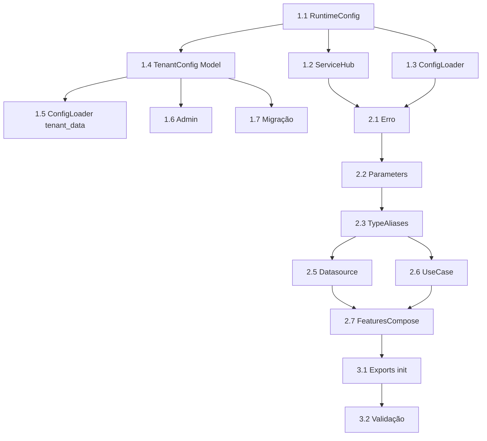

# Plano: Feature de Transcrição de Áudio (transcribe_audio)

**Status**: Em planejamento
**Criado**: 2026-02-12
**Responsável**: Time Engenharia
**Tipo**: Feature (AI Engine / Processamento de Áudio)
**Prioridade**: Alta

## Objetivo

Criar uma nova feature `transcribe_audio` no módulo `ai_engine` para **transcrever áudios enviados pelos clientes via WhatsApp**, seguindo a Clean Architecture e metodologia de criação de features do projeto. Inclui a adição de uma **nova configuração global de LLM dedicada à transcrição** (classe e modelo separados da LLM principal de chat).

## Contexto Atual

Hoje, quando um áudio é recebido via webhook, o sistema:
1. Detecta o tipo `audioMessage` em `load_mensage_data_usecase.py` (linha 194)
2. Armazena metadados: `mimetype`, `url`, `seconds`, `ptt`
3. Define o conteúdo como texto genérico: `"Áudio recebido"`
4. **Nenhuma transcrição é realizada**

## Escopo

### Incluído
- Nova configuração global para LLM de transcrição (`transcription_provider`, `transcription_model`) em `RuntimeConfig`, `ConfigLoader`, `ServiceHub`
- Override opcional por tenant (campos em `TenantConfig`)
- Feature `transcribe_audio` completa no `ai_engine` (tipo `call_data`)
- Datasource que faz download do áudio via URL e chama API de transcrição
- Facade method em `FeaturesCompose`
- Suporte a múltiplos provedores: **OpenAI Whisper** e **Groq Whisper**

### Fora de Escopo
- Integração automática com o fluxo de mensagens (chamar transcrição no `load_message_data`) — será feita em task separada
- Transcrição de vídeos
- Suporte a provedores locais (Ollama Whisper)
- Testes automatizados (responsabilidade do agente de testes)

## Decisões Arquiteturais

### Por que LLM separada para transcrição?
- Transcrição usa modelos especializados (Whisper) que são diferentes dos LLMs de chat (Llama, GPT)
- A API de transcrição (speech-to-text) usa endpoints diferentes dos endpoints de chat completion
- Permite configurar provedor/modelo de transcrição independentemente do provedor de chat
- Exemplo: Chat pode usar Groq/Llama enquanto transcrição usa OpenAI/whisper-1

### Por que tipo `call_data`?
- O datasource encapsula a lógica de download do áudio + chamada à API de transcrição
- O usecase orquestra validações (URL válida, formato suportado, tamanho máximo)
- Segue o padrão `UsecaseBaseCallData` já usado em `analise_mensage`, `generate_embeddings`, etc.

### Provedor de Transcrição
- **Não usa LangChain** para transcrição — LangChain não tem wrapper nativo para Whisper speech-to-text
- Usa diretamente os SDKs `openai` (já é dependência do projeto via `langchain-openai`) e `groq` (já é dependência via `langchain-groq`)
- Factory pattern no datasource para selecionar provedor por string (similar ao `_resolve_llm_class` do ServiceHub)

## Componentes e Arquivos

### Fase 1: Configuração Global de LLM para Transcrição

#### 1.1 RuntimeConfig — Novos campos
**Arquivo**: `src/smart_core_assistant_painel/modules/services/config/context.py`

Adicionar na seção `# === LLM ===`:
```python
# === Transcrição de Áudio ===
transcription_provider: str = "openai"     # "openai" ou "groq"
transcription_model: str = "whisper-1"     # modelo do provedor
```

#### 1.2 ServiceHub — Novas properties
**Arquivo**: `src/smart_core_assistant_painel/modules/services/features/service_hub.py`

Adicionar properties:
```python
# === Transcrição ===
@property
def TRANSCRIPTION_PROVIDER(self) -> str:
    return ConfigProvider.get().transcription_provider

@property
def TRANSCRIPTION_MODEL(self) -> str:
    return ConfigProvider.get().transcription_model
```

#### 1.3 ConfigLoader — Mapear novos campos
**Arquivo**: `src/smart_core_assistant_painel/app/tenants/services/config_loader.py`

No `RuntimeConfig(...)` dentro de `load_for_request()`:
```python
# === Transcrição ===
transcription_provider=tenant_cfg.get("transcription_provider")
    or core.get("transcription_provider", "openai"),
transcription_model=tenant_cfg.get("transcription_model")
    or core.get("transcription_model", "whisper-1"),
```

#### 1.4 TenantConfig — Campos opcionais de override
**Arquivo**: `src/smart_core_assistant_painel/app/tenants/models.py`

Adicionar em `TenantConfig`:
```python
transcription_provider = models.CharField(
    max_length=50, blank=True, default="",
    help_text="Provedor de transcrição (openai, groq). Sobrescreve config global."
)
transcription_model = models.CharField(
    max_length=100, blank=True, default="",
    help_text="Modelo de transcrição (ex: whisper-1). Sobrescreve config global."
)
```

#### 1.5 ConfigLoader._get_tenant_config — Expor novos campos
**Arquivo**: `src/smart_core_assistant_painel/app/tenants/services/config_loader.py`

No dict `tenant_data`:
```python
"transcription_provider": cfg.transcription_provider if cfg.transcription_provider else "",
"transcription_model": cfg.transcription_model if cfg.transcription_model else "",
```

#### 1.6 TenantConfig Admin — Expor no admin
**Arquivo**: `src/smart_core_assistant_painel/app/tenants/admin.py`

Adicionar `transcription_provider` e `transcription_model` ao fieldset de "Configurações de LLM" no `TenantConfigInline`.

#### 1.7 Migração Django
```bash
uv run task makemigrations
```

---

### Fase 2: Feature `transcribe_audio` no ai_engine

#### 2.1 Erro customizado
**Arquivo**: `src/smart_core_assistant_painel/modules/ai_engine/utils/erros.py`

```python
@dataclass
class TranscribeAudioError(AppError):
    message: str

    def __str__(self) -> str:
        return f"TranscribeAudioError - {self.message}"
```

#### 2.2 Parâmetros de entrada
**Arquivo**: `src/smart_core_assistant_painel/modules/ai_engine/utils/parameters.py`

```python
@dataclass
class TranscribeAudioParameters(ParametersReturnResult):
    """Parâmetros para transcrição de áudio.

    Attributes:
        audio_url: URL do arquivo de áudio (Evolution API).
        mimetype: Tipo MIME do áudio (ex: audio/ogg).
        language: Código do idioma para transcrição (ISO 639-1).
        error: Erro a ser levantado em caso de falha.
    """

    audio_url: str
    mimetype: str
    language: str = "pt"
    error: TranscribeAudioError
```

#### 2.3 TypeAliases
**Arquivo**: `src/smart_core_assistant_painel/modules/ai_engine/utils/types.py`

```python
# Aliases para Transcribe Audio
TAData: TypeAlias = Datasource[str, TranscribeAudioParameters]
TAUsecase: TypeAlias = UsecaseBaseCallData[
    str,
    str,
    TranscribeAudioParameters,
]
```

#### 2.4 Estrutura de diretórios da feature
```
features/transcribe_audio/
├── __init__.py
├── datasource/
│   ├── __init__.py
│   └── transcribe_audio_datasource.py
└── domain/
    ├── __init__.py
    └── usecase/
        ├── __init__.py
        └── transcribe_audio_usecase.py
```

#### 2.5 Datasource — Transcrição via API
**Arquivo**: `src/smart_core_assistant_painel/modules/ai_engine/features/transcribe_audio/datasource/transcribe_audio_datasource.py`

Responsabilidades:
1. Obter `transcription_provider` e `transcription_model` do SERVICEHUB
2. Fazer download do áudio via `audio_url` (usando `httpx` ou `requests`)
3. Salvar temporariamente em arquivo (APIs Whisper requerem file upload)
4. Chamar API de transcrição conforme o provedor:
   - **OpenAI**: `openai.audio.transcriptions.create(model=..., file=...)`
   - **Groq**: `groq.audio.transcriptions.create(model=..., file=...)`
5. Retornar texto transcrito
6. Limpar arquivo temporário

```python
class TranscribeAudioDatasource(TAData):
    def __call__(self, parameters: TranscribeAudioParameters) -> str:
        provider = SERVICEHUB.TRANSCRIPTION_PROVIDER
        model = SERVICEHUB.TRANSCRIPTION_MODEL

        # 1. Download do áudio
        audio_bytes = self._download_audio(parameters.audio_url)

        # 2. Salvar em arquivo temporário
        # 3. Transcrever via provedor
        if provider == "openai":
            return self._transcribe_openai(audio_bytes, model, parameters)
        elif provider == "groq":
            return self._transcribe_groq(audio_bytes, model, parameters)
        else:
            raise ValueError(f"Provedor de transcrição não suportado: {provider}")
```

Métodos privados:
- `_download_audio(url: str) -> bytes` — Download via httpx
- `_transcribe_openai(audio: bytes, model: str, params) -> str`
- `_transcribe_groq(audio: bytes, model: str, params) -> str`
- `_get_file_extension(mimetype: str) -> str` — Mapeia mimetype para extensão (.ogg, .mp3, .wav, etc.)

#### 2.6 UseCase — Orquestração e validações
**Arquivo**: `src/smart_core_assistant_painel/modules/ai_engine/features/transcribe_audio/domain/usecase/transcribe_audio_usecase.py`

```python
class TranscribeAudioUseCase(TAUsecase):
    def __call__(
        self, parameters: TranscribeAudioParameters
    ) -> ReturnSuccessOrError[str]:
        # Validações
        if not parameters.audio_url:
            return ErrorReturn(
                parameters.error(message="URL do áudio não fornecida")
            )

        # Delega ao datasource
        return self._resultDatasource(
            parameters=parameters, datasource=self._datasource
        )
```

#### 2.7 FeaturesCompose — Método facade
**Arquivo**: `src/smart_core_assistant_painel/modules/ai_engine/features/features_compose.py`

```python
@staticmethod
def transcribe_audio(
    audio_url: str,
    mimetype: str,
    language: str = "pt",
) -> str:
    """Transcreve um áudio a partir de sua URL.

    Args:
        audio_url: URL do arquivo de áudio.
        mimetype: Tipo MIME do áudio.
        language: Código do idioma (padrão: "pt").

    Returns:
        str: Texto transcrito do áudio.

    Raises:
        TranscribeAudioError: Se ocorrer erro na transcrição.
    """
    error = TranscribeAudioError("Erro ao transcrever áudio!")
    parameters = TranscribeAudioParameters(
        audio_url=audio_url,
        mimetype=mimetype,
        language=language,
        error=error,
    )
    datasource: TAData = TranscribeAudioDatasource()
    usecase: TAUsecase = TranscribeAudioUseCase(datasource)
    data = usecase(parameters)

    if isinstance(data, SuccessReturn):
        return data.result
    elif isinstance(data, ErrorReturn):
        raise data.result
    else:
        raise ValueError("Unexpected return type from usecase")
```

---

### Fase 3: Exports e Integração

#### 3.1 ai_engine/__init__.py — Exportar novos tipos
**Arquivo**: `src/smart_core_assistant_painel/modules/ai_engine/__init__.py`

Adicionar:
- Import de `TranscribeAudioError`
- Import de `TranscribeAudioParameters`
- Import de `TAData`, `TAUsecase`
- Adicionar ao `__all__`

#### 3.2 Validação manual
- Criar script em `teste_debug/` para testar transcrição com URL de áudio real
- Verificar logs de download e resposta da API
- Testar com provedores OpenAI e Groq

---

## Mapa de Arquivos Afetados

| Arquivo | Ação | Fase |
|---------|------|------|
| `modules/services/config/context.py` | Editar (add campos) | 1 |
| `modules/services/features/service_hub.py` | Editar (add properties) | 1 |
| `app/tenants/services/config_loader.py` | Editar (mapear campos) | 1 |
| `app/tenants/models.py` | Editar (add campos TenantConfig) | 1 |
| `app/tenants/admin.py` | Editar (add ao fieldset) | 1 |
| Migração Django | Criar | 1 |
| `modules/ai_engine/utils/erros.py` | Editar (add erro) | 2 |
| `modules/ai_engine/utils/parameters.py` | Editar (add params) | 2 |
| `modules/ai_engine/utils/types.py` | Editar (add aliases) | 2 |
| `features/transcribe_audio/__init__.py` | Criar | 2 |
| `features/transcribe_audio/domain/__init__.py` | Criar | 2 |
| `features/transcribe_audio/domain/usecase/__init__.py` | Criar | 2 |
| `features/transcribe_audio/domain/usecase/transcribe_audio_usecase.py` | Criar | 2 |
| `features/transcribe_audio/datasource/__init__.py` | Criar | 2 |
| `features/transcribe_audio/datasource/transcribe_audio_datasource.py` | Criar | 2 |
| `features/features_compose.py` | Editar (add facade method) | 2 |
| `modules/ai_engine/__init__.py` | Editar (add exports) | 3 |

## Dependências de Pacotes

Os SDKs necessários já são dependências transitivas do projeto:
- `openai` — via `langchain-openai` (tem `openai.audio.transcriptions`)
- `groq` — via `langchain-groq` (tem `groq.audio.transcriptions`)
- `httpx` — já é dependência do projeto (para download do áudio)

> **Nenhuma dependência nova precisa ser adicionada.**

## Riscos e Mitigações

| Risco | Prob. | Impacto | Mitigação |
|-------|-------|---------|-----------|
| URL do áudio expirada/inacessível | Média | Alto | Retry com backoff; mensagem de erro clara ao usuário |
| Áudio muito longo (>25MB limite Whisper) | Baixa | Médio | Validar tamanho antes de enviar; retornar erro descritivo |
| Formato de áudio não suportado | Baixa | Médio | Mapear mimetypes suportados; fallback para extensão genérica |
| API key não configurada para provedor de transcrição | Média | Alto | Usar mesma API key do provedor (openai_api_key/groq_api_key); validar antes de chamar |
| Latência alta em áudios longos | Média | Médio | Log de tempo de execução; timeout configurável |

## Ordem de Execução Recomendada



## Rollback

- Reverter commits de código + migração
- Se migração já aplicada em produção: manter campos (inofensivos) e apenas remover código da feature
- CoreSettings no banco podem ser removidas via admin sem migração
