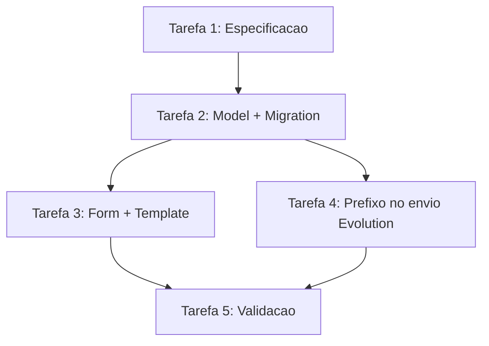

# Plano: Nome do Agente do Bot no WhatsApp (Por Tenant)

**Status**: Em planejamento
**Criado**: 2026-02-10
**Responsável**: Time Produto/Engenharia
**Tipo**: Feature (UX/Identificação do Bot)
**Prioridade**: Alta

## Objetivo

Permitir que cada tenant configure um **nome de agente do bot** e que **toda mensagem enviada pelo bot no WhatsApp** seja prefixada com esse nome **em negrito**, para o cliente identificar claramente que é um bot.

Exemplo esperado (WhatsApp markdown):

```text
*Íris:* Olá, como posso ajudar hoje?
```

## Escopo

- Adicionar um campo novo na **Configuração de IA** do tenant (model `TenantConfig`).
- Exibir/editar esse campo na UI atual de Configuração de IA.
- Ao enviar mensagens via Evolution API (WhatsApp), prefixar `resposta_bot` com `*{nome}:* ` quando houver nome configurado.

## Fora de Escopo (agora)

- Prefixar mensagens de atendentes humanos (fluxos de envio humano não estão neste escopo).
- Mudanças de layout/redesign da tela de configurações.
- Alterar a persona do prompt (`persona_bot`); o novo campo é apenas para **apresentação** no WhatsApp.

## Critérios de Aceite

- O tenant consegue informar um nome (ex: `Íris`) em `Configuração > IA`.
- Se o campo estiver preenchido, toda mensagem enviada pelo bot via WhatsApp começa com `*{nome}:* `.
- Se o campo estiver vazio, o texto enviado permanece como está hoje (sem prefixo).
- O prefixo não deve duplicar em reenvios/atualizações do mesmo `resposta_bot` (idempotência).
- O valor do campo é sanitizado (ex: trim; remover `*` e quebras de linha) para evitar formatação inesperada.

## Contexto no Código (pontos de alteração)

- Configuração do tenant (model): `src/smart_core_assistant_painel/app/tenants/models.py` (`TenantConfig`).
- Form/tela de Configuração IA: `src/smart_core_assistant_painel/app/tenants/forms/legacy.py` (`TenantConfigForm`) e `src/smart_core_assistant_painel/app/tenants/templates/tenants/config_ai.html`.
- Envio efetivo para WhatsApp (Evolution): `src/smart_core_assistant_painel/app/evolution_sync/signals.py` (uso de `EvolutionWhatsAppService().send_message(text=...)`).

## Componentes Necessários (Feature Breakdown)

### Backend
- [ ] Campo novo no `TenantConfig` (ex: `bot_agent_name`)
- [ ] Migração Django para o novo campo
- [ ] Ajuste no signal de envio (`evolution_sync/signals.py`) para prefixar o texto
- [ ] (Opcional) Helper utilitário para formatar prefixo e garantir idempotência

### Frontend
- [ ] Adicionar campo no `TenantConfigForm`
- [ ] Renderizar campo na página `tenants/config_ai.html` com help text claro

### Integrações
- [ ] Confirmar que o markdown do WhatsApp via Evolution suporta `*negrito*` (esperado: sim)

## Tarefas

### Tarefa 1: Definir especificação do campo e regras de sanitização (P)

**Descrição**: Definir nome do campo, tamanho max, comportamento padrão e sanitização.

**Decisões propostas**:
- Nome do campo (identificador): `bot_agent_name`
- Tipo: `models.CharField(max_length=80, blank=True, default=\"\")`
- Sanitização: `strip()`, substituir `\\r`/`\\n` por espaço, remover `*`

**Critérios de aceite**:
- [ ] Especificação registrada no plano e alinhada com Produto

**Estimativa**: P

### Tarefa 2: Adicionar campo no model e migração (E)

**Descrição**: Incluir o campo em `TenantConfig` e gerar migração.

**Arquivos**:
- `src/smart_core_assistant_painel/app/tenants/models.py`
- `src/smart_core_assistant_painel/app/tenants/migrations/`

**Dependências**:
- Tarefa 1

**Critérios de aceite**:
- [ ] Migração criada e aplicável em ambiente de dev

**Estimativa**: P

### Tarefa 3: Expor campo na tela de Configuração de IA (E)

**Descrição**: Atualizar `TenantConfigForm` e `config_ai.html` para permitir edição do nome do agente.

**Arquivos**:
- `src/smart_core_assistant_painel/app/tenants/forms/legacy.py`
- `src/smart_core_assistant_painel/app/tenants/templates/tenants/config_ai.html`

**Dependências**:
- Tarefa 2

**Critérios de aceite**:
- [ ] Campo aparece com label e help text explicando que será exibido no WhatsApp
- [ ] Placeholder sugerido (ex: `Íris`)
- [ ] Validação básica (max_length) funcionando

**Estimativa**: P

### Tarefa 4: Prefixar mensagens do bot no envio via Evolution (E)

**Descrição**: No signal `post_save` de `Mensagem`, antes de enviar `text`, buscar o nome do agente do tenant e prefixar com `*{nome}:* `.

**Arquivos**:
- `src/smart_core_assistant_painel/app/evolution_sync/signals.py`
- (Provável) `src/smart_core_assistant_painel/app/tenants/models.py` (import do `TenantConfig`, se necessário)

**Dependências**:
- Tarefa 2

**Regras**:
- Aplicar apenas quando for envio WhatsApp e `resposta_bot` existir (fluxo atual já faz isso).
- Resolver tenant via `inst.tenant_id` (quando disponível) para evitar depender de contexto de request.
- Idempotência: se `text` já começa com `*{nome}:*` (ou variações sanitizadas), nao prefixar novamente.

**Critérios de aceite**:
- [ ] Mensagem enviada vira `*Nome:* {mensagem}` quando configurado
- [ ] Sem nome configurado: comportamento inalterado
- [ ] Sem duplicação do prefixo

**Estimativa**: M

### Tarefa 5: Validação manual e evidências (V)

**Descrição**: Validar ponta-a-ponta com um tenant configurado e envio real/simulado.

**Pontos de verificação**:
- Tela `Configuração - IA` salva o nome corretamente.
- Ao disparar um fluxo que gera `resposta_bot`, a mensagem chega no WhatsApp com o prefixo em negrito.

**Evidências**:
- [ ] Print/registro do payload enviado (log) contendo `text` prefixado
- [ ] Print no WhatsApp mostrando o negrito

**Estimativa**: P

## Riscos e Mitigações

| Risco | Prob. | Impacto | Mitigacao |
| --- | --- | --- | --- |
| Mensagem enviada sem conseguir resolver tenant (ex: `tenant_id` ausente na instância) | Baixa | Médio | Fallback para `get_current_tenant()` (como já existe para base_url) e, se ainda assim não houver, não prefixar |
| Formatação inesperada por caracteres especiais no nome | Média | Médio | Sanitizar `*` e quebras de linha; limitar tamanho |
| Query extra no DB por mensagem enviada | Média | Baixa | Buscar apenas `values_list` do campo; opcional: cache curto por `tenant_id` (futuro) |

## Ordem Recomendada



## Rollback

- Reverter o commit da migração e do código do prefixo.
- Se a migração já foi aplicada em produção, manter o campo (inofensivo) e apenas desativar o comportamento removendo o prefixo no signal.
