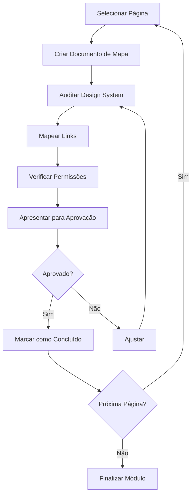

# Refatoração UI Design System v2 - Auditoria Página a Página

> 📋 **Status**: Aguardando Aprovação
> 🔗 **OpenSpec**: Será criado após aprovação deste plano
> 📁 **Mapa de Navegação**: `docs_dev/planejamento/mapa_navegacao/`

## Objetivo

Refatorar **100% das telas navegáveis** do sistema com validação sequencial página a página, garantindo:

1. **Conformidade com Design System** - Uso correto de templates base
2. **Mapeamento de Navegação** - Documentação de todos os links com destino e resumo
3. **Auditoria de Permissões** - Verificação de roles autorizados por página
4. **Validação Sequencial** - Cada página só avança após aprovação explícita

## Contexto

O projeto Smart Core Assistant Painel possui múltiplas áreas:

- **Frontend Público**: Landing page, páginas de erro
- **Autenticação**: Login, cadastro, logout
- **Onboarding**: Wizard de 4 steps para novos tenants
- **Backoffice**: Área exclusiva para Super Admins
- **Área do Tenant**: Dashboard, configurações, gestão de usuários
- **Treinamento IA**: Módulo para treinar a IA do assistente

### Sistema de Permissões

| Role        | Descrição               | Acesso Típico                    |
| ----------- | ----------------------- | -------------------------------- |
| `ADMIN`     | Administrador do Tenant | Tudo menos Backoffice            |
| `MANAGER`   | Gerente                 | Dashboard gerente, configurações |
| `STAFF`     | Funcionário             | Áreas operacionais               |
| `VIEWER`    | Visualizador            | Somente leitura                  |
| `SUPERUSER` | Super Admin             | Backoffice + All                 |

### Módulos de Permissão (`TenantModule`)

- `CLIENTES` - Gestão de clientes
- `OPERACIONAL` - Área operacional
- `TREINAMENTO` - Treinamento IA
- `ATENDIMENTOS` - Central de atendimentos
- `CONFIGURACOES` - Configurações do tenant

## Escopo

### Incluído

| #         | Módulo             | Páginas                                            | Prioridade |
| --------- | ------------------ | -------------------------------------------------- | ---------- |
| 1         | Páginas Públicas   | 4 (landing, 403, 404, 500)                         | Alta       |
| 2         | Autenticação       | 3 (login, cadastro, logout)                        | Alta       |
| 3         | Onboarding         | 4 (steps 1-4)                                      | Alta       |
| 4         | Backoffice         | 2 (dashboard, register_payment)                    | Média      |
| 5         | Dashboard Tenant   | 1 (dashboard principal)                            | Alta       |
| 6         | Configurações      | 5 (database, evolution, trello, ai, debug)         | Média      |
| 7         | Gestão de Usuários | 5 (list, invite, resend, permissions, activate)    | Média      |
| 8         | Treinamento IA     | 5 (treinar, pre_proc, verificar, query_compose x2) | Alta       |
| 9         | Dashboard Gerente  | 1 (dashboard_gerente)                              | Média      |
| **TOTAL** |                    | **30+ páginas**                                    |            |

### Não Incluído

- Páginas do Django Admin padrão
- APIs (endpoints sem interface visual)
- Webhooks e callbacks
- Tenant Admin (área administrativa do Jazzmin)

## Estrutura do Mapa de Navegação

Cada arquivo em `docs_dev/planejamento/mapa_navegacao/` terá:

```markdown
# [Módulo] - Mapa de Navegação

## Página: [Nome da Página]

### Informações Básicas

| Campo             | Valor                                       |
| ----------------- | ------------------------------------------- |
| **URL**           | `/path/to/page/`                            |
| **View**          | `ViewClass` ou `function_name`              |
| **Template**      | `template/path.html`                        |
| **Template Base** | `base_dashboard.html` ou `base_public.html` |
| **App**           | `app_name`                                  |

### Permissões

| Tipo                | Valor                                   |
| ------------------- | --------------------------------------- |
| **Autenticação**    | ✅ Requerida / ❌ Pública               |
| **Roles**           | `ADMIN`, `MANAGER`, ...                 |
| **Módulo**          | `TREINAMENTO`                           |
| **Decorator/Mixin** | `@login_required`, `LoginRequiredMixin` |

### Links da Página

| Nome do Link  | URL de Destino        | Resumo                         |
| ------------- | --------------------- | ------------------------------ |
| Dashboard     | `/tenants/dashboard/` | Retorna ao dashboard principal |
| Configurações | `/tenants/config/ai/` | Abre config de IA              |

### Auditoria Design System

- [ ] Template base correto
- [ ] Sidebar visível (se aplicável)
- [ ] Navegação funcional
- [ ] Responsividade
- [ ] Padrões visuais (cards, forms, tables)
```

## Arquitetura Proposta

### Hierarquia de Templates

```
base.html
├── base_public.html (páginas públicas)
│   ├── landing_page.html
│   ├── 403.html, 404.html, 500.html
│   ├── login.html, cadastro.html
│   └── tenants/onboarding/*.html
│
└── base_dashboard.html (área autenticada)
    ├── tenants/dashboard.html
    ├── tenants/config_*.html
    ├── tenants/users/*.html
    ├── tenants/backoffice/*.html
    └── treinamento/*.html
```

### Templates Especiais

| Template               | Uso               | Herança               |
| ---------------------- | ----------------- | --------------------- |
| `base_tenants.html`    | Views de tenant   | `base_dashboard.html` |
| `onboarding/base.html` | Wizard onboarding | `base_public.html`    |

## Dependências

- **Jazzmin Theme**: Tema base do Django Admin
- **Sistema de Roles**: `rolepermissions` + mixins customizados
- **Templates**: Estrutura de templates Django

## Riscos e Mitigações

| Risco                           | Probabilidade | Impacto | Mitigação                                  |
| ------------------------------- | ------------- | ------- | ------------------------------------------ |
| Templates com herança incorreta | Alta          | Alta    | Verificar `` em cada template |
| Permissões inconsistentes       | Média         | Alta    | Documentar e testar cada role              |
| Links quebrados                 | Média         | Média   | Validar todos os ``               |
| Sidebar não aparece             | Alta          | Alta    | Verificar contexto do template             |

## Estimativa de Esforço

- **Escala PREVC**: MEDIUM
- **Complexidade**: Alta (30+ páginas, múltiplos módulos)
- **Componentes afetados**: Templates, Views, URLs

## Processo de Validação Página a Página



## Tarefas Preliminares

### Fase 1: Setup

- [x] Inicializar scaffolding AI-Context
- [x] Mapear URLs do projeto
- [x] Analisar estrutura de templates
- [x] Identificar sistema de permissões
- [ ] Criar pasta `mapa_navegacao/`
- [ ] Criar índice geral (`00_indice.md`)

### Fase 2: Mapeamento (Por Módulo)

- [ ] Módulo 1: Páginas Públicas
- [ ] Módulo 2: Autenticação
- [ ] Módulo 3: Onboarding
- [ ] Módulo 4: Backoffice
- [ ] Módulo 5: Dashboard Tenant
- [ ] Módulo 6: Configurações
- [ ] Módulo 7: Gestão de Usuários
- [ ] Módulo 8: Treinamento IA
- [ ] Módulo 9: Dashboard Gerente

### Fase 3: Implementação

- [ ] Aplicar correções de Design System
- [ ] Validar links em cada página
- [ ] Testar permissões
- [ ] Documentar em `UI_MAP.md` final

## Critérios de Aceite

1. ✅ Todos os 9 módulos documentados em `mapa_navegacao/`
2. ✅ Cada página com auditoria de Design System completa
3. ✅ Mapeamento de links 100% documentado
4. ✅ Permissões validadas por role
5. ✅ Aprovação sequencial página a página registrada
