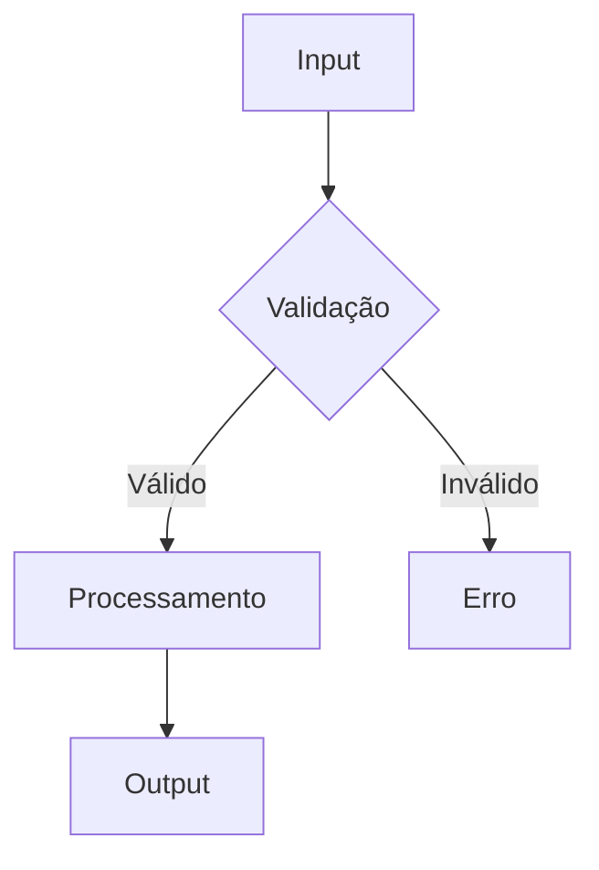

# Documentation Skill

## Quando Usar

Use este skill quando:
- Documentando código novo
- Atualizando documentação existente
- Criando guias de uso

## Instruções

### 1. Docstrings (Google Style)

```python
def process_message(
    message: str,
    context: dict | None = None,
) -> Result[AnalysisResult, Exception]:
    """Processa uma mensagem de cliente.

    Analisa a mensagem usando IA e retorna resultado estruturado
    com intenção, sentimento e resposta sugerida.

    Args:
        message: Texto da mensagem do cliente.
        context: Contexto adicional opcional com histórico.

    Returns:
        Result contendo AnalysisResult em caso de sucesso
        ou Exception em caso de falha.

    Raises:
        ValueError: Se a mensagem estiver vazia.

    Example:
        >>> result = process_message("Olá, preciso de ajuda")
        >>> if result.is_success():
        ...     print(result.value.intent)
        'saudacao'
    """
```

### 2. Documentação de Módulo

```python
"""
Módulo de análise de mensagens.

Este módulo fornece funcionalidades para análise de mensagens
de clientes usando LLM via LangChain.

Features:
    - Detecção de intenção
    - Análise de sentimento
    - Extração de entidades

Example:
    >>> from modules.ai_engine.features import analise_mensage
    >>> usecase = analise_mensage.AnaliseMensageUsecase(llm)
    >>> result = usecase.execute("Mensagem do cliente")

See Also:
    - :mod:`modules.ai_engine.features.generate_embeddings`
"""

from .domain.usecase import AnaliseMensageUsecase

__all__ = ["AnaliseMensageUsecase"]
```

### 3. README de Feature

```markdown
# Nome da Feature

## Descrição

Breve descrição do que a feature faz.

## Instalação

```bash
# Se houver dependências específicas
```

## Uso

```python
from feature import FeatureClass

instance = FeatureClass()
result = instance.execute(input)
```

## API

### `FeatureClass.execute(input)`

Descrição da função.

**Parâmetros:**
- `input` (str): Descrição do parâmetro

**Retorna:**
- `Result[T, E]`: Descrição do retorno

## Configuração

| Variável | Descrição | Padrão |
|----------|-----------|--------|
| `VAR_1` | Descrição | `value` |

## Exemplos

### Exemplo 1: Uso Básico

```python
# Código do exemplo
```
```

### 4. Documentação de API (OpenAPI)

```python
from drf_spectacular.utils import extend_schema, OpenApiParameter

class AtendimentoViewSet(viewsets.ModelViewSet):
    """
    API para gerenciamento de atendimentos.

    Permite criar, listar, atualizar e encerrar atendimentos.
    """

    @extend_schema(
        summary="Listar atendimentos",
        description="Retorna lista paginada de atendimentos.",
        parameters=[
            OpenApiParameter(
                name="status",
                description="Filtrar por status",
                required=False,
                type=str,
            ),
        ],
        responses={200: AtendimentoSerializer(many=True)},
    )
    def list(self, request):
        ...
```

### 5. Diagramas Mermaid

```markdown

```

### 6. Changelog

```markdown
# Changelog

## [0.2.0] - 2026-01-25

### Added
- Nova feature de análise de sentimento
- Integração com Notion

### Changed
- Melhorada performance de queries

### Fixed
- Corrigido bug no webhook

## [0.1.0] - 2026-01-01

### Added
- Release inicial
```

## Checklist

- [ ] Docstrings em funções públicas
- [ ] README do módulo/feature
- [ ] Exemplos de uso
- [ ] Diagramas onde útil
- [ ] Changelog atualizado
- [ ] Sem TODOs na documentação
