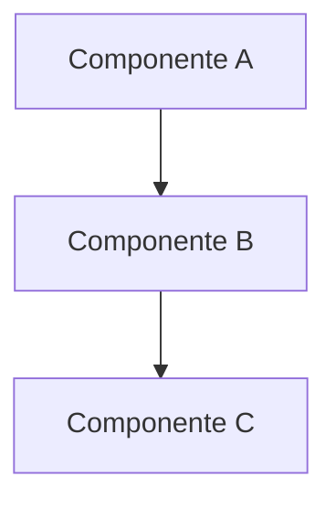
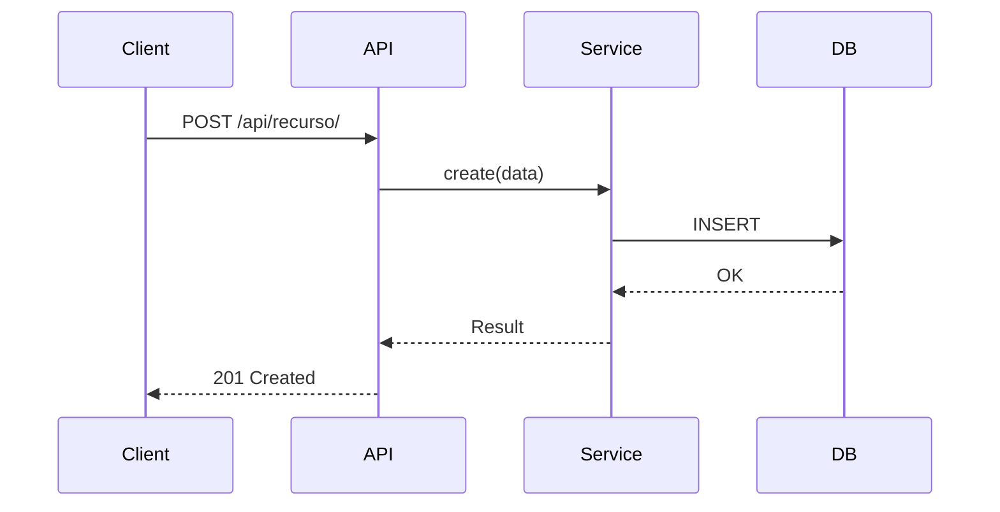

# Technical Specification

## Feature
[Nome da feature]

## Resumo Técnico
[Breve descrição técnica da implementação]

## Arquitetura

### Visão Geral


### Componentes Afetados
| Componente | Mudança | Arquivos |
|------------|---------|----------|
| Models | Novo model X | `app/module/models.py` |
| Views | Novo endpoint | `app/module/views.py` |
| Services | Novo service | `modules/services/...` |

## Design Detalhado

### Models

```python
class NovoModel(TenantAwareModel):
    """Descrição do model."""

    campo1 = models.CharField(max_length=200)
    campo2 = models.ForeignKey(...)

    class Meta:
        indexes = [...]
```

### APIs

#### Endpoint 1
```
POST /api/recurso/
```

**Request:**
```json
{
    "campo1": "valor"
}
```

**Response (201):**
```json
{
    "id": 1,
    "campo1": "valor"
}
```

### Fluxo de Dados



## Migrations

```python
# Migration necessária
class Migration(migrations.Migration):
    operations = [
        migrations.CreateModel(
            name="NovoModel",
            fields=[...],
        ),
    ]
```

## Configurações

### Variáveis de Ambiente
| Variável | Descrição | Obrigatório | Default |
|----------|-----------|-------------|---------|
| `VAR_1` | Descrição | Sim | - |

### Settings
```python
# Novas configurações em settings.py
NOVA_CONFIG = os.getenv("VAR_1", "default")
```

## Dependências

### Pacotes Novos
- `pacote==1.0.0` - Motivo da adição

### Serviços Externos
- [ ] API X - [documentação]

## Segurança

### Considerações
- [ ] Isolamento de tenant verificado
- [ ] Inputs validados
- [ ] Permissões configuradas

### Permissões Necessárias
| Permissão | Descrição |
|-----------|-----------|
| `pode_criar_x` | Permite criar recurso X |

## Performance

### Índices
```python
class Meta:
    indexes = [
        models.Index(fields=["campo1", "campo2"]),
    ]
```

### Queries Esperadas
- Query 1: < 10ms
- Query 2: < 50ms

## Testes

### Casos de Teste
- [ ] Teste de criação com sucesso
- [ ] Teste de validação de inputs
- [ ] Teste de permissões
- [ ] Teste de isolamento de tenant

### Cobertura Alvo
- Mínimo: 80%

## Rollback Plan
1. Reverter migration: `python manage.py migrate app previous_migration`
2. Deploy versão anterior
3. Limpar dados criados (se necessário)

## Checklist de Implementação
- [ ] Models criados
- [ ] Migrations geradas e testadas
- [ ] Views/APIs implementadas
- [ ] Serializers criados
- [ ] Testes escritos
- [ ] Documentação atualizada
- [ ] Code review aprovado
