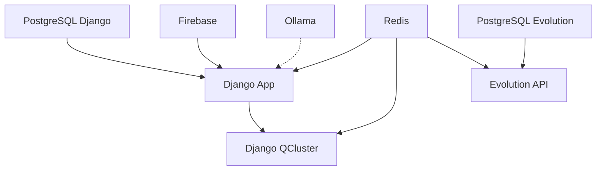

# 🐳 Docker Environment - Smart Core Assistant Painel

Este documento fornece instruções **COMPLETAS e ATUALIZADAS** para configurar e executar o Smart Core Assistant Painel usando Docker. Siga este guia para garantir uma configuração sem erros.

## 📋 Pré-requisitos

### Software Obrigatório
- **Docker Engine 20.10+** (ou Docker Desktop para Windows)
- **Docker Compose 2.0+** (incluído no Docker Desktop)
- **PowerShell 5.0+** (Windows)
- **Git** (para clonar o repositório)

### Software Opcional
- **Python 3.13+** (apenas se quiser desenvolvimento local sem Docker)
- **Ollama** (para funcionalidades de IA local - opcional)

### Hardware Recomendado
- **RAM**: Mínimo 8GB (recomendado 16GB)
- **Espaço em Disco**: Mínimo 15GB livres
- **CPU**: 4 cores ou mais (recomendado 8 cores)

### Verificação Automática dos Pré-requisitos
O script `docker-manager.ps1` verifica automaticamente todos os pré-requisitos:

```powershell
# O script verifica automaticamente:
# ✅ Docker instalado
# ✅ Docker Compose disponível
# ✅ Docker rodando
# ✅ Python instalado
.\docker-manager.ps1 setup
```

### Verificação Manual (Opcional)
```powershell
# Verificar Docker
docker --version
docker compose --version

# Verificar se Docker está rodando
docker info

# Verificar PowerShell
$PSVersionTable.PSVersion
```

## 🚀 Configuração e Execução

### 1. Configuração Rápida (RECOMENDADO)

Use o script `docker-manager.ps1` para configuração automática completa:

```powershell
# 1) Navegar para o diretório do ambiente Docker
cd c:\PROJETOS\PYTHON\APPS\smart-core-assistant-painel\ambiente_docker

# 2) Executar configuração inicial completa (ambiente padrão: prod)
.\docker-manager.ps1 setup

# 3) (Opcional) Ativar ferramentas de desenvolvimento (ex.: Redis Commander)
.\docker-manager.ps1 setup -Tools

# 4) (Opcional) Escolher ambiente explicitamente
.\docker-manager.ps1 setup -Environment dev
```

O comando `setup` executa automaticamente:
- ✅ Verificação de pré-requisitos
- ✅ Criação/atualização do arquivo `.env` com chaves e senhas geradas
- ✅ Verificação das credenciais do Firebase (exige o arquivo firebase_key.json no caminho correto)
- ✅ Verificação da conectividade com Ollama (opcional)
- ✅ Construção das imagens Docker
- ✅ Inicialização de todos os serviços
- ✅ Execução das migrações do banco e collectstatic
- ✅ Exibição das informações finais e URLs de acesso

### 2. Configuração Manual (Para Casos Especiais)

#### 2.1. Configurar Variáveis de Ambiente

O arquivo `.env` será gerado automaticamente pelo script na raiz do projeto com o seguinte conteúdo:

```env
# Firebase Configuration (OBRIGATÓRIO)
GOOGLE_APPLICATION_CREDENTIALS=src/smart_core_assistant_painel/modules/initial_loading/utils/keys/firebase_config/firebase_key.json

# Django Configuration (Gerado automaticamente pelo script)
SECRET_KEY_DJANGO=chave-secreta-django-gerada-automaticamente-50-caracteres
DJANGO_DEBUG=True
DJANGO_ALLOWED_HOSTS=localhost,127.0.0.1,0.0.0.0

# Evolution API Configuration (Gerado automaticamente pelo script)
EVOLUTION_API_URL=http://localhost:8080
EVOLUTION_API_KEY=chave-evolution-api-gerada-automaticamente-25-caracteres
EVOLUTION_API_GLOBAL_WEBHOOK_URL=http://localhost:8000/oraculo/webhook_whatsapp/

# PostgreSQL Configuration
POSTGRES_DB=smart_core_db
POSTGRES_USER=postgres
POSTGRES_PASSWORD=postgres123
POSTGRES_HOST=localhost
POSTGRES_PORT=5432

# Webhook Configuration
WEBHOOK_URL=http://localhost:8000/oraculo/webhook_whatsapp/
WEBHOOK_SECRET=webhook-secret-gerado-automaticamente-25-caracteres

# Server Configuration
SERVER_HOST=0.0.0.0
SERVER_PORT=8000
WORKERS=4

# Security
SECURE_SSL_REDIRECT=False
SESSION_COOKIE_SECURE=False
CSRF_COOKIE_SECURE=False

# Logging
LOG_LEVEL=INFO

# Ollama Configuration (para desenvolvimento local)
OLLAMA_HOST=localhost
OLLAMA_PORT=11434

# As seguintes variáveis são carregadas dinamicamente do Firebase Remote Config:
# - OPENAI_API_KEY
# - GROQ_API_KEY
# - WHATSAPP_API_BASE_URL
# - WHATSAPP_API_SEND_TEXT_URL
# - WHATSAPP_API_START_TYPING_URL
# - WHATSAPP_API_STOP_TYPING_URL
# - LLM_CLASS
# - MODEL
# - TEMPERATURE
# - PROMPT_SYSTEM_ANALISE_CONTEUDO
# - PROMPT_HUMAN_ANALISE_CONTEUDO
# - PROMPT_SYSTEM_MELHORIA_CONTEUDO
# - CHUNK_OVERLAP
# - CHUNK_SIZE
# - FAISS_MODEL
# - PROMPT_HUMAN_ANALISE_PREVIA_MENSAGEM
# - PROMPT_SYSTEM_ANALISE_PREVIA_MENSAGEM
# - VALID_ENTITY_TYPES
# - VALID_INTENT_TYPES
```

⚠️ **IMPORTANTE**: O script `docker-manager.ps1` gera automaticamente as chaves necessárias. Você **NÃO** precisa criar este arquivo manualmente.

#### 2.2. Configurar Firebase (OBRIGATÓRIO)

1. **Obter credenciais do Firebase:**
   - Acesse o [Console do Firebase](https://console.firebase.google.com/)
   - Vá em **Configurações do Projeto > Contas de Serviço**
   - Clique em **"Gerar nova chave privada"**
   - Salve o arquivo como `firebase_key.json`

2. **Colocar arquivo no local correto:**
   ```
   src/smart_core_assistant_painel/modules/initial_loading/utils/keys/firebase_config/firebase_key.json
   ```

3. **Configurar Remote Config no Firebase:**
   Configure as seguintes variáveis no Firebase Remote Config:
   
   **APIs e Chaves:**
   - `OPENAI_API_KEY`
   - `GROQ_API_KEY`
   
   **WhatsApp API:**
   - `WHATSAPP_API_BASE_URL`
   - `WHATSAPP_API_SEND_TEXT_URL`
   - `WHATSAPP_API_START_TYPING_URL`
   - `WHATSAPP_API_STOP_TYPING_URL`
   
   **LLM Configuration:**
   - `LLM_CLASS`
   - `MODEL`
   - `TEMPERATURE`
   
   **Prompts do Sistema:**
   - `PROMPT_SYSTEM_ANALISE_CONTEUDO`
   - `PROMPT_HUMAN_ANALISE_CONTEUDO`
   - `PROMPT_SYSTEM_MELHORIA_CONTEUDO`
   - `PROMPT_HUMAN_ANALISE_PREVIA_MENSAGEM`
   - `PROMPT_SYSTEM_ANALISE_PREVIA_MENSAGEM`
   
   **FAISS Configuration:**
   - `CHUNK_OVERLAP`
   - `CHUNK_SIZE`
   - `FAISS_MODEL`
   
   **Validação:**
   - `VALID_ENTITY_TYPES`
   - `VALID_INTENT_TYPES`

#### 2.3. Configurar Ollama (OPCIONAL)

O sistema funciona sem Ollama, mas para funcionalidades de embeddings locais:

1. **Instalar Ollama:**
   - Download: https://ollama.ai/
   - Instalar e executar localmente

2. **Verificar se está rodando:**
   ```bash
   curl http://localhost:11434/api/tags
   ```

#### 2.4. Construir e Iniciar Serviços (Manual)

```powershell
# 1. Construir as imagens Docker
docker compose build

# 2. Iniciar os serviços
docker compose up -d

# 3. Executar migrações
docker compose exec django-app uv run python src/smart_core_assistant_painel/app/ui/manage.py migrate

# 4. Criar superusuário (opcional)
docker compose exec django-app uv run python src/smart_core_assistant_painel/app/ui/manage.py createsuperuser
```

## 🛠️ Comandos do Docker Manager

O `docker-manager.ps1` é o script principal para gerenciar o ambiente:

### Comandos Principais

```powershell
# ⚡ Configuração inicial completa (RECOMENDADO)
.\docker-manager.ps1 setup

# 🚀 Iniciar serviços
.\docker-manager.ps1 start

# ⏹️ Parar serviços
.\docker-manager.ps1 stop

# 🔄 Reiniciar serviços
.\docker-manager.ps1 restart

# 📊 Ver status dos serviços
.\docker-manager.ps1 status

# 📋 Ver logs em tempo real
.\docker-manager.ps1 logs
```

### Comandos de Manutenção

```powershell
# 🔨 Construir imagens
.\docker-manager.ps1 build

# 🧹 Limpeza completa (cuidado!)
.\docker-manager.ps1 clean

# 💻 Acessar shell do Django
.\docker-manager.ps1 shell

# 📊 Executar migrações
.\docker-manager.ps1 migrate

# 👤 Criar superusuário
.\docker-manager.ps1 createsuperuser
```

### Comandos com Opções

```powershell
# 🛠️ Configuração com ferramentas de desenvolvimento
.\docker-manager.ps1 setup -Tools

# 🚀 Iniciar com ferramentas (Redis Commander)
.\docker-manager.ps1 start -Tools

# 🔨 Construir sem cache
.\docker-manager.ps1 build -Force

# ❓ Mostrar ajuda
.\docker-manager.ps1 help
```

## 🏗️ Arquitetura dos Serviços

### Serviços Principais

| Serviço | Porta | Função | Status |
|---------|-------|--------|--------|
| **django-app** | 8000 | Aplicação principal Django | ✅ Essencial |
| **django-qcluster** | - | Processamento assíncrono | ✅ Essencial |
| **postgres-django** | - | Banco de dados Django | ✅ Essencial |
| **evolution-api** | 8080 | API WhatsApp | ✅ Essencial |
| **postgres** | - | Banco Evolution API | ✅ Essencial |
| **redis** | 6379 | Cache e filas | ✅ Essencial |

### Ferramentas de Desenvolvimento (Opcional)

| Ferramenta | Porta | Função | Ativação |
|------------|-------|--------|----------|
| **redis-commander** | 8082 | Interface Redis | `-Tools` |

### URLs de Acesso

```
📱 Django Admin:     http://localhost:8000/admin/
🤖 Evolution API:    http://localhost:8080/
🔧 Redis Commander:  http://localhost:8082/ (apenas com -Tools)
🎯 Webhook:          http://localhost:8000/oraculo/webhook_whatsapp/
```

### Dependências entre Serviços



### Inicialização Automática

Atualmente, o `docker-compose.yml` está configurado para iniciar os serviços Django diretamente via `manage.py` (os entrypoints de inicialização completa estão temporariamente desabilitados por comentários no compose). Portanto, o fluxo atual é:

1. **django-app**:
   - ✅ Inicia o servidor com `uv run python manage.py runserver 0.0.0.0:8000`
   - ✅ As variáveis dinâmicas são carregadas em runtime pelo módulo `start_services()` do próprio app quando necessário
   - ⚠️ Migrações e criação de superusuário não são automáticas neste modo; utilize `docker-manager.ps1 migrate` e `docker-manager.ps1 createsuperuser` quando precisar

2. **django-qcluster**:
   - ✅ Inicia o QCluster com `uv run python manage.py qcluster`
   - ⚠️ Aguarda implicitamente a disponibilidade do app principal pelo serviço do banco e configurações 

Nota: Os scripts de entrypoint (<mcfile name="docker-entrypoint.sh" path="c:\PROJETOS\PYTHON\APPS\smart-core-assistant-painel\ambiente_docker\scripts\docker-entrypoint.sh"></mcfile> e <mcfile name="docker-entrypoint-qcluster.sh" path="c:\PROJETOS\PYTHON\APPS\smart-core-assistant-painel\ambiente_docker\scripts\docker-entrypoint-qcluster.sh"></mcfile>) já implementam:
- Verificação do PostgreSQL e credenciais do Firebase
- Execução de `start_initial_loading()` e `start_services()`
- Verificação de conectividade com Ollama
- Migrações e criação de superusuário padrão (admin/123456)

Para reativar esse fluxo automaticamente, basta descomentar as linhas `entrypoint` correspondentes no `docker-compose.yml` e remover/ajustar os comandos `command` atuais.

## 📚 Comandos Úteis do Docker

### Gerenciamento de Containers

```bash
# Ver todos os containers
docker compose ps

# Ver logs de todos os serviços
docker compose logs -f

# Ver logs de um serviço específico
docker compose logs -f django-app

# Reiniciar um serviço específico
docker compose restart django-app

# Executar comando em container
docker compose exec django-app bash
```

### Monitoramento

```bash
# Ver uso de recursos
docker stats

# Ver redes Docker
docker network ls

# Ver volumes Docker
docker volume ls

# Inspecionar container
docker compose exec django-app env
```

### Limpeza e Manutenção

```bash
# Remover containers parados
docker container prune

# Remover imagens não utilizadas
docker image prune

# Remover volumes não utilizados
docker volume prune

# Limpeza completa do sistema
docker system prune -a
```

## 🧪 Testes no Ambiente Docker

Para executar testes no ambiente Docker, consulte <mcfile name="README-Tests-Docker.md" path="c:\PROJETOS\PYTHON\APPS\smart-core-assistant-painel\ambiente_docker\README-Tests-Docker.md"></mcfile>.

Comandos rápidos:
```bash
# Executar todos os testes
uv run task test-docker

# Executar testes específicos
uv run task test-docker-specific tests/modules/oraculo/

# Executar com cobertura
uv run task test-docker-coverage
```

## 🔧 Solução de Problemas

### Problemas Comuns

#### 1. Docker não está rodando
```bash
# Verificar se Docker está ativo
docker info

# No Windows, iniciar Docker Desktop
```

#### 2. Porta já está em uso
```bash
# Verificar processos usando a porta
netstat -ano | findstr :8000

# Parar serviços Docker
.\docker-manager.ps1 stop
```

#### 3. Erro de credenciais Firebase
```bash
# Verificar se arquivo existe
ls src/smart_core_assistant_painel/modules/initial_loading/utils/keys/firebase_config/firebase_key.json

# Recolocar arquivo no local correto
```

#### 4. Problema de conectividade com Ollama
```bash
# Verificar se Ollama está rodando
curl http://localhost:11434/api/tags

# Instalar Ollama se necessário
# Download: https://ollama.ai/
```

#### 5. Erro de migrações
```bash
# Executar migrações manualmente
.\docker-manager.ps1 migrate

# Ou via Docker direto
docker compose exec django-app uv run python src/smart_core_assistant_painel/app/ui/manage.py migrate
```

#### 6. Problema com volumes/dados
```bash
# Limpeza completa (CUIDADO: apaga dados)
.\docker-manager.ps1 clean -Force

# Reconstruir do zero
.\docker-manager.ps1 setup
```

### Logs e Debugging

```bash
# Ver logs detalhados
.\docker-manager.ps1 logs

# Ver logs de serviço específico
docker compose logs -f django-app

# Ver logs de inicialização
docker compose logs django-app | grep "Iniciando"

# Acessar shell para debug
.\docker-manager.ps1 shell
```

### Performance

```bash
# Monitorar recursos
docker stats

# Verificar saúde dos containers
docker compose ps

# Reiniciar serviços com problemas
docker compose restart django-app
```

## 📝 Variáveis de Ambiente Importantes

### Arquivo .env (Gerado Automaticamente)
- `SECRET_KEY_DJANGO`: Chave secreta Django (gerada automaticamente)
- `EVOLUTION_API_KEY`: Chave da Evolution API (gerada automaticamente)
- `WEBHOOK_SECRET`: Segredo do webhook (gerado automaticamente)

### Firebase Remote Config (Manual)
- `OPENAI_API_KEY`: Chave da API OpenAI
- `GROQ_API_KEY`: Chave da API Groq
- `LLM_CLASS`: Classe do modelo LLM
- `MODEL`: Nome do modelo
- `FAISS_MODEL`: Modelo para embeddings FAISS

### Configuração Docker
- `OLLAMA_HOST`: Host do Ollama (padrão: host.docker.internal)
- `OLLAMA_PORT`: Porta do Ollama (padrão: 11434)
- `POSTGRES_HOST`: Host do PostgreSQL (padrão: postgres-django)
- `POSTGRES_PORT`: Porta do PostgreSQL (padrão: 5432)

## 🎯 Próximos Passos Após Setup

1. **Acesse o Django Admin**: http://localhost:8000/admin/
   - Usuário: `admin`
   - Senha: `123456`

2. **Configure sua instância WhatsApp na Evolution API**: http://localhost:8080/

3. **Teste o webhook**: http://localhost:8000/oraculo/webhook_whatsapp/

4. **Configure o Firebase Remote Config** com suas chaves de API

5. **Inicie o desenvolvimento** com hot reload ativo

## ✨ Recursos Avançados

### Hot Reload
- ✅ Código Python: Recarregamento automático
- ✅ Templates Django: Recarregamento automático
- ✅ Arquivos estáticos: Coletados automaticamente

### Persistência de Dados
- ✅ Banco PostgreSQL: Dados persistem entre reinicializações
- ✅ Redis: Dados de cache persistem
- ✅ Uploads de mídia: Arquivos persistem
- ✅ Logs de aplicação: Mantidos em volumes

### Monitoramento
- ✅ Health checks automáticos
- ✅ Logs estruturados
- ✅ Status de serviços em tempo real

---

**💡 Dica**: Use sempre `.\docker-manager.ps1 setup` para uma experiência completa e sem erros!

Para dúvidas ou problemas, consulte os logs com `.\docker-manager.ps1 logs` ou acesse o shell com `.\docker-manager.ps1 shell`.