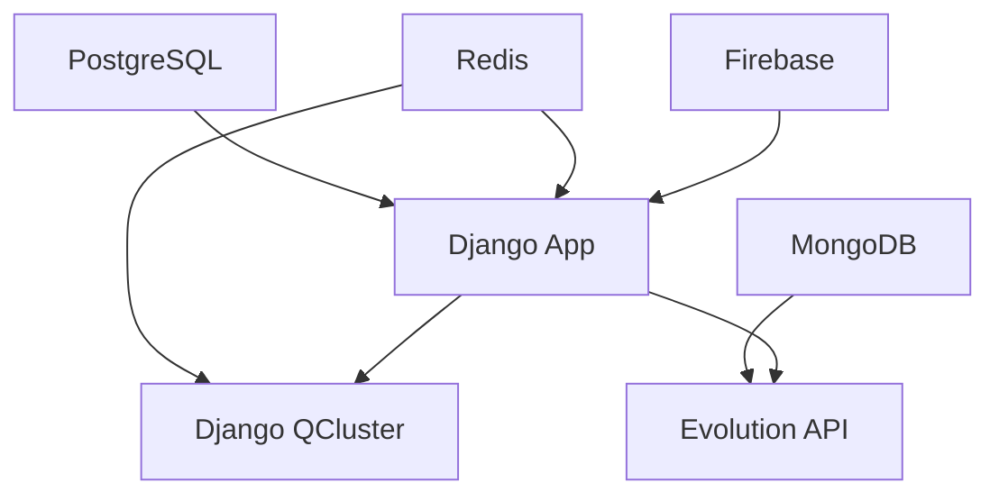

# Guia Completo Docker - Smart Core Assistant Painel

Este documento fornece um guia completo para configurar, executar e gerenciar o Smart Core Assistant Painel usando Docker.

## 📋 Índice

1. [Pré-requisitos](#-pré-requisitos)
2. [Configuração Inicial](#-configuração-inicial)
3. [Uso do Docker Manager](#-uso-do-docker-manager)
4. [Arquitetura do Sistema](#-arquitetura-do-sistema)
5. [Serviços Incluídos](#-serviços-incluídos)
6. [Comandos Úteis](#-comandos-úteis)
7. [Monitoramento e Debug](#-monitoramento-e-debug)
8. [Troubleshooting](#-troubleshooting)
9. [Segurança](#-segurança)
10. [Performance](#-performance)

## 📋 Pré-requisitos

### Software Necessário
- **Docker Engine 20.10+**
- **Docker Compose 2.0+**
- **Python 3.11+**
- **PowerShell 5.0+** (Windows)
- **Git**

### Verificação dos Pré-requisitos
```powershell
# Verificar Docker
docker --version
docker-compose --version

# Verificar Python
python --version

# Verificar se Docker está rodando
docker info
```

## 🚀 Configuração Inicial

### 1. Configuração Rápida (Recomendado)

Use o script `docker-manager.ps1` para configuração automática:

```powershell
# Navegar para o diretório do projeto
cd c:\PROJETOS\PYTHON\APPS\smart-core-assistant-painel\ambiente_docker

# Executar configuração inicial completa
.\docker-manager.ps1 setup

# Para desenvolvimento com ferramentas extras
.\docker-manager.ps1 setup -Environment dev -Tools
```

### 2. Configuração Manual

#### 2.1. Configurar Variáveis de Ambiente

Copie o arquivo de exemplo:
```bash
cp ../.env.example ../.env
```

Edite o arquivo `.env` com suas configurações:

```env
# Firebase Configuration
GOOGLE_APPLICATION_CREDENTIALS=src/smart_core_assistant_painel/modules/initial_loading/utils/keys/firebase_config/firebase_key.json

# Django Configuration (OBRIGATÓRIO)
SECRET_KEY_DJANGO=sua-chave-secreta-django-aqui
DJANGO_DEBUG=True
DJANGO_ALLOWED_HOSTS=localhost,127.0.0.1,0.0.0.0

# Evolution API Configuration (OBRIGATÓRIO)
EVOLUTION_API_URL=http://localhost:8080
EVOLUTION_API_KEY=sua-chave-evolution-api-aqui
EVOLUTION_API_GLOBAL_WEBHOOK_URL=http://localhost:8000/oraculo/webhook_whatsapp/

# PostgreSQL Configuration
POSTGRES_DB=smart_core_db
POSTGRES_USER=postgres
POSTGRES_PASSWORD=postgres123
POSTGRES_HOST=localhost
POSTGRES_PORT=5432

# Webhook Configuration (OBRIGATÓRIO)
WEBHOOK_URL=http://localhost:8000/oraculo/webhook_whatsapp/
WEBHOOK_SECRET=seu-webhook-secret

# Server Configuration
SERVER_HOST=0.0.0.0
SERVER_PORT=8000
WORKERS=4

# Security
SECURE_SSL_REDIRECT=False
SESSION_COOKIE_SECURE=False
CSRF_COOKIE_SECURE=False

# Logging
LOG_LEVEL=INFO

# Ollama Configuration (opcional)
OLLAMA_HOST=localhost
OLLAMA_PORT=11434
```

#### 2.2. Configurar Firebase

1. **Obter credenciais do Firebase:**
   - Acesse o [Console do Firebase](https://console.firebase.google.com/)
   - Vá em **Configurações do Projeto > Contas de Serviço**
   - Clique em **"Gerar nova chave privada"**
   - Salve o arquivo como `firebase_key.json`

2. **Colocar arquivo no local correto:**
   ```
   src/smart_core_assistant_painel/modules/initial_loading/utils/keys/firebase_config/firebase_key.json
   ```

3. **Configurar Remote Config:**
   Configure as seguintes variáveis no Firebase Remote Config:
   - `OPENAI_API_KEY`
   - `GROQ_API_KEY`
   - `WHATSAPP_API_BASE_URL`
   - `WHATSAPP_API_SEND_TEXT_URL`
   - `WHATSAPP_API_START_TYPING_URL`
   - `WHATSAPP_API_STOP_TYPING_URL`
   - `LLM_CLASS`
   - `MODEL`
   - `TEMPERATURE`
   - Prompts do sistema
   - Configurações do FAISS

#### 2.3. Gerar Chave Secreta Django

```bash
python -c "from django.core.management.utils import get_random_secret_key; print(get_random_secret_key())"
```

#### 2.4. Construir e Iniciar Serviços

```powershell
# Construir as imagens Docker
docker-compose build

# Iniciar os serviços
docker-compose up -d
```

#### 2.5. Configurar Banco de Dados

Após iniciar os serviços, é necessário criar e aplicar as migrações do Django:

```powershell
# Criar migrações para os apps (se necessário)
docker-compose exec django-app uv run python src/smart_core_assistant_painel/app/ui/manage.py makemigrations

# Aplicar migrações
docker-compose exec django-app uv run python src/smart_core_assistant_painel/app/ui/manage.py migrate

# Criar superusuário (opcional)
docker-compose exec django-app uv run python src/smart_core_assistant_painel/app/ui/manage.py createsuperuser
```

**Nota Importante**: O passo de migrações é essencial para criar as tabelas do banco de dados. Sem ele, você pode encontrar erros como `ProgrammingError: relation "oraculo_treinamentos" does not exist` ao acessar o Django Admin.

## 🛠️ Uso do Docker Manager

O `docker-manager.ps1` é um script único que consolida todas as operações Docker:

### Comandos Principais

```powershell
# Configuração inicial completa
.\docker-manager.ps1 setup

# Iniciar serviços
.\docker-manager.ps1 start

# Parar serviços
.\docker-manager.ps1 stop

# Reiniciar serviços
.\docker-manager.ps1 restart

# Ver status dos serviços
.\docker-manager.ps1 status

# Ver logs em tempo real
.\docker-manager.ps1 logs

# Construir imagens
.\docker-manager.ps1 build

# Limpeza completa
.\docker-manager.ps1 clean

# Acessar shell do Django
.\docker-manager.ps1 shell

# Executar migrações
.\docker-manager.ps1 migrate

# Criar superusuário
.\docker-manager.ps1 createsuperuser

# Mostrar ajuda
.\docker-manager.ps1 help
```

### Opções Avançadas

```powershell
# Desenvolvimento com ferramentas extras
.\docker-manager.ps1 setup -Environment dev -Tools

# Forçar reconstrução
.\docker-manager.ps1 build -Force

# Limpeza forçada sem confirmação
.\docker-manager.ps1 clean -Force
```

## 🏗️ Arquitetura do Sistema

### Sequência de Inicialização

O sistema foi projetado com uma sequência específica de inicialização:

1. **PostgreSQL** - Banco de dados principal
2. **Redis** - Cache e filas
3. **MongoDB** - Banco para Evolution API
4. **start_initial_loading** - Inicializa Firebase Remote Config
5. **start_services** - Carrega configurações dinâmicas
6. **Django App** - Aplicação principal
7. **Django QCluster** - Processamento assíncrono
8. **Evolution API** - API WhatsApp
9. **Nginx** (opcional) - Proxy reverso

### Dependências entre Serviços



## 🔧 Serviços Incluídos

### Django Application (smart-core-assistant)
- **Porta**: 8000
- **URL**: http://localhost:8000
- **Descrição**: Aplicação principal Django
- **Health Check**: `/admin/`
- **Volumes**: Banco SQLite, media files, static files

### Django Q Cluster (smart-core-qcluster)
- **Descrição**: Processamento assíncrono de tarefas
- **Dependências**: Redis, Django App
- **Função**: Executa tarefas em background

### Evolution API (evolution-api)
- **Porta**: 8080
- **URL**: http://localhost:8080
- **Descrição**: API para integração WhatsApp
- **Versão**: v2.1.1
- **Webhook**: Configurado para Django app

### PostgreSQL (postgres-django)
- **Porta**: 5432
- **Descrição**: Banco de dados principal do Django
- **Database**: `smart_core_db`
- **Usuário**: postgres

### MongoDB (mongodb)
- **Porta**: 27017
- **Descrição**: Banco de dados para Evolution API
- **Usuário**: admin (configurável)
- **Persistência**: Volume nomeado

### Redis (redis)
- **Porta**: 6379
- **Descrição**: Cache e filas para Django Q
- **Persistência**: Habilitada
- **Configuração**: Otimizada para Django Q

### Ferramentas de Desenvolvimento (Opcionais)

#### MongoDB Express
- **Porta**: 8081
- **URL**: http://localhost:8081
- **Descrição**: Interface web para MongoDB
- **Ativação**: Use a flag `-Tools`

#### Redis Commander
- **Porta**: 8082
- **URL**: http://localhost:8082
- **Descrição**: Interface web para Redis
- **Ativação**: Use a flag `-Tools`

## 📚 Comandos Úteis

### Gerenciamento de Containers

```bash
# Ver todos os containers
docker-compose ps

# Ver logs de todos os serviços
docker-compose logs -f

# Ver logs de um serviço específico
docker-compose logs -f django-app

# Reiniciar um serviço específico
docker-compose restart django-app

# Parar todos os serviços
docker-compose down

# Parar e remover volumes
docker-compose down -v

# Reconstruir imagens
docker-compose build --no-cache
```

### Django Management

```bash
# Criar migrações (quando necessário)
docker-compose exec django-app uv run python src/smart_core_assistant_painel/app/ui/manage.py makemigrations

# Executar migrações
docker-compose exec django-app uv run python src/smart_core_assistant_painel/app/ui/manage.py migrate

# Criar superusuário
docker-compose exec django-app uv run python src/smart_core_assistant_painel/app/ui/manage.py createsuperuser

# Coletar arquivos estáticos
docker-compose exec django-app uv run python src/smart_core_assistant_painel/app/ui/manage.py collectstatic --noinput

# Acessar shell Django
docker-compose exec django-app uv run python src/smart_core_assistant_painel/app/ui/manage.py shell

# Acessar bash do container
docker-compose exec django-app bash
```

### Backup e Restore

```bash
# Backup PostgreSQL
docker-compose exec postgres-django pg_dump -U postgres smart_core_db > backup_django.sql

# Restore PostgreSQL
docker-compose exec -T postgres-django psql -U postgres smart_core_db < backup_django.sql

# Backup MongoDB
docker-compose exec mongodb mongodump --out /data/backup

# Backup Redis
docker-compose exec redis redis-cli --rdb /data/backup.rdb
```

## 🔍 Monitoramento e Debug

### URLs de Acesso

- **Django Admin**: http://localhost:8000/admin/
- **Django App**: http://localhost:8000
- **Evolution API**: http://localhost:8080
- **MongoDB Express** (dev): http://localhost:8081
- **Redis Commander** (dev): http://localhost:8082

### Health Checks

Todos os serviços possuem health checks configurados:

```bash
# Verificar status de saúde
docker-compose ps

# Detalhes do health check
docker inspect smart-core-assistant | grep -A 10 Health
```

### Logs Estruturados

```bash
# Logs de todos os serviços
docker-compose logs -f

# Logs com timestamp
docker-compose logs -f -t django-app

# Últimas N linhas
docker-compose logs --tail=50 django-app

# Logs de múltiplos serviços
docker-compose logs -f django-app evolution-api
```

### Monitoramento de Recursos

```bash
# Uso de recursos por container
docker stats

# Informações detalhadas
docker-compose top

# Espaço em disco usado
docker system df
```

## 🚨 Troubleshooting

### Problemas Comuns

#### 1. Container não inicia

**Sintomas**: Container fica em estado "Exited" ou "Restarting"

**Soluções**:
```bash
# Verificar logs
docker-compose logs django-app

# Verificar configuração
docker-compose config

# Verificar recursos disponíveis
docker system df
docker stats
```

#### 2. Erro de conexão com banco

**Sintomas**: Erro "connection refused" ou "database does not exist"

**Soluções**:
```bash
# Verificar se PostgreSQL está rodando
docker-compose ps postgres-django

# Verificar logs do PostgreSQL
docker-compose logs postgres-django

# Testar conexão
docker-compose exec django-app python -c "import psycopg2; print('OK')"

# Recriar banco se necessário
docker-compose exec postgres-django createdb -U postgres smart_core_db
```

#### 3. Erro de tabela não encontrada (Django)

**Sintomas**: Erro `ProgrammingError: relation "oraculo_treinamentos" does not exist` ou similar

**Soluções**:
```bash
# Verificar migrações pendentes
docker-compose exec django-app uv run python src/smart_core_assistant_painel/app/ui/manage.py showmigrations

# Criar migrações se necessário
docker-compose exec django-app uv run python src/smart_core_assistant_painel/app/ui/manage.py makemigrations

# Aplicar migrações
docker-compose exec django-app uv run python src/smart_core_assistant_painel/app/ui/manage.py migrate
```

#### 4. Evolution API não conecta

**Sintomas**: Webhook não funciona ou API não responde

**Soluções**:
```bash
# Verificar logs da Evolution API
docker-compose logs evolution-api

# Verificar se MongoDB está rodando
docker-compose ps mongodb

# Testar webhook
curl -X POST http://localhost:8000/oraculo/webhook_whatsapp/

# Verificar configuração da Evolution API
curl http://localhost:8080/manager/status
```

#### 4. Firebase não inicializa

**Sintomas**: Erro "firebase_key.json not found" ou "Firebase initialization failed"

**Soluções**:
```bash
# Verificar se arquivo existe
ls -la src/smart_core_assistant_painel/modules/initial_loading/utils/keys/firebase_config/

# Verificar permissões
chmod 644 src/smart_core_assistant_painel/modules/initial_loading/utils/keys/firebase_config/firebase_key.json

# Verificar conteúdo do arquivo
cat src/smart_core_assistant_painel/modules/initial_loading/utils/keys/firebase_config/firebase_key.json | jq .
```

#### 5. Problemas de permissão

**Sintomas**: Erro "Permission denied" ao acessar arquivos

**Soluções**:
```bash
# Corrigir permissões (Linux/Mac)
sudo chown -R $USER:$USER ./src/smart_core_assistant_painel/app/ui/db
sudo chown -R $USER:$USER ./src/smart_core_assistant_painel/app/ui/media

# Windows - executar PowerShell como administrador
takeown /f .\src\smart_core_assistant_painel\app\ui\db /r
```

#### 6. Porta já em uso

**Sintomas**: Erro "port already in use" ou "address already in use"

**Soluções**:
```bash
# Verificar processos usando a porta
netstat -tulpn | grep :8000

# Parar processo específico
kill -9 <PID>

# Usar portas diferentes no docker-compose.yml
```

### Limpeza Completa

Para resolver problemas persistentes:

```bash
# Parar e remover tudo
docker-compose down -v --remove-orphans

# Remover imagens
docker-compose down --rmi all

# Limpeza geral do Docker
docker system prune -a

# Remover volumes órfãos
docker volume prune

# Recriar do zero
.\docker-manager.ps1 setup -Force
```

## 🔒 Segurança

### Configurações de Segurança Implementadas

1. **Usuário não-root** nos containers
2. **Health checks** para todos os serviços
3. **Senhas configuráveis** para todos os serviços
4. **Rede isolada** para comunicação entre containers
5. **Volumes com permissões restritas**
6. **Secrets management** via variáveis de ambiente

### Recomendações de Segurança

#### Produção
1. **Altere todas as senhas padrão**
2. **Use HTTPS** com certificados válidos
3. **Configure firewall** adequadamente
4. **Monitore logs** regularmente
5. **Mantenha imagens atualizadas**
6. **Use secrets** do Docker Swarm ou Kubernetes
7. **Implemente rate limiting**
8. **Configure backup automático**

#### Desenvolvimento
1. **Nunca commite** credenciais no código
2. **Use .env.local** para configurações pessoais
3. **Mantenha Firebase keys** fora do repositório
4. **Use HTTPS** mesmo em desenvolvimento
5. **Monitore dependências** com vulnerabilidades

### Checklist de Segurança

- [ ] Senhas fortes configuradas
- [ ] Firebase keys protegidas
- [ ] HTTPS configurado
- [ ] Firewall configurado
- [ ] Logs monitorados
- [ ] Backups automáticos
- [ ] Dependências atualizadas
- [ ] Secrets não commitados

## 📊 Performance

### Otimizações Implementadas

1. **Multi-stage builds** para imagens menores
2. **Cache de dependências** com uv
3. **Volumes nomeados** para persistência
4. **Health checks** otimizados
5. **Resource limits** configuráveis
6. **Connection pooling** para bancos de dados

### Configurações de Performance

#### PostgreSQL
```sql
-- Configurações otimizadas no postgresql.conf
shared_buffers = 256MB
effective_cache_size = 1GB
work_mem = 4MB
maintenance_work_mem = 64MB
```

#### Redis
```conf
# Configurações otimizadas no redis.conf
maxmemory 512mb
maxmemory-policy allkeys-lru
save 900 1
save 300 10
save 60 10000
```

#### Django
```python
# Configurações de cache
CACHES = {
    'default': {
        'BACKEND': 'django_redis.cache.RedisCache',
        'LOCATION': 'redis://redis:6379/1',
        'OPTIONS': {
            'CLIENT_CLASS': 'django_redis.client.DefaultClient',
            'CONNECTION_POOL_KWARGS': {
                'max_connections': 50,
                'retry_on_timeout': True,
            }
        }
    }
}
```

### Monitoramento de Performance

```bash
# Uso de recursos
docker stats --format "table {{.Container}}\t{{.CPUPerc}}\t{{.MemUsage}}\t{{.NetIO}}\t{{.BlockIO}}"

# Logs de performance
docker-compose logs django-app | grep -i "slow\|timeout\|error"

# Análise de queries lentas (PostgreSQL)
docker-compose exec postgres-django psql -U postgres -d smart_core_db -c "SELECT query, mean_time, calls FROM pg_stat_statements ORDER BY mean_time DESC LIMIT 10;"
```

## 🔄 Atualizações

### Atualizar Evolution API

```bash
# Parar serviço
docker-compose stop evolution-api

# Atualizar imagem
docker-compose pull evolution-api

# Reiniciar
docker-compose up -d evolution-api
```

### Atualizar Aplicação Django

```bash
# Reconstruir imagem
docker-compose build django-app

# Reiniciar com nova imagem
docker-compose up -d django-app

# Executar migrações se necessário
.\docker-manager.ps1 migrate
```

### Atualizar Dependências

```bash
# Atualizar requirements.txt
uv pip compile requirements.in --output-file requirements.txt

# Reconstruir imagens
.\docker-manager.ps1 build -Force
```

## 📞 Suporte

Para problemas ou dúvidas:

1. **Verifique os logs** dos containers
2. **Consulte este README** para soluções comuns
3. **Verifique a documentação** da Evolution API
4. **Teste as conexões** entre serviços
5. **Use o comando** `docker-manager.ps1 help`

### Comandos de Diagnóstico

```bash
# Diagnóstico completo
.\docker-manager.ps1 status
docker-compose config
docker system info
docker system df

# Verificar conectividade
docker-compose exec django-app ping postgres-django
docker-compose exec django-app ping redis
docker-compose exec django-app ping mongodb
```

---

**Nota**: Esta configuração segue as melhores práticas de Docker e está otimizada para produção e desenvolvimento. O script `docker-manager.ps1` automatiza a maioria das operações e deve ser usado como ponto de entrada principal.