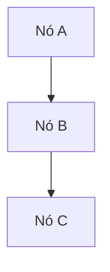
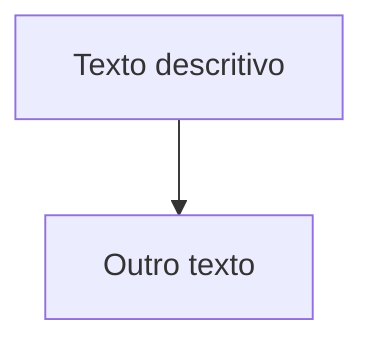
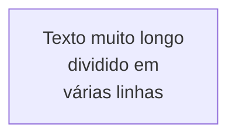
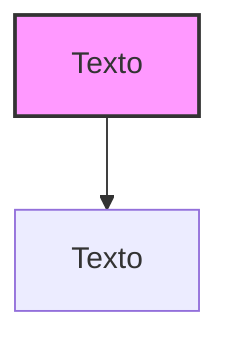
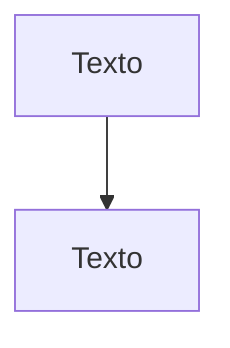
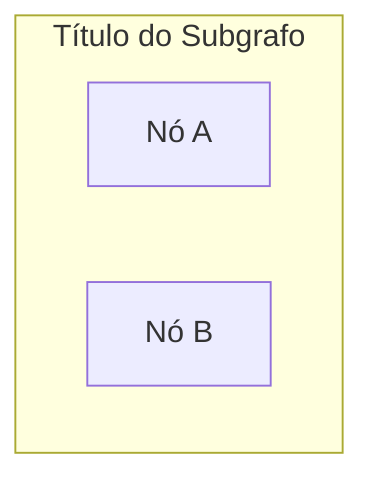
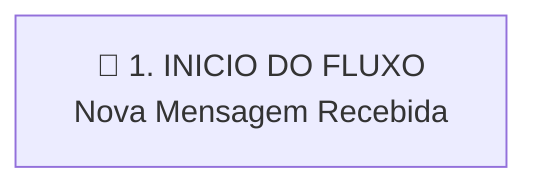
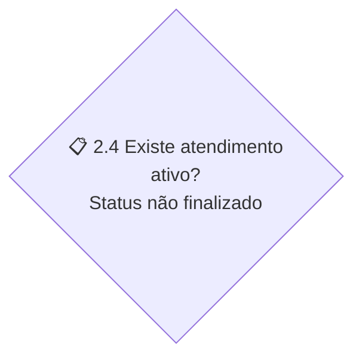
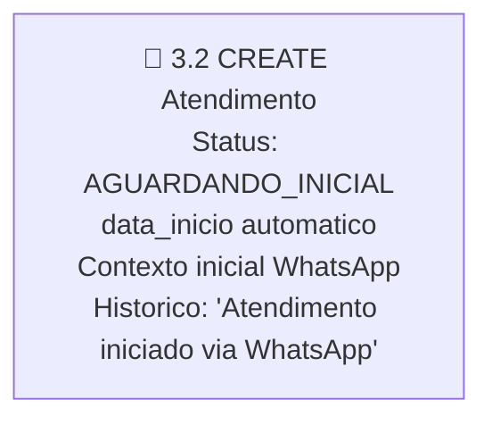

# Diretrizes de Formatação para Diagramas Mermaid

## Introdução

Este documento contém regras e boas práticas para a formatação de diagramas Mermaid, especificamente focados no tipo de diagrama de fluxo (`graph TD`). O objetivo é prevenir erros comuns de sintaxe e garantir consistência na manutenção dos diagramas.

## Regras Gerais de Sintaxe

### 1. Estrutura Básica



### 2. Identificadores de Nós

- Os identificadores dos nós devem ser simples (alfanuméricos)
- Evite usar espaços ou caracteres especiais nos identificadores dos nós



## Caracteres Especiais e Problemas Comuns

### 1. Aspas Duplas (")

- **PROBLEMA**: Aspas duplas em textos dentro dos nós podem causar erros de interpretação no parser Mermaid
- **SOLUÇÃO**: Use aspas simples (') em vez de aspas duplas

```
✅ CORRETO:
node[Texto com 'aspas simples']

❌ INCORRETO:
node[Texto com "aspas duplas"]
```

### 2. Parênteses ()

- **PROBLEMA**: Parênteses em textos dentro dos nós podem ser confundidos com sintaxe do Mermaid
- **SOLUÇÃO**: Evite usar parênteses em textos dentro dos nós ou remova-os

```
✅ CORRETO:
node[cliente.save]
node[método save]

❌ INCORRETO:
node[cliente.save()]
node[método save()]
```

### 3. Caracteres de Quebra de Linha

- Use `<br/>` para quebrar linhas dentro de nós
- Certifique-se de que não há espaços antes ou depois de `<br/>`

```
✅ CORRETO:
node[Primeira linha<br/>Segunda linha]

❌ INCORRETO:
node[Primeira linha <br/> Segunda linha]
```

### 4. Símbolos Reservados

Evite usar os seguintes símbolos em textos de nós sem escape adequado:
- `{` e `}` (chaves)
- `(` e `)` (parênteses)
- `[` e `]` (colchetes) - apenas dentro do texto, não nos delimitadores de nós
- `>` e `<` (maior/menor que)
- `&`, `|`, `!` (operadores lógicos)
- `:` (dois pontos) - especialmente em contextos ambíguos

## Formatação de Textos Longos

### 1. Texto em Múltiplas Linhas



### 2. Textos que Contêm Código

Ao referenciar nomes de métodos ou funções:

```
✅ CORRETO:
node[função timezone.now]
node[método objeto.save]

❌ INCORRETO:
node[função timezone.now()]
node[método objeto.save()]
```

## Conectores entre Nós

### 1. Tipos de Conectores

- Seta simples: `-->`
- Seta com texto: `-->|Texto da seta|`
- Linha tracejada: `-.->` 
- Linha tracejada com texto: `-.->|Texto da seta|`

### 2. Formatação de Textos nos Conectores

```
✅ CORRETO:
A -->|Sim| B
A -->|✅ Sim| B
A -.->|Loop| B

❌ INCORRETO:
A -->|"Sim"| B  (aspas duplas)
A -->|(Sim)| B  (parênteses)
```

## Estilos e Classes

### 1. Definição de Classes



### 2. Aplicação Direta de Estilos



## Subgrafos

### 1. Formatação Correta



### 2. Evite Espaços em Branco nos Identificadores

```
✅ CORRETO:
subgraph SubgrafoA ["Título do Subgrafo"]

❌ INCORRETO:
subgraph Subgrafo A ["Título do Subgrafo"]
```

## Exemplos de Nós do Diagrama Atual

### Exemplo de Nó com Formatação Correta



### Exemplo de Nó de Decisão



### Exemplo de Nó de Banco de Dados



## Processo de Validação

Antes de finalizar as alterações em um diagrama Mermaid, verifique:

1. Substitua todas as aspas duplas por aspas simples dentro dos textos dos nós
2. Remova parênteses de chamadas de funções (transforme `método()` em `método`)
3. Verifique se não há símbolos reservados sem escape adequado
4. Teste o diagrama em um visualizador Mermaid para garantir que a sintaxe está correta

## Referências

- [Documentação Oficial do Mermaid](https://mermaid-js.github.io/mermaid/#/)
- [Sintaxe de Diagramas de Fluxo](https://mermaid-js.github.io/mermaid/#/flowchart)
- [Editor Online de Mermaid](https://mermaid-js.github.io/mermaid-live-editor/)
