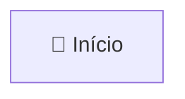
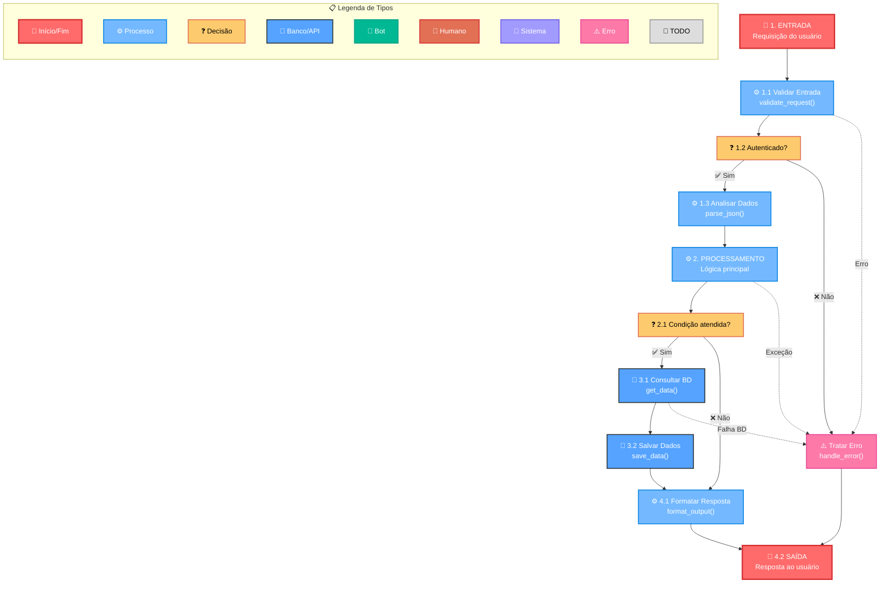
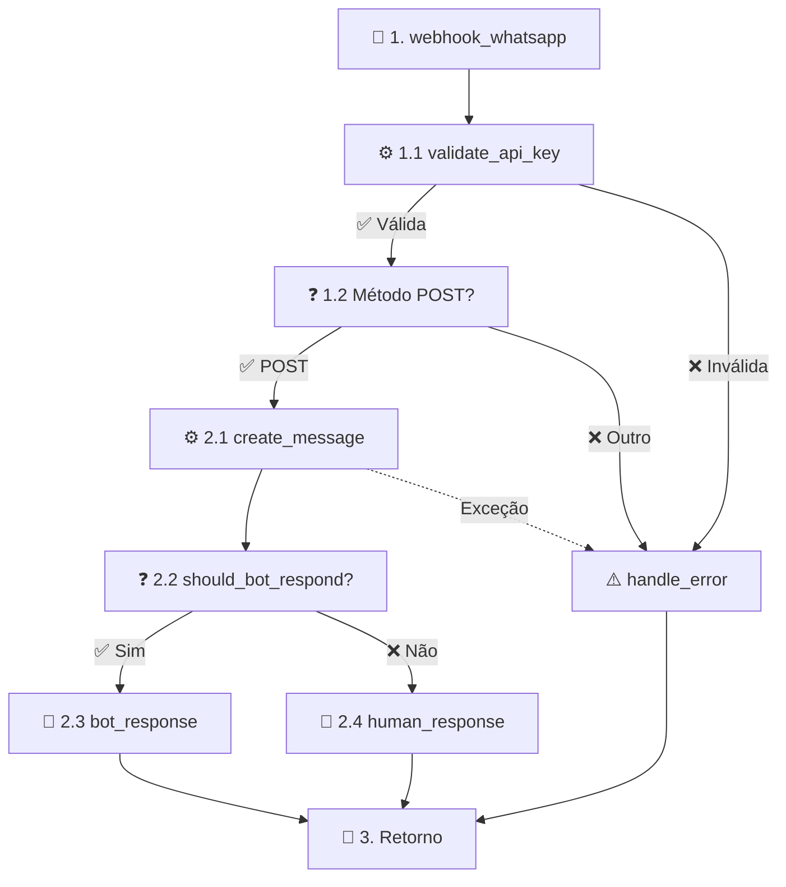
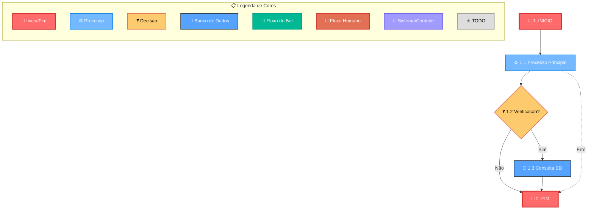
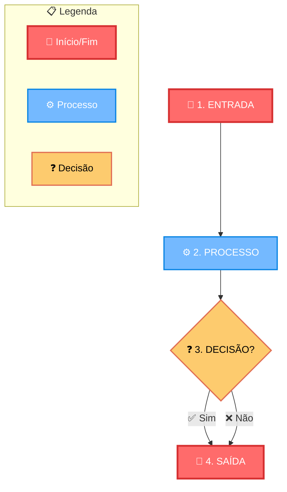

# Instruções para Criação de Diagramas Mermaid

## 🎯 Objetivo Principal

Esta documentação serve como **contexto essencial para IA** na geração automática de diagramas Mermaid que representem fielmente a arquitetura e funcionalidades do projeto. As diretrizes garantem:

### Para Desenvolvedores
- **Compreensão visual** da arquitetura do sistema
- **Padronização** de fluxos, classes e processos
- **Documentação viva** sincronizada com o código-fonte
- **Facilidade de manutenção** e evolução dos diagramas

### Para IA (Assistente de Código)
- **Contexto estruturado** para geração automática de diagramas
- **Padrões consistentes** que garantem qualidade e legibilidade
- **Sintaxe segura** que evita erros de parsing
- **Mapeamento direto** entre código e representação visual
- **Compatibilidade garantida** com ferramentas de documentação

## 🤖 Instruções Específicas para IA

### Quando Gerar Diagramas
A IA deve criar diagramas Mermaid quando:
- Analisar fluxos de código complexos
- Documentar arquitetura de módulos
- Explicar processos de negócio
- Mapear integrações entre sistemas
- Visualizar estruturas de classes
- Demonstrar fluxos de dados

### Princípios de Geração
1. **Fidelidade ao Código**: O diagrama deve refletir exatamente a implementação
2. **Clareza Visual**: Use cores e símbolos para facilitar compreensão
3. **Numeração Hierárquica**: Organize passos logicamente (1.1, 1.2, 2.1)
4. **Modularidade**: Agrupe processos relacionados em subgrafos
5. **Completude**: Inclua todos os caminhos possíveis, incluindo erros

## 📁 Formato de Arquivo

**IMPORTANTE**: Todos os fluxogramas devem ser criados em arquivos com extensão `.mmd` (Mermaid):

- ✅ **Correto**: `fluxograma_webhook_whatsapp.mmd`
- ❌ **Incorreto**: `fluxograma_webhook_whatsapp.md`

### ⚠️ Conteúdo dos Arquivos .mmd

**CRÍTICO**: Arquivos `.mmd` devem conter **APENAS** código Mermaid puro:

- ✅ **Correto**: Apenas código `flowchart TD` sem markdown
- ❌ **Incorreto**: Títulos, descrições, blocos ```mermaid``` ou qualquer markdown
- 📓 **Documentação**: Deve estar nos arquivos `.md` separados (notas técnicas)

### Estrutura de Arquivos
```
docs/diagramas/
└─ modulo/
  └─ funcionalidade/
    └─ fluxograma_nome.mmd          # APENAS código Mermaid
    └─ notas_tecnicas_nome.md       # Documentação técnica
└─ INSTRUCOES_CRIACAO_DIAGRAMA.md
```

### Exemplo de Arquivo .mmd Correto
```
flowchart TD
    Start[🚀 Início]:::startEnd
    Process[⚙️ Processo]:::process
    Start --> Process
```

### ❌ Exemplo Incorreto (NÃO fazer)
```
# Título do Fluxograma

## Descrição
Este é um fluxograma...


```

## Numeração de Passos e Correspondência com Notas

- **Estilo de Numeração**: Adote uma numeração hierárquica para os passos no diagrama, como '1. INICIO DO FLUXO', '1.1 webhook_whatsapp', etc. Isso ajuda a organizar o fluxo logicamente.
- **Correspondência com Arquivo de Notas**: Cada número no diagrama deve corresponder a uma seção em um arquivo de notas separado, onde se detalha o processo, implementação e justificativas. Por exemplo, a seção '1.1' nas notas explica a função correspondente no diagrama.
- **Benefícios**: Facilita a manutenção, depuração e compreensão, alinhando o visual com documentação detalhada.
- **Estilo Visual**: Siga o estilo do exemplo completo abaixo, incluindo definições de classes, cores, legendas e subgrafos para consistência visual.

## 🏗️ Mapeamento de Código para Diagrama

### Correspondência Direta com Implementação
Cada elemento do diagrama deve ter correspondência direta com o código:

#### Estruturas de Código → Elementos Visuais
- **Funções/Métodos** → Nós de processo `[⚙️ nome_funcao]`
- **Condicionais (if/else)** → Nós de decisão `{❓ condicao?}`
- **Loops (for/while)** → Subgrafos com setas circulares
- **Try/Except** → Conectores pontilhados para tratamento de erro
- **Classes** → Subgrafos agrupando métodos relacionados
- **APIs/Banco de Dados** → Nós específicos `[💾 consulta_bd]`
- **Retornos** → Nós de fim `[🏁 retorno]`

#### Fluxo de Execução → Numeração Hierárquica
- **Entrada do sistema**: `1. INICIO`
- **Validações iniciais**: `1.1, 1.2, 1.3...`
- **Processamento principal**: `2. PROCESSAMENTO`
- **Sub-processos**: `2.1, 2.2, 2.3...`
- **Saída/Retorno**: `3. FIM`

### Arquitetura em Camadas
Represente a arquitetura do projeto seguindo estas camadas:

#### 1. Camada de Entrada (1.x)
- **Usuário/Cliente**: Ponto de entrada do sistema
- **Interface (API/Web/App)**: Recepção e validação de dados
- **Autenticação**: Verificação de credenciais
- **Parsing**: Análise e estruturação de dados de entrada

#### 2. Camada de Orquestração (2.x)
- **Roteamento**: Direcionamento para processadores específicos
- **Validação de Negócio**: Regras e políticas do sistema
- **Coordenação**: Gerenciamento de fluxo entre módulos

#### 3. Camada de Processamento (3.x)
- **Lógica de Negócio**: Algoritmos e processamento principal
- **Transformação de Dados**: Conversões e manipulações
- **Cálculos**: Operações matemáticas e lógicas

#### 4. Camada de Dados (4.x)
- **Consultas**: Operações de leitura em banco/API
- **Persistência**: Operações de escrita e atualização
- **Cache**: Armazenamento temporário

#### 5. Camada de Saída (5.x)
- **Formatação**: Estruturação da resposta
- **Serialização**: Conversão para formato de saída
- **Entrega**: Envio da resposta ao cliente

## Justificativas Técnicas para a Modelagem

### Arquitetura e Design
- **Modularidade**: Separação clara de responsabilidades facilita manutenção e evolução do código
- **Escalabilidade**: Estrutura permite adição de novos fluxos sem impactar existentes
- **Rastreabilidade**: Numeração hierárquica conecta diagramas com documentação técnica
- **Padrões SOLID**: Visualização de princípios de design orientado a objetos

### Visualização e Comunicação
- **Clareza Visual**: Cores padronizadas facilitam identificação rápida de tipos de operação
- **Fluxo Lógico**: Conectores rotulados explicitam condições e dependências
- **Redução de Complexidade**: Subgrafos agrupam processos relacionados
- **Documentação Viva**: Diagramas refletem estado atual do sistema

### Compatibilidade Técnica
- **Sintaxe Segura**: Evita caracteres especiais que causam erros de parsing
- **Integração MkDocs**: Compatível com pipeline de documentação do projeto
- **Versionamento**: Diagramas como código permitem controle de versão
- **Automação**: Estrutura padronizada facilita geração automática pela IA

## Diagrama Mermaid

Inclua numeração nos rótulos dos nós, como '1.1 InterfaceAplicacao', e siga o estilo visual do exemplo completo fornecido abaixo.

## Diretrizes de Formatação Mermaid

### Sintaxe Segura e Compatibilidade

- **Tipo de diagrama**: SEMPRE use `flowchart TD` em vez de `graph TD` para melhor compatibilidade
- **Evitar caracteres especiais**: Não use acentos, cedilhas ou caracteres especiais nos IDs dos nós (ex.: use `Decisao` em vez de `Decisão`)
- **Palavras-chave em inglês**: Use APENAS palavras-chave Mermaid em inglês (direction, subgraph, end, etc.)
- **IDs consistentes**: Mantenha IDs de nós em inglês e sem espaços (ex.: `CheckMethod` não `Verificar Método`)
- **Classes CSS consistentes**: Use nomes de classes sem espaços e caracteres especiais
- **Quebras de linha**: Use `<br/>` para quebras de linha dentro dos rótulos dos nós
- **Aspas e escape**: Use aspas duplas para rótulos e escape caracteres especiais quando necessário
- **Comentários**: Use `%%` para comentários explicativos no código Mermaid
- **Conectores rotulados**: Use `-->|Rótulo|` para adicionar descrições às conexões
- **Conectores pontilhados**: Use `-.->` para fluxos de erro ou alternativos

### Estrutura Recomendada

1. **Definições de classes CSS** no início do diagrama
2. **Legenda visual** com exemplos de cada tipo de nó
3. **Fluxo principal** com numeração hierárquica
4. **Subgrafos** para agrupar processos relacionados
5. **Tratamento de erros** separado do fluxo principal

### Padrões de Nomenclatura

- **IDs de nós**: CamelCase sem acentos (ex.: `CheckBotCanRespond`)
- **Rótulos**: Descritivos com emojis e numeração (ex.: `🤖 2.1 Verificar Bot`)
- **Subgrafos**: Nomes descritivos entre aspas (ex.: `"Processamento Principal"`)

### Erros Comuns e Como Evitar

#### ❌ Erros de Sintaxe
- **NUNCA use**: `graph TD` → **SEMPRE use**: `flowchart TD`
- **NUNCA use**: `gráfico TD` ou outras traduções → **SEMPRE use**: palavras-chave em inglês
- **NUNCA use**: `direção TB` → **SEMPRE use**: `direction TB`
- **NUNCA use**: `fim` → **SEMPRE use**: `end`
- **NUNCA use**: Parênteses em labels de nós (`funcao()`) → **SEMPRE use**: sem parênteses (`funcao`)
- **NUNCA use**: Caracteres especiais em IDs (`@`, `#`, `$`, etc.) → **SEMPRE use**: apenas letras e números

#### ❌ Erros de Nomenclatura
- **NUNCA use**: IDs com espaços (`Verificar Método`) → **SEMPRE use**: CamelCase (`CheckMethod`)
- **NUNCA use**: Acentos em IDs (`decisão`) → **SEMPRE use**: ASCII (`decisao`)
- **NUNCA use**: Classes com espaços (`banco de dados`) → **SEMPRE use**: camelCase (`database`)
- **NUNCA use**: Parênteses em labels (`Processar nova_mensagem()`) → **SEMPRE use**: sem parênteses (`Processar nova_mensagem`)
- **NUNCA use**: Underscore em IDs (`_funcao`) → **SEMPRE use**: camelCase (`funcao`) ou `funcaoPrivada`

#### ❌ Erros de Referência
- **NUNCA use**: Classes inexistentes (`:::decisão`) → **SEMPRE use**: classes definidas (`:::decision`)
- **NUNCA use**: IDs inconsistentes → **SEMPRE use**: mesmos IDs em definição e referência

#### ❌ Erros de Extensão de Arquivo
- **NUNCA use**: `.md` para fluxogramas → **SEMPRE use**: `.mmd`
- **NUNCA use**: `.txt` ou outras extensões → **SEMPRE use**: `.mmd` para diagramas Mermaid
- **Exemplo correto**: `fluxograma_webhook_whatsapp.mmd`
- **Exemplo incorreto**: `fluxograma_webhook_whatsapp.md`

#### ❌ Erros de Conteúdo em Arquivos .mmd
- **NUNCA use**: Títulos markdown (`# Título`) → **SEMPRE use**: apenas código Mermaid
- **NUNCA use**: Blocos ```mermaid``` → **SEMPRE use**: código direto
- **NUNCA use**: Descrições em markdown → **SEMPRE use**: arquivos .md separados
- **NUNCA use**: Mistura de markdown + Mermaid → **SEMPRE use**: .mmd puro

#### ✅ Exemplo Correto vs Incorreto
```mermaid
%% ❌ INCORRETO
grafico TD
    decisao{Verificar?}:::decisao
    direcao TB
fim

%% ✅ CORRETO
flowchart TD
    CheckDecision{Verificar?}:::decision
    direction TB
end
```

## 📋 Template Padrão para IA

### Estrutura Obrigatória
Todo diagrama gerado pela IA deve seguir esta estrutura:



### Exemplo Prático: Webhook WhatsApp
Exemplo de como mapear código real para diagrama:

```python
# Código Python
def webhook_whatsapp(request):
    # 1.1 Validação
    if not validate_api_key(request.headers):
        return error_response("Invalid API key")
    
    # 1.2 Verificação do método
    if request.method != "POST":
        return error_response("Method not allowed")
    
    # 2. Processamento
    try:
        message = create_message(request.json)
        if should_bot_respond(message):
            return bot_response(message)
        else:
            return human_response(message)
    except Exception as e:
        return handle_error(e)
```

**Diagrama correspondente:**


## Introdução

Esta documentação estabelece diretrizes padronizadas para criação de diagramas Mermaid (flowchart, classDiagram, etc.) baseados na arquitetura e funcionalidades do projeto. O objetivo é:

- **Facilitar a compreensão** da arquitetura do sistema para desenvolvedores e stakeholders
- **Padronizar a visualização** de fluxos, classes e processos do projeto
- **Auxiliar a IA** na geração automática de diagramas consistentes e legíveis
- **Manter a documentação visual** sincronizada com o código-fonte
- **Garantir compatibilidade** com ferramentas como MkDocs e visualizadores Mermaid

Todos os diagramas devem seguir estas diretrizes para manter consistência visual e facilitar a manutenção.

## 📁 Formato de Arquivo

**IMPORTANTE**: Todos os fluxogramas devem ser criados em arquivos com extensão `.mmd` (Mermaid):

- ✅ **Correto**: `fluxograma_webhook_whatsapp.mmd`
- ❌ **Incorreto**: `fluxograma_webhook_whatsapp.md`

### ⚠️ Conteúdo dos Arquivos .mmd

**CRÍTICO**: Arquivos `.mmd` devem conter **APENAS** código Mermaid puro:

- ✅ **Correto**: Apenas código `flowchart TD` sem markdown
- ❌ **Incorreto**: Títulos, descrições, blocos ```mermaid``` ou qualquer markdown
- 📝 **Documentação**: Deve estar nos arquivos `.md` separados (notas técnicas)

### Estrutura de Arquivos
```
docs/diagramas/
├── modulo/
│   ├── funcionalidade/
│   │   ├── fluxograma_nome.mmd          # APENAS código Mermaid
│   │   ├── notas_tecnicas_nome.md       # Documentação técnica
│   └── ...
└── INSTRUCOES_CRIACAO_DIAGRAMA.md
```

### Exemplo de Arquivo .mmd Correto
```
flowchart TD
    Start[🚀 Início]:::startEnd
    Process[⚙️ Processo]:::process
    Start --> Process
```

### ❌ Exemplo Incorreto (NÃO fazer)
```
# Título do Fluxograma

## Descrição
Este é um fluxograma...


```

## Numeração de Passos e Correspondência com Notas

- **Estilo de Numeração**: Adote uma numeração hierárquica para os passos no diagrama, como '1. INICIO DO FLUXO', '1.1 webhook_whatsapp', etc. Isso ajuda a organizar o fluxo logicamente.
- **Correspondência com Arquivo de Notas**: Cada número no diagrama deve corresponder a uma seção em um arquivo de notas separado, onde se detalha o processo, implementação e justificativas. Por exemplo, a seção '1.1' nas notas explica a função correspondente no diagrama.
- **Benefícios**: Facilita a manutenção, depuração e compreensão, alinhando o visual com documentação detalhada.
- **Estilo Visual**: Siga o estilo do exemplo completo abaixo, incluindo definições de classes, cores, legendas e subgrafos para consistência visual.

## Descrição dos Módulos/Classes

Ao descrever módulos ou classes, associe-os a números de passos para facilitar a referência cruzada com o arquivo de notas.

- **Usuário**: Representa o ponto de entrada, onde o usuário interage com o sistema (ex.: 1. INICIO).
- **Interface de Aplicação (API/Web/App)**: Camada de interação que recebe e valida entradas (ex.: 1.1 Validação).
- **Sistema de Orquestração**: Gerencia o fluxo de tarefas e integrações (ex.: 2. Orquestração).
- **Processamento Principal**: Núcleo do sistema, baseado em classes e funções do projeto (ex.: 3. Processamento).
- **Fontes de Dados Externas**: Integrações com bancos de dados, APIs ou outros recursos (ex.: 3.1 Consulta).
- **Pós-processamento**: Refina saídas, aplicando lógicas adicionais (ex.: 4. Refinamento).
- **Retorno ao Usuário**: Envia a resposta final (ex.: 5. Saída).

## Justificativas Técnicas para a Modelagem

### Arquitetura e Design
- **Modularidade**: Separação clara de responsabilidades facilita manutenção e evolução do código
- **Escalabilidade**: Estrutura permite adição de novos fluxos sem impactar existentes
- **Rastreabilidade**: Numeração hierárquica conecta diagramas com documentação técnica
- **Padrões SOLID**: Visualização de princípios de design orientado a objetos

### Visualização e Comunicação
- **Clareza Visual**: Cores padronizadas facilitam identificação rápida de tipos de operação
- **Fluxo Lógico**: Conectores rotulados explicitam condições e dependências
- **Redução de Complexidade**: Subgrafos agrupam processos relacionados
- **Documentação Viva**: Diagramas refletem estado atual do sistema

### Compatibilidade Técnica
- **Sintaxe Segura**: Evita caracteres especiais que causam erros de parsing
- **Integração MkDocs**: Compatível com pipeline de documentação do projeto
- **Versionamento**: Diagramas como código permitem controle de versão
- **Automação**: Estrutura padronizada facilita geração automática pela IA

## Diagrama Mermaid

Inclua numeração nos rótulos dos nós, como '1.1 InterfaceAplicacao', e siga o estilo visual do exemplo completo fornecido abaixo.

## Diretrizes de Formatação Mermaid

### Sintaxe Segura e Compatibilidade

- **Tipo de diagrama**: SEMPRE use `flowchart TD` em vez de `graph TD` para melhor compatibilidade
- **Evitar caracteres especiais**: Não use acentos, cedilhas ou caracteres especiais nos IDs dos nós (ex.: use `Decisao` em vez de `Decisão`)
- **Palavras-chave em inglês**: Use APENAS palavras-chave Mermaid em inglês (direction, subgraph, end, etc.)
- **IDs consistentes**: Mantenha IDs de nós em inglês e sem espaços (ex.: `CheckMethod` não `Verificar Método`)
- **Classes CSS consistentes**: Use nomes de classes sem espaços e caracteres especiais
- **Quebras de linha**: Use `<br/>` para quebras de linha dentro dos rótulos dos nós
- **Aspas e escape**: Use aspas duplas para rótulos e escape caracteres especiais quando necessário
- **Comentários**: Use `%%` para comentários explicativos no código Mermaid
- **Conectores rotulados**: Use `-->|Rótulo|` para adicionar descrições às conexões
- **Conectores pontilhados**: Use `-.->` para fluxos de erro ou alternativos

### Estrutura Recomendada

1. **Definições de classes CSS** no início do diagrama
2. **Legenda visual** com exemplos de cada tipo de nó
3. **Fluxo principal** com numeração hierárquica
4. **Subgrafos** para agrupar processos relacionados
5. **Tratamento de erros** separado do fluxo principal

### Padrões de Nomenclatura

- **IDs de nós**: CamelCase sem acentos (ex.: `CheckBotCanRespond`)
- **Rótulos**: Descritivos com emojis e numeração (ex.: `🤖 2.1 Verificar Bot`)
- **Subgrafos**: Nomes descritivos entre aspas (ex.: `"Processamento Principal")

### Erros Comuns e Como Evitar

#### ❌ Erros de Sintaxe
- **NUNCA use**: `graph TD` → **SEMPRE use**: `flowchart TD`
- **NUNCA use**: `gráfico TD` ou outras traduções → **SEMPRE use**: palavras-chave em inglês
- **NUNCA use**: `direção TB` → **SEMPRE use**: `direction TB`
- **NUNCA use**: `fim` → **SEMPRE use**: `end`
- **NUNCA use**: Parênteses em labels de nós (`funcao()`) → **SEMPRE use**: sem parênteses (`funcao`)
- **NUNCA use**: Caracteres especiais em IDs (`@`, `#`, `$`, etc.) → **SEMPRE use**: apenas letras e números

#### ❌ Erros de Nomenclatura
- **NUNCA use**: IDs com espaços (`Verificar Método`) → **SEMPRE use**: CamelCase (`CheckMethod`)
- **NUNCA use**: Acentos em IDs (`decisão`) → **SEMPRE use**: ASCII (`decision`)
- **NUNCA use**: Classes com espaços (`banco de dados`) → **SEMPRE use**: camelCase (`database`)
- **NUNCA use**: Parênteses em labels (`Processar nova_mensagem()`) → **SEMPRE use**: sem parênteses (`Processar nova_mensagem`)
- **NUNCA use**: Underscore em IDs (`_funcao`) → **SEMPRE use**: camelCase (`funcao`) ou `funcaoPrivada`

#### ❌ Erros de Referência
- **NUNCA use**: Classes inexistentes (`:::decisão`) → **SEMPRE use**: classes definidas (`:::decision`)
- **NUNCA use**: IDs inconsistentes → **SEMPRE use**: mesmos IDs em definição e referência

#### ❌ Erros de Extensão de Arquivo
- **NUNCA use**: `.md` para fluxogramas → **SEMPRE use**: `.mmd`
- **NUNCA use**: `.txt` ou outras extensões → **SEMPRE use**: `.mmd` para diagramas Mermaid
- **Exemplo correto**: `fluxograma_webhook_whatsapp.mmd`
- **Exemplo incorreto**: `fluxograma_webhook_whatsapp.md`

#### ❌ Erros de Conteúdo em Arquivos .mmd
- **NUNCA use**: Títulos markdown (`# Título`) → **SEMPRE use**: apenas código Mermaid
- **NUNCA use**: Blocos ```mermaid``` → **SEMPRE use**: código direto
- **NUNCA use**: Descrições em markdown → **SEMPRE use**: arquivos .md separados
- **NUNCA use**: Mistura de markdown + Mermaid → **SEMPRE use**: .mmd puro

#### ✅ Exemplo Correto vs Incorreto
```mermaid
%% ❌ INCORRETO
gráfico TD
    decisão{Verificar?}:::decisão
    direção TB
fim

%% ✅ CORRETO
flowchart TD
    CheckDecision{Verificar?}:::decision
    direction TB
end
```

## Exemplo de Referência de Estilo Visual

Use este exemplo como base para definições de classes, cores e estrutura. Adapte conforme necessário para o contexto específico:



## Legenda de Cores e Significados

- **🚀 Vermelho (startEnd)**: Pontos de início e fim do fluxo
- **⚙️ Azul (process)**: Processos e operações gerais
- **❓ Amarelo (decision)**: Pontos de decisão e verificações
- **💾 Azul Escuro (database)**: Operações de banco de dados
- **🤖 Verde (botFlow)**: Fluxos automatizados do bot
- **👤 Laranja (humanFlow)**: Fluxos direcionados para humanos
- **🔧 Roxo (systemFlow)**: Controles e verificações do sistema
- **🔄 Rosa (transferFlow)**: Transferências e redirecionamentos
- **⚠️ Cinza (todoFlow)**: Funcionalidades não implementadas

## Boas Práticas de Implementação

- **Consistência Visual**: Sempre use as mesmas cores para tipos similares de operações
- **Numeração Hierárquica**: Mantenha a numeração sequencial e lógica (1.1, 1.2, 2.1, etc.)
- **Documentação Paralela**: Crie arquivos de notas correspondentes para explicações detalhadas
- **Modularidade**: Use subgrafos para agrupar processos relacionados
- **Tratamento de Erros**: Sempre inclua fluxos de erro com conectores pontilhados
- **Legibilidade**: Prefira rótulos descritivos com emojis para facilitar a compreensão

## 🤖 Prompts Recomendados para IA

### Prompt Base para Geração de Diagramas
```
Crie um diagrama Mermaid (.mmd) que represente o fluxo do código [NOME_FUNCAO/MODULO]. 
Siga as instruções do arquivo INSTRUCOES_CRIACAO_DIAGRAMA.md:

1. Use APENAS código Mermaid puro (sem markdown)
2. Inclua legenda de cores obrigatória
3. Numeração hierárquica (1.1, 1.2, 2.1, etc.)
4. Mapeie cada função/método para um nó específico
5. Use conectores rotulados para decisões
6. Inclua tratamento de erros com conectores pontilhados
7. Agrupe processos relacionados em subgrafos

Código a analisar:
[INSERIR_CODIGO_AQUI]
```

### Prompt para Análise de Arquitetura
```
Analise a arquitetura do módulo [NOME] e crie um diagrama Mermaid que mostre:
- Camadas da aplicação (1.x Entrada, 2.x Orquestração, 3.x Processamento, 4.x Dados, 5.x Saída)
- Fluxo de dados entre componentes
- Integrações externas (APIs, banco de dados)
- Pontos de decisão e validação
- Tratamento de erros

Siga o template padrão das instruções de criação de diagramas.
```

### Prompt para Documentação de API
```
Documente o endpoint [ENDPOINT] criando um diagrama Mermaid que mostre:
- Validação de entrada (autenticação, parâmetros)
- Processamento da requisição
- Consultas ao banco de dados
- Formatação da resposta
- Códigos de erro possíveis

Use o padrão de numeração hierárquica e cores definidas nas instruções.
```

## ✅ Checklist de Validação para IA

### Antes de Gerar o Diagrama
- [ ] **Analisei o código** completamente para entender o fluxo
- [ ] **Identifiquei todas as funções** e métodos principais
- [ ] **Mapeei condicionais** (if/else) para nós de decisão
- [ ] **Localizei operações de BD/API** para nós específicos
- [ ] **Identifiquei tratamento de erros** (try/except)
- [ ] **Entendi a arquitetura** em camadas do sistema

### Durante a Geração
- [ ] **Estrutura obrigatória**: Definições CSS → Legenda → Fluxo → Conexões
- [ ] **Sintaxe segura**: `flowchart TD`, IDs em CamelCase, sem acentos
- [ ] **Numeração hierárquica**: 1.x, 2.x, 3.x seguindo as camadas
- [ ] **Cores corretas**: startEnd, process, decision, database, etc.
- [ ] **Legenda completa**: Todos os tipos de nó representados
- [ ] **Conectores rotulados**: Decisões com "✅ Sim"/"❌ Não"
- [ ] **Erros pontilhados**: `-.->` para fluxos de exceção
- [ ] **Emojis apropriados**: 🚀 início, ⚙️ processo, ❓ decisão, etc.

### Após a Geração
- [ ] **Arquivo .mmd puro**: Sem markdown, títulos ou blocos ```mermaid```
- [ ] **Sintaxe válida**: Testada em visualizador Mermaid
- [ ] **Fidelidade ao código**: Diagrama reflete implementação real
- [ ] **Completude**: Todos os caminhos possíveis representados
- [ ] **Clareza visual**: Fluxo fácil de seguir e compreender
- [ ] **Documentação**: Correspondência com notas técnicas (se aplicável)

### Validação Técnica Específica
- [ ] **IDs únicos**: Cada nó tem identificador único
- [ ] **Classes definidas**: Todas as classes CSS estão declaradas
- [ ] **Referências corretas**: Classes aplicadas corretamente (:::process)
- [ ] **Conectores válidos**: Sintaxe correta para setas e rótulos
- [ ] **Subgrafos**: Agrupamentos lógicos quando necessário
- [ ] **Comentários**: Seções bem documentadas com %%

### Critérios de Qualidade
- [ ] **Legibilidade**: Rótulos claros e descritivos
- [ ] **Organização**: Fluxo lógico de cima para baixo
- [ ] **Consistência**: Padrão visual mantido em todo diagrama
- [ ] **Utilidade**: Diagrama ajuda na compreensão do código
- [ ] **Manutenibilidade**: Fácil de atualizar quando código mudar

## 📚 Resumo Executivo para IA

### Objetivo Principal
Este documento serve como **contexto essencial** para assistentes de IA gerarem diagramas Mermaid que representem fielmente a arquitetura e funcionalidades do projeto smart-core-assistant-painel.

### Regras Fundamentais
1. **Arquivo .mmd puro**: APENAS código Mermaid, sem markdown
2. **Estrutura obrigatória**: CSS → Legenda → Fluxo → Conexões
3. **Sintaxe segura**: `flowchart TD`, IDs em CamelCase, sem acentos
4. **Mapeamento direto**: Cada função/método → nó específico
5. **Numeração hierárquica**: Camadas 1.x a 5.x (Entrada → Saída)

### Template Mínimo


### Cores Padronizadas
- **🚀 Vermelho (#ff6b6b)**: Início/Fim
- **⚙️ Azul (#74b9ff)**: Processos
- **❓ Amarelo (#fdcb6e)**: Decisões
- **💾 Azul Escuro (#55a3ff)**: Banco/API
- **🤖 Verde (#00b894)**: Bot/Automação
- **👤 Laranja (#e17055)**: Humano/Manual
- **⚠️ Rosa (#fd79a8)**: Erros/Exceções

### Arquitetura em 5 Camadas
1. **1.x Entrada**: Validação, autenticação, parsing
2. **2.x Orquestração**: Roteamento, coordenação
3. **3.x Processamento**: Lógica de negócio, algoritmos
4. **4.x Dados**: Consultas, persistência, cache
5. **5.x Saída**: Formatação, serialização, entrega

### Elementos Obrigatórios
- ✅ Legenda visual completa
- ✅ Numeração hierárquica
- ✅ Tratamento de erros (pontilhados)
- ✅ Conectores rotulados
- ✅ Emojis descritivos
- ✅ Mapeamento fiel ao código

### Validação Final
Antes de entregar o diagrama, verificar:
- Sintaxe Mermaid válida
- Arquivo .mmd puro (sem markdown)
- Todas as funções mapeadas
- Fluxos de erro incluídos
- Legenda completa
- Numeração consistente

---

**📝 Nota**: Este documento é atualizado regularmente para manter compatibilidade com as melhores práticas de documentação visual e geração automática de diagramas.