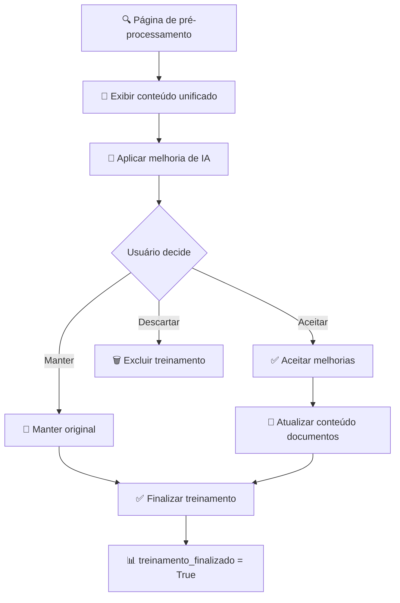

# Fluxo de Treinamento de IA - Arquitetura Otimizada

## 📋 Visão Geral

O novo fluxo de treinamento foi redesenhado para ser mais fluido, organizado e eficiente, utilizando uma arquitetura limpa que separa responsabilidades e otimiza o armazenamento de documentos e embeddings.

## 🎯 Objetivos da Refatoração

- **Simplificação**: Remover duplicação de dados entre JSON e modelo relacional
- **Performance**: Embeddings pré-calculados e armazenados diretamente no banco
- **Manutenibilidade**: Código mais limpo e organizado
- **Escalabilidade**: Estrutura preparada para grandes volumes de documentos

## 🏗️ Arquitetura dos Modelos

### Modelo Principal: `Treinamentos`
```
┌─────────────────────────────────────────┐
│             Treinamentos                │
├─────────────────────────────────────────┤
│ • id (PK)                              │
│ • tag (str, 40 chars, unique)          │
│ • grupo (str, 40 chars)                │
│ • conteudo (TextField)                 │
│ • treinamento_finalizado (bool)        │
│ • treinamento_vetorizado (bool)        │
│ • data_criacao (auto)                  │
│ • data_atualizacao (auto)              │
└─────────────────────────────────────────┘
```

### Modelo Relacionado: `Documento`
```
┌─────────────────────────────────────────┐
│               Documento                 │
├─────────────────────────────────────────┤
│ • id (PK)                              │
│ • treinamento (FK → Treinamentos)      │
│ • conteudo (TextField) - chunk         │
│ • metadata (JSONField)                 │
│ • embedding (VectorField, 1024d)       │
│ • ordem (PositiveInt)                  │
│ • data_criacao (auto)                  │
└─────────────────────────────────────────┘
```

### Relacionamento
```
Treinamentos 1 ←→ N Documento
    (related_name="documentos")

## 🔄 Fluxo Completo de Treinamento

### 1. **Criação/Edição de Treinamento**
``mermaid
graph TD
    A[📝 Usuário submete formulário] --> B{Modo de operação?}
    B -->|Novo| C[🆕 Criar novo Treinamento]
    B -->|Edição| D[✏️ Carregar treinamento existente]
    
    D --> E[🧹 Limpar documentos existentes]
    E --> F[🔄 treinamento.limpar_documentos()]
    
    C --> G[📋 Processar conteúdo/arquivo]
    F --> G
    
    G --> H[📚 RecursiveCharacterTextSplitter]
    H --> I[🎯 Lista de Document do LangChain]
```

### 2. **Processamento de Conteúdo com Embeddings Automáticos**
``mermaid
graph TD
    I[📄 Arquivo/Texto do Usuário] --> J[📝 Concatenar conteúdo completo]
    J --> K[💾 Armazenar em Treinamentos.conteudo]
    K --> L[🔧 processar_conteudo_para_chunks()]
    L --> M[🧠 RecursiveCharacterTextSplitter do LangChain]
    M --> N[✂️ Chunking automático com SERVICEHUB.CHUNK_SIZE e CHUNK_OVERLAP]
    N --> O[📊 Criar registros Documento]
    O --> P[🧠 Geração automática de embeddings no save()]
    P --> Q[✅ Chunks salvos como Documento com embeddings]
    Q --> R[🏁 Treinamento finalizado automaticamente]
```

### 3. **Busca Semântica**
``mermaid
graph TD
    EE[🎯 Sistema pronto para busca] --> FF[🔍 Consulta do usuário]
    FF --> GG[🧠 Gerar embedding da consulta]
    GG --> HH[📊 Documento.search_by_similarity()]
    HH --> II[🎯 Busca vetorial no banco]
    II --> JJ[📋 Documentos mais similares]
    JJ --> KK[🏆 Agrupar por treinamento]
    KK --> LL[📤 Retornar resultados rankeados]
```

## ⚙️ Métodos Principais

### Modelo `Treinamentos`

#### 📄 **processar_conteudo_para_chunks(conteudo_novo)**
- Armazena conteúdo completo no campo `conteudo`
- Aplica chunking automático via **RecursiveCharacterTextSplitter do LangChain**
- Usa configurações **SERVICEHUB.CHUNK_SIZE** e **SERVICEHUB.CHUNK_OVERLAP** para otimização
- Cria registros `Documento` para cada chunk gerado
- **Gera embeddings automaticamente** durante a criação
- **Finaliza o treinamento automaticamente** se todos os embeddings foram criados com sucesso

#### 🧹 **limpar_documentos()**
- Remove todos os documentos relacionados
- Usado durante edição para limpar dados antigos

#### 🎯 **vetorizar_documentos()**
- Gera embeddings para documentos que ainda não possuem embedding
- Usado principalmente para reprocessamento ou casos especiais
- **Finaliza automaticamente** o treinamento se todos os embeddings foram criados
- Controle individual de erros

#### 🔍 **search_by_similarity()**
- Busca treinamentos similares via documentos
- Agrupa resultados por treinamento
- Retorna melhor distância por treinamento

### Modelo `Documento`

#### 🧠 **save()**
- **NOVIDADE**: Gera embeddings automaticamente **antes** de salvar
- Garante que todos os documentos tenham embeddings válidos
- Previne a criação de documentos sem embeddings

#### 🧠 **gerar_embedding_sem_salvar()**
- Gera o embedding do documento sem salvar no banco
- Usado internamente pelo método save()
- **Implementação direta** com base no generate_embeddings_langchain_datasource.py
- Suporta múltiplos provedores: OpenAI, Ollama, HuggingFace
- Lança exceções em caso de erro na geração

#### 🧠 **gerar_embedding()**
- Gera o embedding do documento e salva no banco
- Mantido para compatibilidade com código existente
- Usa o método interno gerar_embedding_sem_salvar()

#### 🔍 **search_by_similarity()**
- Busca documentos similares via pgvector
- Filtros opcionais por grupo/tag
- Retorna documentos rankeados por distância

## 🎨 Vantagens da Nova Arquitetura

### ✅ **Performance**
- Embeddings pré-calculados no banco
- Busca vetorial direta sem geração em tempo real
- Geração de embeddings otimizada no save()

### ✅ **Manutenibilidade**
- Separação clara de responsabilidades
- Código mais limpo e organizado
- Melhor tratamento de erros

### ✅ **Escalabilidade**
- Estrutura preparada para grandes volumes
- Índices otimizados para busca
- Relacionamento eficiente 1:N

### ✅ **Flexibilidade**
- Metadados individuais por documento (incluindo tag e grupo)
- Controle granular de embeddings
- Facilita extensões futuras

## 🔧 Comportamento de Edição

### Durante Edição de Treinamento:
1. **Preservação de ID**: Mantém o mesmo registro de treinamento
2. **Limpeza completa**: Remove todos os documentos existentes
3. **Recriação**: Gera novos documentos e embeddings
4. **Consistência**: Garante que não há dados órfãos ou conflitantes

### Sessão Django para Edição:
```
# Na view de listagem (ao clicar "Editar")
request.session['treinamento_edicao'] = {
    'id': treinamento.id,
    'tag': treinamento.tag,
    'grupo': treinamento.grupo,
    'conteudo': treinamento.conteudo  # Agora usa o campo conteudo diretamente
}

# Na view de formulário
dados_edicao = request.session.get('treinamento_edicao')
if dados_edicao:
    # Modo edição: preencher campos
    # Após processamento: limpar sessão
    del request.session['treinamento_edicao']
```

## 📊 Comparação: Antes vs. Depois

| Aspecto | Arquitetura Anterior | Nova Arquitetura |
|---------|---------------------|------------------|
| **Armazenamento** | JSON + DocumentoVetorizado | Documento direto |
| **Duplicação** | Sim (JSON + relacional) | Não |
| **Busca** | Embedding único concatenado | Embeddings individuais |
| **Performance** | Geração em tempo real | Pré-calculado |
| **Manutenção** | Complexa | Simplificada |
| **Escalabilidade** | Limitada | Otimizada |

## 🎯 Próximos Passos

1. **Aplicar migrações** no ambiente limpo
2. **Testar fluxo completo** de criação/edição
3. **Validar busca semântica** com nova estrutura
4. **Monitorar performance** de embeddings pré-calculados
5. **Documentar APIs** para integração externa

---

**📅 Data de criação**: 2025-08-25  
**✍️ Arquiteto**: Qoder AI  
**🎯 Objetivo**: Otimização do fluxo de treinamento de IA
# Na view de formulário
dados_edicao = request.session.get('treinamento_edicao')
if dados_edicao:
    # Modo edição: preencher campos
    # Após processamento: limpar sessão
    del request.session['treinamento_edicao']
```

## 📊 Comparação: Antes vs. Depois

| Aspecto | Arquitetura Anterior | Nova Arquitetura |
|---------|---------------------|------------------|
| **Armazenamento** | JSON + DocumentoVetorizado | Documento direto |
| **Duplicação** | Sim (JSON + relacional) | Não |
| **Busca** | Embedding único concatenado | Embeddings individuais |
| **Performance** | Geração em tempo real | Pré-calculado |
| **Manutenção** | Complexa | Simplificada |
| **Escalabilidade** | Limitada | Otimizada |

## 🎯 Próximos Passos

1. **Aplicar migrações** no ambiente limpo
2. **Testar fluxo completo** de criação/edição
3. **Validar busca semântica** com nova estrutura
4. **Monitorar performance** de embeddings pré-calculados
5. **Documentar APIs** para integração externa

---

**📅 Data de criação**: 2025-08-25  
**✍️ Arquiteto**: Qoder AI  
**🎯 Objetivo**: Otimização do fluxo de treinamento de IA
```

## 代码修改建议
```
# Fluxo de Treinamento de IA - Arquitetura Otimizada

## 📋 Visão Geral

O novo fluxo de treinamento foi redesenhado para ser mais fluido, organizado e eficiente, utilizando uma arquitetura limpa que separa responsabilidades e otimiza o armazenamento de documentos e embeddings.

## 🎯 Objetivos da Refatoração

- **Simplificação**: Remover duplicação de dados entre JSON e modelo relacional
- **Performance**: Embeddings pré-calculados e armazenados diretamente no banco
- **Manutenibilidade**: Código mais limpo e organizado
- **Escalabilidade**: Estrutura preparada para grandes volumes de documentos

## 🏗️ Arquitetura dos Modelos

### Modelo Principal: `Treinamentos`
```
┌─────────────────────────────────────────┐
│             Treinamentos                │
├─────────────────────────────────────────┤
│ • id (PK)                              │
│ • tag (str, 40 chars, unique)         │
│ • grupo (str, 40 chars)               │
│ • conteudo (TextField)                 │
│ • treinamento_finalizado (bool)       │
│ • treinamento_vetorizado (bool)       │
│ • data_criacao (auto)                 │
│ • data_atualizacao (auto)             │
└─────────────────────────────────────────┘
```

### Modelo Relacionado: `Documento`
```
┌─────────────────────────────────────────┐
│               Documento                 │
├─────────────────────────────────────────┤
│ • id (PK)                              │
│ • treinamento (FK → Treinamentos)      │
│ • conteudo (TextField) - chunk         │
│ • metadata (JSONField)                 │
│ • embedding (VectorField, 1024d)       │
│ • ordem (PositiveInt)                  │
│ • data_criacao (auto)                  │
└─────────────────────────────────────────┘
```

### Relacionamento
```
Treinamentos 1 ←→ N Documento
    (related_name="documentos")
```

## 🔄 Fluxo Completo de Treinamento

### 1. **Criação/Edição de Treinamento**
```mermaid
graph TD
    A[📝 Usuário submete formulário] --> B{Modo de operação?}
    B -->|Novo| C[🆕 Criar novo Treinamento]
    B -->|Edição| D[✏️ Carregar treinamento existente]
    
    D --> E[🧹 Limpar documentos existentes]
    E --> F[🔄 treinamento.limpar_documentos()]
    
    C --> G[📋 Processar conteúdo/arquivo]
    F --> G
    
    G --> H[📚 FeaturesCompose.load_document_*]
    H --> I[🎯 Lista de Document do LangChain]
```

### 2. **Processamento de Conteúdo**
``mermaid
graph TD
    I[📄 Arquivo/Texto do Usuário] --> J[📝 Concatenar conteúdo completo]
    J --> K[💾 Armazenar em Treinamentos.conteudo]
    K --> L[🔧 processar_conteudo_para_chunks()]
    L --> M[🧠 FeaturesCompose.load_document_conteudo()]
    M --> N[✂️ Chunking automático]
    N --> O[📊 Bulk create registros Documento]
    O --> P[✅ Chunks salvos como Documento]
    P --> Q[➡️ Redirecionamento para pré-processamento]
```

### 3. **Pré-processamento**


### 4. **Vetorização**
```mermaid
graph TD
    W[✅ Treinamento finalizado] --> X[🔀 Processo de vetorização]
    X --> Y[🎯 treinamento.vetorizar_documentos()]
    Y --> Z[🔍 Buscar documentos sem embedding]
    Z --> AA{Há documentos?}
    
    AA -->|Sim| BB[🧠 Gerar embeddings individuais]
    AA -->|Não| CC[✅ Já vetorizado]
    
    BB --> DD[💾 Salvar embeddings no banco]
    DD --> EE[📊 treinamento_vetorizado = True]
    CC --> EE
```

### 5. **Busca Semântica**
``mermaid
graph TD
    EE[🎯 Sistema pronto para busca] --> FF[🔍 Consulta do usuário]
    FF --> GG[🧠 Gerar embedding da consulta]
    GG --> HH[📊 Documento.search_by_similarity()]
    HH --> II[🎯 Busca vetorial no banco]
    II --> JJ[📋 Documentos mais similares]
    JJ --> KK[🏆 Agrupar por treinamento]
    KK --> LL[📤 Retornar resultados rankeados]
```

## ⚙️ Métodos Principais

### Modelo `Treinamentos`

#### 📄 **processar_conteudo_para_chunks(conteudo_novo)**
- Armazena conteúdo completo no campo `conteudo`
- Aplica chunking automático via FeaturesCompose
- Cria registros `Documento` para cada chunk

#### 🧹 **limpar_documentos()**
- Remove todos os documentos relacionados
- Usado durante edição para limpar dados antigos

#### 🔍 **get_conteudo_unificado()**
- Retorna o conteúdo completo armazenado no campo `conteudo`
- Usado para visualização e pré-processamento

#### 🎯 **vetorizar_documentos()**
- Gera embeddings para documentos sem embedding
- Controle individual de erros
- Atualiza status de vetorização

#### 🔍 **search_by_similarity()**
- Busca treinamentos similares via documentos
- Agrupa resultados por treinamento
- Retorna melhor distância por treinamento

### Modelo `Documento`

#### 🧠 **gerar_embedding()**
- Gera embedding individual do documento
- Salva diretamente no banco
- Controle de erro específico

#### 🔍 **search_by_similarity()**
- Busca documentos similares via pgvector
- Filtros opcionais por grupo/tag
- Retorna documentos rankeados por distância

## 🎨 Vantagens da Nova Arquitetura

### ✅ **Performance**
- Embeddings pré-calculados no banco
- Busca vetorial direta sem geração em tempo real
- Bulk operations para operações em lote

### ✅ **Manutenibilidade**
- Separação clara de responsabilidades
- Código mais limpo e organizado
- Melhor tratamento de erros

### ✅ **Escalabilidade**
- Estrutura preparada para grandes volumes
- Índices otimizados para busca
- Relacionamento eficiente 1:N

### ✅ **Flexibilidade**
- Metadados individuais por documento
- Controle granular de embeddings
- Facilita extensões futuras

## 🔧 Comportamento de Edição

### Durante Edição de Treinamento:
1. **Preservação de ID**: Mantém o mesmo registro de treinamento
2. **Limpeza completa**: Remove todos os documentos existentes
3. **Recriação**: Gera novos documentos e embeddings
4. **Consistência**: Garante que não há dados órfãos ou conflitantes

### Sessão Django para Edição:
```
# Na view de listagem (ao clicar "Editar")
request.session['treinamento_edicao'] = {
    'id': treinamento.id,
    'tag': treinamento.tag,
    'grupo': treinamento.grupo,
    'conteudo': treinamento.get_conteudo_unificado()
}

# Na view de formulário
dados_edicao = request.session.get('treinamento_edicao')
if dados_edicao:
    # Modo edição: preencher campos
    # Após processamento: limpar sessão
    del request.session['treinamento_edicao']
```

## 📊 Comparação: Antes vs. Depois

| Aspecto | Arquitetura Anterior | Nova Arquitetura |
|---------|---------------------|------------------|
| **Armazenamento** | JSON + DocumentoVetorizado | Documento direto |
| **Duplicação** | Sim (JSON + relacional) | Não |
| **Busca** | Embedding único concatenado | Embeddings individuais |
| **Performance** | Geração em tempo real | Pré-calculado |
| **Manutenção** | Complexa | Simplificada |
| **Escalabilidade** | Limitada | Otimizada |

## 🎯 Próximos Passos

1. **Aplicar migrações** no ambiente limpo
2. **Testar fluxo completo** de criação/edição
3. **Validar busca semântica** com nova estrutura
4. **Monitorar performance** de embeddings pré-calculados
5. **Documentar APIs** para integração externa

---

**📅 Data de criação**: 2025-08-25  
**✍️ Arquiteto**: Qoder AI  
**🎯 Objetivo**: Otimização do fluxo de treinamento de IA
```

## 代码修改建议
```
# Fluxo de Treinamento de IA - Arquitetura Otimizada

## 📋 Visão Geral

O novo fluxo de treinamento foi redesenhado para ser mais fluido, organizado e eficiente, utilizando uma arquitetura limpa que separa responsabilidades e otimiza o armazenamento de documentos e embeddings.

## 🎯 Objetivos da Refatoração

- **Simplificação**: Remover duplicação de dados entre JSON e modelo relacional
- **Performance**: Embeddings pré-calculados e armazenados diretamente no banco
- **Manutenibilidade**: Código mais limpo e organizado
- **Escalabilidade**: Estrutura preparada para grandes volumes de documentos

## 🏗️ Arquitetura dos Modelos

### Modelo Principal: `Treinamentos`
```
┌─────────────────────────────────────────┐
│             Treinamentos                │
├─────────────────────────────────────────┤
│ • id (PK)                              │
│ • tag (str, 40 chars, unique)         │
│ • grupo (str, 40 chars)               │
│ • conteudo (TextField)                 │
│ • treinamento_finalizado (bool)       │
│ • treinamento_vetorizado (bool)       │
│ • data_criacao (auto)                 │
│ • data_atualizacao (auto)             │
└─────────────────────────────────────────┘
```

### Modelo Relacionado: `Documento`
```
┌─────────────────────────────────────────┐
│               Documento                 │
├─────────────────────────────────────────┤
│ • id (PK)                              │
│ • treinamento (FK → Treinamentos)      │
│ • conteudo (TextField) - chunk         │
│ • metadata (JSONField)                 │
│ • embedding (VectorField, 1024d)       │
│ • ordem (PositiveInt)                  │
│ • data_criacao (auto)                  │
└─────────────────────────────────────────┘
```

### Relacionamento
```
Treinamentos 1 ←→ N Documento
    (related_name="documentos")
```

## 🔄 Fluxo Completo de Treinamento

### 1. **Criação/Edição de Treinamento**
```mermaid
graph TD
    A[📝 Usuário submete formulário] --> B{Modo de operação?}
    B -->|Novo| C[🆕 Criar novo Treinamento]
    B -->|Edição| D[✏️ Carregar treinamento existente]
    
    D --> E[🧹 Limpar documentos existentes]
    E --> F[🔄 treinamento.limpar_documentos()]
    
    C --> G[📋 Processar conteúdo/arquivo]
    F --> G
    
    G --> H[📚 FeaturesCompose.load_document_*]
    H --> I[🎯 Lista de Document do LangChain]
```

### 2. **Processamento de Conteúdo**
``mermaid
graph TD
    I[📄 Arquivo/Texto do Usuário] --> J[📝 Concatenar conteúdo completo]
    J --> K[💾 Armazenar em Treinamentos.conteudo]
    K --> L[🔧 processar_conteudo_para_chunks()]
    L --> M[🧠 FeaturesCompose.load_document_conteudo()]
    M --> N[✂️ Chunking automático]
    N --> O[📊 Bulk create registros Documento]
    O --> P[✅ Chunks salvos como Documento]
    P --> Q[➡️ Redirecionamento para pré-processamento]
```

### 3. **Pré-processamento**


### 4. **Vetorização**
```mermaid
graph TD
    W[✅ Treinamento finalizado] --> X[🔀 Processo de vetorização]
    X --> Y[🎯 treinamento.vetorizar_documentos()]
    Y --> Z[🔍 Buscar documentos sem embedding]
    Z --> AA{Há documentos?}
    
    AA -->|Sim| BB[🧠 Gerar embeddings individuais]
    AA -->|Não| CC[✅ Já vetorizado]
    
    BB --> DD[💾 Salvar embeddings no banco]
    DD --> EE[📊 treinamento_vetorizado = True]
    CC --> EE
```

### 5. **Busca Semântica**
``mermaid
graph TD
    EE[🎯 Sistema pronto para busca] --> FF[🔍 Consulta do usuário]
    FF --> GG[🧠 Gerar embedding da consulta]
    GG --> HH[📊 Documento.search_by_similarity()]
    HH --> II[🎯 Busca vetorial no banco]
    II --> JJ[📋 Documentos mais similares]
    JJ --> KK[🏆 Agrupar por treinamento]
    KK --> LL[📤 Retornar resultados rankeados]
```

## ⚙️ Métodos Principais

### Modelo `Treinamentos`

#### 📄 **processar_conteudo_para_chunks(conteudo_novo)**
- Armazena conteúdo completo no campo `conteudo`
- Aplica chunking automático via FeaturesCompose
- Cria registros `Documento` para cada chunk

#### 🧹 **limpar_documentos()**
- Remove todos os documentos relacionados
- Usado durante edição para limpar dados antigos

#### 🔍 **get_conteudo_unificado()**
- Retorna o conteúdo completo armazenado no campo `conteudo`
- Usado para visualização e pré-processamento

#### 🎯 **vetorizar_documentos()**
- Gera embeddings para documentos sem embedding
- Controle individual de erros
- Atualiza status de vetorização

#### 🔍 **search_by_similarity()**
- Busca treinamentos similares via documentos
- Agrupa resultados por treinamento
- Retorna melhor distância por treinamento

### Modelo `Documento`

#### 🧠 **gerar_embedding()**
- Gera embedding individual do documento
- Salva diretamente no banco
- Controle de erro específico

#### 🔍 **search_by_similarity()**
- Busca documentos similares via pgvector
- Filtros opcionais por grupo/tag
- Retorna documentos rankeados por distância

## 🎨 Vantagens da Nova Arquitetura

### ✅ **Performance**
- Embeddings pré-calculados no banco
- Busca vetorial direta sem geração em tempo real
- Bulk operations para operações em lote

### ✅ **Manutenibilidade**
- Separação clara de responsabilidades
- Código mais limpo e organizado
- Melhor tratamento de erros

### ✅ **Escalabilidade**
- Estrutura preparada para grandes volumes
- Índices otimizados para busca
- Relacionamento eficiente 1:N

### ✅ **Flexibilidade**
- Metadados individuais por documento
- Controle granular de embeddings
- Facilita extensões futuras

## 🔧 Comportamento de Edição

### Durante Edição de Treinamento:
1. **Preservação de ID**: Mantém o mesmo registro de treinamento
2. **Limpeza completa**: Remove todos os documentos existentes
3. **Recriação**: Gera novos documentos e embeddings
4. **Consistência**: Garante que não há dados órfãos ou conflitantes

### Sessão Django para Edição:
```
# Na view de listagem (ao clicar "Editar")
request.session['treinamento_edicao'] = {
    'id': treinamento.id,
    'tag': treinamento.tag,
    'grupo': treinamento.grupo,
    'conteudo': treinamento.get_conteudo_unificado()
}

# Na view de formulário
dados_edicao = request.session.get('treinamento_edicao')
if dados_edicao:
    # Modo edição: preencher campos
    # Após processamento: limpar sessão
    del request.session['treinamento_edicao']
```

## 📊 Comparação: Antes vs. Depois

| Aspecto | Arquitetura Anterior | Nova Arquitetura |
|---------|---------------------|------------------|
| **Armazenamento** | JSON + DocumentoVetorizado | Documento direto |
| **Duplicação** | Sim (JSON + relacional) | Não |
| **Busca** | Embedding único concatenado | Embeddings individuais |
| **Performance** | Geração em tempo real | Pré-calculado |
| **Manutenção** | Complexa | Simplificada |
| **Escalabilidade** | Limitada | Otimizada |

## 🎯 Próximos Passos

1. **Aplicar migrações** no ambiente limpo
2. **Testar fluxo completo** de criação/edição
3. **Validar busca semântica** com nova estrutura
4. **Monitorar performance** de embeddings pré-calculados
5. **Documentar APIs** para integração externa

---

**📅 Data de criação**: 2025-08-25  
**✍️ Arquiteto**: Qoder AI  
**🎯 Objetivo**: Otimização do fluxo de treinamento de IA
```

## 代码修改建议
```
# Fluxo de Treinamento de IA - Arquitetura Otimizada

## 📋 Visão Geral

O novo fluxo de treinamento foi redesenhado para ser mais fluido, organizado e eficiente, utilizando uma arquitetura limpa que separa responsabilidades e otimiza o armazenamento de documentos e embeddings.

## 🎯 Objetivos da Refatoração

- **Simplificação**: Remover duplicação de dados entre JSON e modelo relacional
- **Performance**: Embeddings pré-calculados e armazenados diretamente no banco
- **Manutenibilidade**: Código mais limpo e organizado
- **Escalabilidade**: Estrutura preparada para grandes volumes de documentos

## 🏗️ Arquitetura dos Modelos

### Modelo Principal: `Treinamentos`
```
┌─────────────────────────────────────────┐
│             Treinamentos                │
├─────────────────────────────────────────┤
│ • id (PK)                              │
│ • tag (str, 40 chars, unique)         │
│ • grupo (str, 40 chars)               │
│ • conteudo (TextField)                 │
│ • treinamento_finalizado (bool)       │
│ • treinamento_vetorizado (bool)       │
│ • data_criacao (auto)                 │
│ • data_atualizacao (auto)             │
└─────────────────────────────────────────┘
```

### Modelo Relacionado: `Documento`
```
┌─────────────────────────────────────────┐
│               Documento                 │
├─────────────────────────────────────────┤
│ • id (PK)                              │
│ • treinamento (FK → Treinamentos)      │
│ • conteudo (TextField) - chunk         │
│ • metadata (JSONField)                 │
│ • embedding (VectorField, 1024d)       │
│ • ordem (PositiveInt)                  │
│ • data_criacao (auto)                  │
└─────────────────────────────────────────┘
```

### Relacionamento
```
Treinamentos 1 ←→ N Documento
    (related_name="documentos")
```

## 🔄 Fluxo Completo de Treinamento

### 1. **Criação/Edição de Treinamento**
```mermaid
graph TD
    A[📝 Usuário submete formulário] --> B{Modo de operação?}
    B -->|Novo| C[🆕 Criar novo Treinamento]
    B -->|Edição| D[✏️ Carregar treinamento existente]
    
    D --> E[🧹 Limpar documentos existentes]
    E --> F[🔄 treinamento.limpar_documentos()]
    
    C --> G[📋 Processar conteúdo/arquivo]
    F --> G
    
    G --> H[📚 FeaturesCompose.load_document_*]
    H --> I[🎯 Lista de Document do LangChain]
```

### 2. **Processamento de Conteúdo**
``mermaid
graph TD
    I[📄 Arquivo/Texto do Usuário] --> J[📝 Concatenar conteúdo completo]
    J --> K[💾 Armazenar em Treinamentos.conteudo]
    K --> L[🔧 processar_conteudo_para_chunks()]
    L --> M[🧠 FeaturesCompose.load_document_conteudo()]
    M --> N[✂️ Chunking automático]
    N --> O[📊 Bulk create registros Documento]
    O --> P[✅ Chunks salvos como Documento]
    P --> Q[➡️ Redirecionamento para pré-processamento]
```

### 3. **Pré-processamento**


### 4. **Vetorização**
```mermaid
graph TD
    W[✅ Treinamento finalizado] --> X[🔀 Processo de vetorização]
    X --> Y[🎯 treinamento.vetorizar_documentos()]
    Y --> Z[🔍 Buscar documentos sem embedding]
    Z --> AA{Há documentos?}
    
    AA -->|Sim| BB[🧠 Gerar embeddings individuais]
    AA -->|Não| CC[✅ Já vetorizado]
    
    BB --> DD[💾 Salvar embeddings no banco]
    DD --> EE[📊 treinamento_vetorizado = True]
    CC --> EE
```

### 5. **Busca Semântica**
``mermaid
graph TD
    EE[🎯 Sistema pronto para busca] --> FF[🔍 Consulta do usuário]
    FF --> GG[🧠 Gerar embedding da consulta]
    GG --> HH[📊 Documento.search_by_similarity()]
    HH --> II[🎯 Busca vetorial no banco]
    II --> JJ[📋 Documentos mais similares]
    JJ --> KK[🏆 Agrupar por treinamento]
    KK --> LL[📤 Retornar resultados rankeados]
```

## ⚙️ Métodos Principais

### Modelo `Treinamentos`

#### 📄 **processar_conteudo_para_chunks(conteudo_novo)**
- Armazena conteúdo completo no campo `conteudo`
- Aplica chunking automático via FeaturesCompose
- Cria registros `Documento` para cada chunk

#### 🧹 **limpar_documentos()**
- Remove todos os documentos relacionados
- Usado durante edição para limpar dados antigos

#### 🔍 **get_conteudo_unificado()**
- Retorna o conteúdo completo armazenado no campo `conteudo`
- Usado para visualização e pré-processamento

#### 🎯 **vetorizar_documentos()**
- Gera embeddings para documentos sem embedding
- Controle individual de erros
- Atualiza status de vetorização

#### 🔍 **search_by_similarity()**
- Busca treinamentos similares via documentos
- Agrupa resultados por treinamento
- Retorna melhor distância por treinamento

### Modelo `Documento`

#### 🧠 **gerar_embedding()**
- Gera embedding individual do documento
- Salva diretamente no banco
- Controle de erro específico

#### 🔍 **search_by_similarity()**
- Busca documentos similares via pgvector
- Filtros opcionais por grupo/tag
- Retorna documentos rankeados por distância

## 🎨 Vantagens da Nova Arquitetura

### ✅ **Performance**
- Embeddings pré-calculados no banco
- Busca vetorial direta sem geração em tempo real
- Bulk operations para operações em lote

### ✅ **Manutenibilidade**
- Separação clara de responsabilidades
- Código mais limpo e organizado
- Melhor tratamento de erros

### ✅ **Escalabilidade**
- Estrutura preparada para grandes volumes
- Índices otimizados para busca
- Relacionamento eficiente 1:N

### ✅ **Flexibilidade**
- Metadados individuais por documento
- Controle granular de embeddings
- Facilita extensões futuras

## 🔧 Comportamento de Edição

### Durante Edição de Treinamento:
1. **Preservação de ID**: Mantém o mesmo registro de treinamento
2. **Limpeza completa**: Remove todos os documentos existentes
3. **Recriação**: Gera novos documentos e embeddings
4. **Consistência**: Garante que não há dados órfãos ou conflitantes

### Sessão Django para Edição:
```
# Na view de listagem (ao clicar "Editar")
request.session['treinamento_edicao'] = {
    'id': treinamento.id,
    'tag': treinamento.tag,
    'grupo': treinamento.grupo,
    'conteudo': treinamento.get_conteudo_unificado()
}

# Na view de formulário
dados_edicao = request.session.get('treinamento_edicao')
if dados_edicao:
    # Modo edição: preencher campos
    # Após processamento: limpar sessão
    del request.session['treinamento_edicao']
```

## 📊 Comparação: Antes vs. Depois

| Aspecto | Arquitetura Anterior | Nova Arquitetura |
|---------|---------------------|------------------|
| **Armazenamento** | JSON + DocumentoVetorizado | Documento direto |
| **Duplicação** | Sim (JSON + relacional) | Não |
| **Busca** | Embedding único concatenado | Embeddings individuais |
| **Performance** | Geração em tempo real | Pré-calculado |
| **Manutenção** | Complexa | Simplificada |
| **Escalabilidade** | Limitada | Otimizada |

## 🎯 Próximos Passos

1. **Aplicar migrações** no ambiente limpo
2. **Testar fluxo completo** de criação/edição
3. **Validar busca semântica** com nova estrutura
4. **Monitorar performance** de embeddings pré-calculados
5. **Documentar APIs** para integração externa

---

**📅 Data de criação**: 2025-08-25  
**✍️ Arquiteto**: Qoder AI  
**🎯 Objetivo**: Otimização do fluxo de treinamento de IA
```

## 代码修改建议
```
# Fluxo de Treinamento de IA - Arquitetura Otimizada

## 📋 Visão Geral

O novo fluxo de treinamento foi redesenhado para ser mais fluido, organizado e eficiente, utilizando uma arquitetura limpa que separa responsabilidades e otimiza o armazenamento de documentos e embeddings.

## 🎯 Objetivos da Refatoração

- **Simplificação**: Remover duplicação de dados entre JSON e modelo relacional
- **Performance**: Embeddings pré-calculados e armazenados diretamente no banco
- **Manutenibilidade**: Código mais limpo e organizado
- **Escalabilidade**: Estrutura preparada para grandes volumes de documentos

## 🏗️ Arquitetura dos Modelos

### Modelo Principal: `Treinamentos`
```
┌─────────────────────────────────────────┐
│             Treinamentos                │
├─────────────────────────────────────────┤
│ • id (PK)                              │
│ • tag (str, 40 chars, unique)         │
│ • grupo (str, 40 chars)               │
│ • conteudo (TextField)                 │
│ • treinamento_finalizado (bool)       │
│ • treinamento_vetorizado (bool)       │
│ • data_criacao (auto)                 │
│ • data_atualizacao (auto)             │
└─────────────────────────────────────────┘
```

### Modelo Relacionado: `Documento`
```
┌─────────────────────────────────────────┐
│               Documento                 │
├─────────────────────────────────────────┤
│ • id (PK)                              │
│ • treinamento (FK → Treinamentos)      │
│ • conteudo (TextField) - chunk         │
│ • metadata (JSONField)                 │
│ • embedding (VectorField, 1024d)       │
│ • ordem (PositiveInt)                  │
│ • data_criacao (auto)                  │
└─────────────────────────────────────────┘
```

### Relacionamento
```
Treinamentos 1 ←→ N Documento
    (related_name="documentos")
```

## 🔄 Fluxo Completo de Treinamento

### 1. **Criação/Edição de Treinamento**
```mermaid
graph TD
    A[📝 Usuário submete formulário] --> B{Modo de operação?}
    B -->|Novo| C[🆕 Criar novo Treinamento]
    B -->|Edição| D[✏️ Carregar treinamento existente]
    
    D --> E[🧹 Limpar documentos existentes]
    E --> F[🔄 treinamento.limpar_documentos()]
    
    C --> G[📋 Processar conteúdo/arquivo]
    F --> G
    
    G --> H[📚 FeaturesCompose.load_document_*]
    H --> I[🎯 Lista de Document do LangChain]
```

### 2. **Processamento de Conteúdo**
``mermaid
graph TD
    I[📄 Arquivo/Texto do Usuário] --> J[📝 Concatenar conteúdo completo]
    J --> K[💾 Armazenar em Treinamentos.conteudo]
    K --> L[🔧 processar_conteudo_para_chunks()]
    L --> M[🧠 FeaturesCompose.load_document_conteudo()]
    M --> N[✂️ Chunking automático]
    N --> O[📊 Bulk create registros Documento]
    O --> P[✅ Chunks salvos como Documento]
    P --> Q[➡️ Redirecionamento para pré-processamento]
```

### 3. **Pré-processamento**


### 4. **Vetorização**
```mermaid
graph TD
    W[✅ Treinamento finalizado] --> X[🔀 Processo de vetorização]
    X --> Y[🎯 treinamento.vetorizar_documentos()]
    Y --> Z[🔍 Buscar documentos sem embedding]
    Z --> AA{Há documentos?}
    
    AA -->|Sim| BB[🧠 Gerar embeddings individuais]
    AA -->|Não| CC[✅ Já vetorizado]
    
    BB --> DD[💾 Salvar embeddings no banco]
    DD --> EE[📊 treinamento_vetorizado = True]
    CC --> EE
```

### 5. **Busca Semântica**
``mermaid
graph TD
    EE[🎯 Sistema pronto para busca] --> FF[🔍 Consulta do usuário]
    FF --> GG[🧠 Gerar embedding da consulta]
    GG --> HH[📊 Documento.search_by_similarity()]
    HH --> II[🎯 Busca vetorial no banco]
    II --> JJ[📋 Documentos mais similares]
    JJ --> KK[🏆 Agrupar por treinamento]
    KK --> LL[📤 Retornar resultados rankeados]
```

## ⚙️ Métodos Principais

### Modelo `Treinamentos`

#### 📄 **processar_conteudo_para_chunks(conteudo_novo)**
- Armazena conteúdo completo no campo `conteudo`
- Aplica chunking automático via FeaturesCompose
- Cria registros `Documento` para cada chunk

#### 🧹 **limpar_documentos()**
- Remove todos os documentos relacionados
- Usado durante edição para limpar dados antigos

#### 🔍 **get_conteudo_unificado()**
- Retorna o conteúdo completo armazenado no campo `conteudo`
- Usado para visualização e pré-processamento

#### 🎯 **vetorizar_documentos()**
- Gera embeddings para documentos sem embedding
- Controle individual de erros
- Atualiza status de vetorização

#### 🔍 **search_by_similarity()**
- Busca treinamentos similares via documentos
- Agrupa resultados por treinamento
- Retorna melhor distância por treinamento

### Modelo `Documento`

#### 🧠 **gerar_embedding()**
- Gera embedding individual do documento
- Salva diretamente no banco
- Controle de erro específico

#### 🔍 **search_by_similarity()**
- Busca documentos similares via pgvector
- Filtros opcionais por grupo/tag
- Retorna documentos rankeados por distância

## 🎨 Vantagens da Nova Arquitetura

### ✅ **Performance**
- Embeddings pré-calculados no banco
- Busca vetorial direta sem geração em tempo real
- Bulk operations para operações em lote

### ✅ **Manutenibilidade**
- Separação clara de responsabilidades
- Código mais limpo e organizado
- Melhor tratamento de erros

### ✅ **Escalabilidade**
- Estrutura preparada para grandes volumes
- Índices otimizados para busca
- Relacionamento eficiente 1:N

### ✅ **Flexibilidade**
- Metadados individuais por documento
- Controle granular de embeddings
- Facilita extensões futuras

## 🔧 Comportamento de Edição

### Durante Edição de Treinamento:
1. **Preservação de ID**: Mantém o mesmo registro de treinamento
2. **Limpeza completa**: Remove todos os documentos existentes
3. **Recriação**: Gera novos documentos e embeddings
4. **Consistência**: Garante que não há dados órfãos ou conflitantes

### Sessão Django para Edição:
```
# Na view de listagem (ao clicar "Editar")
request.session['treinamento_edicao'] = {
    'id': treinamento.id,
    'tag': treinamento.tag,
    'grupo': treinamento.grupo,
    'conteudo': treinamento.get_conteudo_unificado()
}

# Na view de formulário
dados_edicao = request.session.get('treinamento_edicao')
if dados_edicao:
    # Modo edição: preencher campos
    # Após processamento: limpar sessão
    del request.session['treinamento_edicao']
```

## 📊 Comparação: Antes vs. Depois

| Aspecto | Arquitetura Anterior | Nova Arquitetura |
|---------|---------------------|------------------|
| **Armazenamento** | JSON + DocumentoVetorizado | Documento direto |
| **Duplicação** | Sim (JSON + relacional) | Não |
| **Busca** | Embedding único concatenado | Embeddings individuais |
| **Performance** | Geração em tempo real | Pré-calculado |
| **Manutenção** | Complexa | Simplificada |
| **Escalabilidade** | Limitada | Otimizada |

## 🎯 Próximos Passos

1. **Aplicar migrações** no ambiente limpo
2. **Testar fluxo completo** de criação/edição
3. **Validar busca semântica** com nova estrutura
4. **Monitorar performance** de embeddings pré-calculados
5. **Documentar APIs** para integração externa

---

**📅 Data de criação**: 2025-08-25  
**✍️ Arquiteto**: Qoder AI  
**🎯 Objetivo**: Otimização do fluxo de treinamento de IA
```

## 代码修改建议
```
# Fluxo de Treinamento de IA - Arquitetura Otimizada

## 📋 Visão Geral

O novo fluxo de treinamento foi redesenhado para ser mais fluido, organizado e eficiente, utilizando uma arquitetura limpa que separa responsabilidades e otimiza o armazenamento de documentos e embeddings.

## 🎯 Objetivos da Refatoração

- **Simplificação**: Remover duplicação de dados entre JSON e modelo relacional
- **Performance**: Embeddings pré-calculados e armazenados diretamente no banco
- **Manutenibilidade**: Código mais limpo e organizado
- **Escalabilidade**: Estrutura preparada para grandes volumes de documentos

## 🏗️ Arquitetura dos Modelos

### Modelo Principal: `Treinamentos`
```
┌─────────────────────────────────────────┐
│             Treinamentos                │
├─────────────────────────────────────────┤
│ • id (PK)                              │
│ • tag (str, 40 chars, unique)         │
│ • grupo (str, 40 chars)               │
│ • conteudo (TextField)                 │
│ • treinamento_finalizado (bool)       │
│ • treinamento_vetorizado (bool)       │
│ • data_criacao (auto)                 │
│ • data_atualizacao (auto)             │
└─────────────────────────────────────────┘
```

### Modelo Relacionado: `Documento`
```
┌─────────────────────────────────────────┐
│               Documento                 │
├─────────────────────────────────────────┤
│ • id (PK)                              │
│ • treinamento (FK → Treinamentos)      │
│ • conteudo (TextField) - chunk         │
│ • metadata (JSONField)                 │
│ • embedding (VectorField, 1024d)       │
│ • ordem (PositiveInt)                  │
│ • data_criacao (auto)                  │
└─────────────────────────────────────────┘
```

### Relacionamento
```
Treinamentos 1 ←→ N Documento
    (related_name="documentos")
```

## 🔄 Fluxo Completo de Treinamento

### 1. **Criação/Edição de Treinamento**
```mermaid
graph TD
    A[📝 Usuário submete formulário] --> B{Modo de operação?}
    B -->|Novo| C[🆕 Criar novo Treinamento]
    B -->|Edição| D[✏️ Carregar treinamento existente]
    
    D --> E[🧹 Limpar documentos existentes]
    E --> F[🔄 treinamento.limpar_documentos()]
    
    C --> G[📋 Processar conteúdo/arquivo]
    F --> G
    
    G --> H[📚 FeaturesCompose.load_document_*]
    H --> I[🎯 Lista de Document do LangChain]
```

### 2. **Processamento de Conteúdo**
``mermaid
graph TD
    I[📄 Arquivo/Texto do Usuário] --> J[📝 Concatenar conteúdo completo]
    J --> K[💾 Armazenar em Treinamentos.conteudo]
    K --> L[🔧 processar_conteudo_para_chunks()]
    L --> M[🧠 FeaturesCompose.load_document_conteudo()]
    M --> N[✂️ Chunking automático]
    N --> O[📊 Bulk create registros Documento]
    O --> P[✅ Chunks salvos como Documento]
    P --> Q[➡️ Redirecionamento para pré-processamento]
```

### 3. **Pré-processamento**


### 4. **Vetorização**
```mermaid
graph TD
    W[✅ Treinamento finalizado] --> X[🔀 Processo de vetorização]
    X --> Y[🎯 treinamento.vetorizar_documentos()]
    Y --> Z[🔍 Buscar documentos sem embedding]
    Z --> AA{Há documentos?}
    
    AA -->|Sim| BB[🧠 Gerar embeddings individuais]
    AA -->|Não| CC[✅ Já vetorizado]
    
    BB --> DD[💾 Salvar embeddings no banco]
    DD --> EE[📊 treinamento_vetorizado = True]
    CC --> EE
```

### 5. **Busca Semântica**
``mermaid
graph TD
    EE[🎯 Sistema pronto para busca] --> FF[🔍 Consulta do usuário]
    FF --> GG[🧠 Gerar embedding da consulta]
    GG --> HH[📊 Documento.search_by_similarity()]
    HH --> II[🎯 Busca vetorial no banco]
    II --> JJ[📋 Documentos mais similares]
    JJ --> KK[🏆 Agrupar por treinamento]
    KK --> LL[📤 Retornar resultados rankeados]
```

## ⚙️ Métodos Principais

### Modelo `Treinamentos`

#### 📄 **processar_conteudo_para_chunks(conteudo_novo)**
- Armazena conteúdo completo no campo `conteudo`
- Aplica chunking automático via FeaturesCompose
- Cria registros `Documento` para cada chunk

#### 🧹 **limpar_documentos()**
- Remove todos os documentos relacionados
- Usado durante edição para limpar dados antigos

#### 🔍 **get_conteudo_unificado()**
- Retorna o conteúdo completo armazenado no campo `conteudo`
- Usado para visualização e pré-processamento

#### 🎯 **vetorizar_documentos()**
- Gera embeddings para documentos sem embedding
- Controle individual de erros
- Atualiza status de vetorização

#### 🔍 **search_by_similarity()**
- Busca treinamentos similares via documentos
- Agrupa resultados por treinamento
- Retorna melhor distância por treinamento

### Modelo `Documento`

#### 🧠 **gerar_embedding()**
- Gera embedding individual do documento
- Salva diretamente no banco
- Controle de erro específico

#### 🔍 **search_by_similarity()**
- Busca documentos similares via pgvector
- Filtros opcionais por grupo/tag
- Retorna documentos rankeados por distância

## 🎨 Vantagens da Nova Arquitetura

### ✅ **Performance**
- Embeddings pré-calculados no banco
- Busca vetorial direta sem geração em tempo real
- Bulk operations para operações em lote

### ✅ **Manutenibilidade**
- Separação clara de responsabilidades
- Código mais limpo e organizado
- Melhor tratamento de erros

### ✅ **Escalabilidade**
- Estrutura preparada para grandes volumes
- Índices otimizados para busca
- Relacionamento eficiente 1:N

### ✅ **Flexibilidade**
- Metadados individuais por documento
- Controle granular de embeddings
- Facilita extensões futuras

## 🔧 Comportamento de Edição

### Durante Edição de Treinamento:
1. **Preservação de ID**: Mantém o mesmo registro de treinamento
2. **Limpeza completa**: Remove todos os documentos existentes
3. **Recriação**: Gera novos documentos e embeddings
4. **Consistência**: Garante que não há dados órfãos ou conflitantes

### Sessão Django para Edição:
```
# Na view de listagem (ao clicar "Editar")
request.session['treinamento_edicao'] = {
    'id': treinamento.id,
    'tag': treinamento.tag,
    'grupo': treinamento.grupo,
    'conteudo': treinamento.get_conteudo_unificado()
}

# Na view de formulário
dados_edicao = request.session.get('treinamento_edicao')
if dados_edicao:
    # Modo edição: preencher campos
    # Após processamento: limpar sessão
    del request.session['treinamento_edicao']
```

## 📊 Comparação: Antes vs. Depois

| Aspecto | Arquitetura Anterior | Nova Arquitetura |
|---------|---------------------|------------------|
| **Armazenamento** | JSON + DocumentoVetorizado | Documento direto |
| **Duplicação** | Sim (JSON + relacional) | Não |
| **Busca** | Embedding único concatenado | Embeddings individuais |
| **Performance** | Geração em tempo real | Pré-calculado |
| **Manutenção** | Complexa | Simplificada |
| **Escalabilidade** | Limitada | Otimizada |

## 🎯 Próximos Passos

1. **Aplicar migrações** no ambiente limpo
2. **Testar fluxo completo** de criação/edição
3. **Validar busca semântica** com nova estrutura
4. **Monitorar performance** de embeddings pré-calculados
5. **Documentar APIs** para integração externa

---

**📅 Data de criação**: 2025-08-25  
**✍️ Arquiteto**: Qoder AI  
**🎯 Objetivo**: Otimização do fluxo de treinamento de IA
```

## 代码修改建议
```
# Fluxo de Treinamento de IA - Arquitetura Otimizada

## 📋 Visão Geral

O novo fluxo de treinamento foi redesenhado para ser mais fluido, organizado e eficiente, utilizando uma arquitetura limpa que separa responsabilidades e otimiza o armazenamento de documentos e embeddings.

## 🎯 Objetivos da Refatoração

- **Simplificação**: Remover duplicação de dados entre JSON e modelo relacional
- **Performance**: Embeddings pré-calculados e armazenados diretamente no banco
- **Manutenibilidade**: Código mais limpo e organizado
- **Escalabilidade**: Estrutura preparada para grandes volumes de documentos

## 🏗️ Arquitetura dos Modelos

### Modelo Principal: `Treinamentos`
```
┌─────────────────────────────────────────┐
│             Treinamentos                │
├─────────────────────────────────────────┤
│ • id (PK)                              │
│ • tag (str, 40 chars, unique)         │
│ • grupo (str, 40 chars)               │
│ • conteudo (TextField)                 │
│ • treinamento_finalizado (bool)       │
│ • treinamento_vetorizado (bool)       │
│ • data_criacao (auto)                 │
│ • data_atualizacao (auto)             │
└─────────────────────────────────────────┘
```

### Modelo Relacionado: `Documento`
```
┌─────────────────────────────────────────┐
│               Documento                 │
├─────────────────────────────────────────┤
│ • id (PK)                              │
│ • treinamento (FK → Treinamentos)      │
│ • conteudo (TextField) - chunk         │
│ • metadata (JSONField)                 │
│ • embedding (VectorField, 1024d)       │
│ • ordem (PositiveInt)                  │
│ • data_criacao (auto)                  │
└─────────────────────────────────────────┘
```

### Relacionamento
```
Treinamentos 1 ←→ N Documento
    (related_name="documentos")
```

## 🔄 Fluxo Completo de Treinamento

### 1. **Criação/Edição de Treinamento**
```mermaid
graph TD
    A[📝 Usuário submete formulário] --> B{Modo de operação?}
    B -->|Novo| C[🆕 Criar novo Treinamento]
    B -->|Edição| D[✏️ Carregar treinamento existente]
    
    D --> E[🧹 Limpar documentos existentes]
    E --> F[🔄 treinamento.limpar_documentos()]
    
    C --> G[📋 Processar conteúdo/arquivo]
    F --> G
    
    G --> H[📚 FeaturesCompose.load_document_*]
    H --> I[🎯 Lista de Document do LangChain]
```

### 2. **Processamento de Conteúdo**
``mermaid
graph TD
    I[📄 Arquivo/Texto do Usuário] --> J[📝 Concatenar conteúdo completo]
    J --> K[💾 Armazenar em Treinamentos.conteudo]
    K --> L[🔧 processar_conteudo_para_chunks()]
    L --> M[🧠 FeaturesCompose.load_document_conteudo()]
    M --> N[✂️ Chunking automático]
    N --> O[📊 Bulk create registros Documento]
    O --> P[✅ Chunks salvos como Documento]
    P --> Q[➡️ Redirecionamento para pré-processamento]
```

### 3. **Pré-processamento**


### 4. **Vetorização**
```mermaid
graph TD
    W[✅ Treinamento finalizado] --> X[🔀 Processo de vetorização]
    X --> Y[🎯 treinamento.vetorizar_documentos()]
    Y --> Z[🔍 Buscar documentos sem embedding]
    Z --> AA{Há documentos?}
    
    AA -->|Sim| BB[🧠 Gerar embeddings individuais]
    AA -->|Não| CC[✅ Já vetorizado]
    
    BB --> DD[💾 Salvar embeddings no banco]
    DD --> EE[📊 treinamento_vetorizado = True]
    CC --> EE
```

### 5. **Busca Semântica**
``mermaid
graph TD
    EE[🎯 Sistema pronto para busca] --> FF[🔍 Consulta do usuário]
    FF --> GG[🧠 Gerar embedding da consulta]
    GG --> HH[📊 Documento.search_by_similarity()]
    HH --> II[🎯 Busca vetorial no banco]
    II --> JJ[📋 Documentos mais similares]
    JJ --> KK[🏆 Agrupar por treinamento]
    KK --> LL[📤 Retornar resultados rankeados]
```

## ⚙️ Métodos Principais

### Modelo `Treinamentos`

#### 📄 **processar_conteudo_para_chunks(conteudo_novo)**
- Armazena conteúdo completo no campo `conteudo`
- Aplica chunking automático via FeaturesCompose
- Cria registros `Documento` para cada chunk

#### 🧹 **limpar_documentos()**
- Remove todos os documentos relacionados
- Usado durante edição para limpar dados antigos

#### 🔍 **get_conteudo_unificado()**
- Retorna o conteúdo completo armazenado no campo `conteudo`
- Usado para visualização e pré-processamento

#### 🎯 **vetorizar_documentos()**
- Gera embeddings para documentos sem embedding
- Controle individual de erros
- Atualiza status de vetorização

#### 🔍 **search_by_similarity()**
- Busca treinamentos similares via documentos
- Agrupa resultados por treinamento
- Retorna melhor distância por treinamento

### Modelo `Documento`

#### 🧠 **gerar_embedding()**
- Gera embedding individual do documento
- Salva diretamente no banco
- Controle de erro específico

#### 🔍 **search_by_similarity()**
- Busca documentos similares via pgvector
- Filtros opcionais por grupo/tag
- Retorna documentos rankeados por distância

## 🎨 Vantagens da Nova Arquitetura

### ✅ **Performance**
- Embeddings pré-calculados no banco
- Busca vetorial direta sem geração em tempo real
- Bulk operations para operações em lote

### ✅ **Manutenibilidade**
- Separação clara de responsabilidades
- Código mais limpo e organizado
- Melhor tratamento de erros

### ✅ **Escalabilidade**
- Estrutura preparada para grandes volumes
- Índices otimizados para busca
- Relacionamento eficiente 1:N

### ✅ **Flexibilidade**
- Metadados individuais por documento
- Controle granular de embeddings
- Facilita extensões futuras

## 🔧 Comportamento de Edição

### Durante Edição de Treinamento:
1. **Preservação de ID**: Mantém o mesmo registro de treinamento
2. **Limpeza completa**: Remove todos os documentos existentes
3. **Recriação**: Gera novos documentos e embeddings
4. **Consistência**: Garante que não há dados órfãos ou conflitantes

### Sessão Django para Edição:
```
# Na view de listagem (ao clicar "Editar")
request.session['treinamento_edicao'] = {
    'id': treinamento.id,
    'tag': treinamento.tag,
    'grupo': treinamento.grupo,
    'conteudo': treinamento.get_conteudo_unificado()
}

# Na view de formulário
dados_edicao = request.session.get('treinamento_edicao')
if dados_edicao:
    # Modo edição: preencher campos
    # Após processamento: limpar sessão
    del request.session['treinamento_edicao']
```

## 📊 Comparação: Antes vs. Depois

| Aspecto | Arquitetura Anterior | Nova Arquitetura |
|---------|---------------------|------------------|
| **Armazenamento** | JSON + DocumentoVetorizado | Documento direto |
| **Duplicação** | Sim (JSON + relacional) | Não |
| **Busca** | Embedding único concatenado | Embeddings individuais |
| **Performance** | Geração em tempo real | Pré-calculado |
| **Manutenção** | Complexa | Simplificada |
| **Escalabilidade** | Limitada | Otimizada |

## 🎯 Próximos Passos

1. **Aplicar migrações** no ambiente limpo
2. **Testar fluxo completo** de criação/edição
3. **Validar busca semântica** com nova estrutura
4. **Monitorar performance** de embeddings pré-calculados
5. **Documentar APIs** para integração externa

---

**📅 Data de criação**: 2025-08-25  
**✍️ Arquiteto**: Qoder AI  
**🎯 Objetivo**: Otimização do fluxo de treinamento de IA
```

## 代码修改建议
```
# Fluxo de Treinamento de IA - Arquitetura Otimizada

## 📋 Visão Geral

O novo fluxo de treinamento foi redesenhado para ser mais fluido, organizado e eficiente, utilizando uma arquitetura limpa que separa responsabilidades e otimiza o armazenamento de documentos e embeddings.

## 🎯 Objetivos da Refatoração

- **Simplificação**: Remover duplicação de dados entre JSON e modelo relacional
- **Performance**: Embeddings pré-calculados e armazenados diretamente no banco
- **Manutenibilidade**: Código mais limpo e organizado
- **Escalabilidade**: Estrutura preparada para grandes volumes de documentos

## 🏗️ Arquitetura dos Modelos

### Modelo Principal: `Treinamentos`
```
┌─────────────────────────────────────────┐
│             Treinamentos                │
├─────────────────────────────────────────┤
│ • id (PK)                              │
│ • tag (str, 40 chars, unique)         │
│ • grupo (str, 40 chars)               │
│ • conteudo (TextField)                 │
│ • treinamento_finalizado (bool)       │
│ • treinamento_vetorizado (bool)       │
│ • data_criacao (auto)                 │
│ • data_atualizacao (auto)             │
└─────────────────────────────────────────┘
```

### Modelo Relacionado: `Documento`
```
┌─────────────────────────────────────────┐
│               Documento                 │
├─────────────────────────────────────────┤
│ • id (PK)                              │
│ • treinamento (FK → Treinamentos)      │
│ • conteudo (TextField) - chunk         │
│ • metadata (JSONField)                 │
│ • embedding (VectorField, 1024d)       │
│ • ordem (PositiveInt)                  │
│ • data_criacao (auto)                  │
└─────────────────────────────────────────┘
```

### Relacionamento
```
Treinamentos 1 ←→ N Documento
    (related_name="documentos")
```

## 🔄 Fluxo Completo de Treinamento

### 1. **Criação/Edição de Treinamento**
```mermaid
graph TD
    A[📝 Usuário submete formulário] --> B{Modo de operação?}
    B -->|Novo| C[🆕 Criar novo Treinamento]
    B -->|Edição| D[✏️ Carregar treinamento existente]
    
    D --> E[🧹 Limpar documentos existentes]
    E --> F[🔄 treinamento.limpar_documentos()]
    
    C --> G[📋 Processar conteúdo/arquivo]
    F --> G
    
    G --> H[📚 FeaturesCompose.load_document_*]
    H --> I[🎯 Lista de Document do LangChain]
```

### 2. **Processamento de Conteúdo**
``mermaid
graph TD
    I[📄 Arquivo/Texto do Usuário] --> J[📝 Concatenar conteúdo completo]
    J --> K[💾 Armazenar em Treinamentos.conteudo]
    K --> L[🔧 processar_conteudo_para_chunks()]
    L --> M[🧠 FeaturesCompose.load_document_conteudo()]
    M --> N[✂️ Chunking automático]
    N --> O[📊 Bulk create registros Documento]
    O --> P[✅ Chunks salvos como Documento]
    P --> Q[➡️ Redirecionamento para pré-processamento]
```

### 3. **Pré-processamento**
``mermaid
graph TD
    N[🔍 Página de pré-processamento] --> O[📖 Exibir conteúdo unificado]
    O --> P[🤖 Aplicar melhoria de IA]
    P --> Q{Usuário decide}
    
    Q -->|Aceitar| R[✅ Aceitar melhorias]
    Q -->|Manter| S[📌 Manter original]
    Q -->|Descartar| T[🗑️ Excluir treinamento]
    
    R --> U[🔄 Atualizar conteúdo documentos]
    S --> V[✅ Finalizar treinamento]
    U --> V
    
    V --> W[📊 treinamento_finalizado = True]
```

### 3. **Vetorização Automática (Integrada)**
```mermaid
graph TD
    W[✅ Treinamento criado] --> X[🔄 Processo de chunking]
    X --> Y[🎯 criar_documentos()]
    Y --> Z[🧠 Geração automática de embeddings]
    Z --> AA[💾 Salvar embeddings no banco]
    AA --> BB[📊 treinamento_vetorizado = True]
    BB --> CC[🏁 treinamento_finalizado = True]
    CC --> DD[✅ Sistema pronto para busca]
```

### 5. **Busca Semântica**
``mermaid
graph TD
    EE[🎯 Sistema pronto para busca] --> FF[🔍 Consulta do usuário]
    FF --> GG[🧠 Gerar embedding da consulta]
    GG --> HH[📊 Documento.search_by_similarity()]
    HH --> II[🎯 Busca vetorial no banco]
    II --> JJ[📋 Documentos mais similares]
    JJ --> KK[🏆 Agrupar por treinamento]
    KK --> LL[📤 Retornar resultados rankeados]
```

## ⚙️ Métodos Principais

### Modelo `Treinamentos`

#### 📄 **processar_conteudo_para_chunks(conteudo_novo)**
- Armazena conteúdo completo no campo `conteudo`
- Aplica chunking automático via **RecursiveCharacterTextSplitter do LangChain**
- Usa configurações **SERVICEHUB.CHUNK_SIZE** e **SERVICEHUB.CHUNK_OVERLAP** para otimização
- Cria registros `Documento` para cada chunk gerado
- Substitui o uso do FeaturesCompose por método direto do LangChain
- Gera embeddings para documentos sem embedding
- Controle individual de erros
- Atualiza status de vetorização

#### 🔍 **search_by_similarity()**
- Busca treinamentos similares via documentos
- Agrupa resultados por treinamento
- Retorna melhor distância por treinamento

### Modelo `Documento`

#### 🧠 **gerar_embedding()**
- Gera embedding individual do documento
- Salva diretamente no banco
- Controle de erro específico

#### 🔍 **search_by_similarity()**
- Busca documentos similares via pgvector
- Filtros opcionais por grupo/tag
- Retorna documentos rankeados por distância

## 🎨 Vantagens da Nova Arquitetura

### ✅ **Performance**
- Embeddings pré-calculados no banco
- Busca vetorial direta sem geração em tempo real
- Bulk operations para operações em lote

### ✅ **Manutenibilidade**
- Separação clara de responsabilidades
- Código mais limpo e organizado
- Melhor tratamento de erros

### ✅ **Escalabilidade**
- Estrutura preparada para grandes volumes
- Índices otimizados para busca
- Relacionamento eficiente 1:N

### ✅ **Flexibilidade**
- Metadados individuais por documento
- Controle granular de embeddings
- Facilita extensões futuras

## 🔧 Comportamento de Edição

### Durante Edição de Treinamento:
1. **Preservação de ID**: Mantém o mesmo registro de treinamento
2. **Limpeza completa**: Remove todos os documentos existentes
3. **Recriação**: Gera novos documentos e embeddings
4. **Consistência**: Garante que não há dados órfãos ou conflitantes

### Sessão Django para Edição:
```
# Na view de listagem (ao clicar "Editar")
request.session['treinamento_edicao'] = {
    'id': treinamento.id,
    'tag': treinamento.tag,
    'grupo': treinamento.grupo,
    'conteudo': treinamento.get_conteudo_unificado()
}

# Na view de formulário
dados_edicao = request.session.get('treinamento_edicao')
if dados_edicao:
    # Modo edição: preencher campos
    # Após processamento: limpar sessão
    del request.session['treinamento_edicao']
```

## 📊 Comparação: Antes vs. Depois

| Aspecto | Arquitetura Anterior | Nova Arquitetura |
|---------|---------------------|------------------|
| **Armazenamento** | JSON + DocumentoVetorizado | Documento direto |
| **Duplicação** | Sim (JSON + relacional) | Não |
| **Busca** | Embedding único concatenado | Embeddings individuais |
| **Performance** | Geração em tempo real | Pré-calculado |
| **Manutenção** | Complexa | Simplificada |
| **Escalabilidade** | Limitada | Otimizada |

## 🎯 Próximos Passos

1. **Aplicar migrações** no ambiente limpo
2. **Testar fluxo completo** de criação/edição
3. **Validar busca semântica** com nova estrutura
4. **Monitorar performance** de embeddings pré-calculados
5. **Documentar APIs** para integração externa

---

**📅 Data de criação**: 2025-08-25  
**✍️ Arquiteto**: Qoder AI  
**🎯 Objetivo**: Otimização do fluxo de treinamento de IA
```

```

```

```
