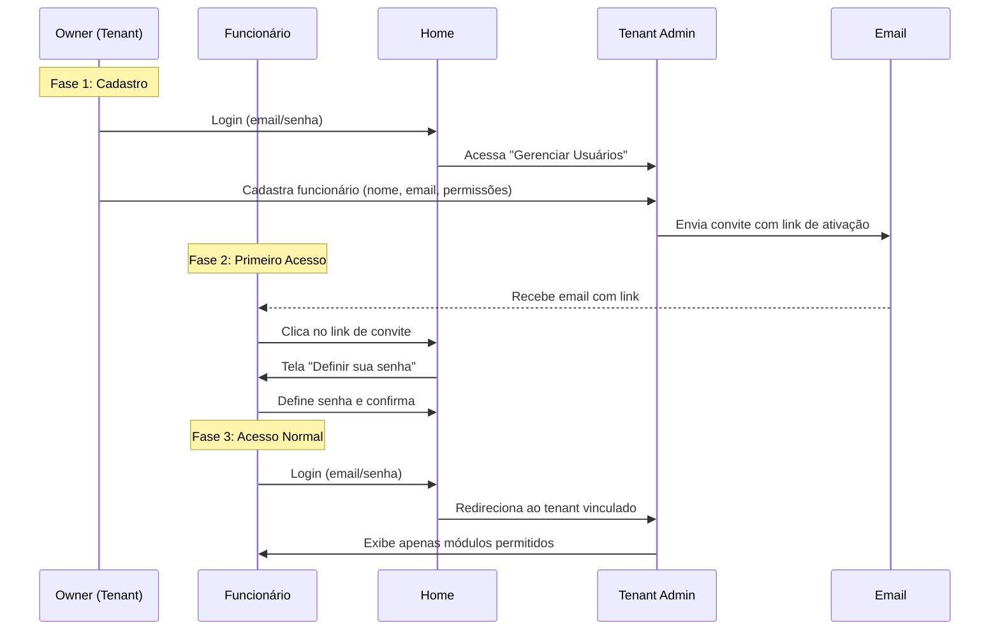
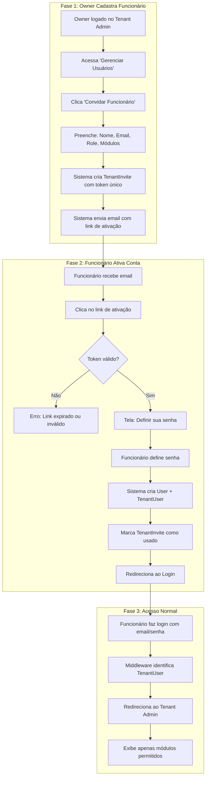

# [FEAT] Sistema de Gerenciamento de Usuários e Permissões por Tenant

> **Task #38** - Plano aprovado e registrado no TaskMaster

## Contexto e Motivação

O sistema atual possui uma arquitetura SaaS multi-tenant onde:
- O **owner** do tenant acessa a home e o `tenant-admin`
- Não existe mecanismo para o owner cadastrar **funcionários**
- As permissões são globais e não são escopo por tenant

### Fluxo Desejado (Confirmado pelo Usuário)



### Módulos do Sistema (Permissões Granulares)

| Módulo | Modelos |
|--------|---------|
| **clientes** | `Cliente`, `Contato` |
| **operacional** | `Departamento`, `AppInstance`, `FluxoAtendimento` |
| **treinamento** | `QueryCompose`, `Documento` |
| **atendimentos** | `Atendimento`, `Mensagem` |
| **configuracoes** | `TenantConfig`, Integrações |

---

## Proposta de Arquitetura

### Modelos de Dados

```mermaid
erDiagram
    User ||--o{ TenantUser : "pode pertencer a"
    Tenant ||--|{ TenantUser : "possui"
    Tenant ||--o{ TenantInvite : "convites pendentes"
    
    User {
        int id PK
        string email UK
        string first_name
        string last_name
        bool is_staff
        bool is_active
    }
    
    Tenant {
        uuid id PK
        string name
        string slug
        FK owner_id
    }
    
    TenantInvite {
        uuid id PK
        FK tenant_id
        string email
        string name
        string role
        json module_permissions
        string token UK
        datetime expires_at
        bool used
    }
    
    TenantUser {
        int id PK
        FK user_id UK
        FK tenant_id
        string role
        json module_permissions
        bool is_active
        datetime created_at
        FK created_by
    }
```

### Fluxo Completo de Onboarding



---

## Implementação

### Componente 1: Modelo de Dados (app/tenants)

#### [NEW] permissions.py

```python
from enum import Enum


class TenantModule(str, Enum):
    """Módulos disponíveis no sistema para controle de permissão."""
    CLIENTES = "clientes"
    OPERACIONAL = "operacional"
    TREINAMENTO = "treinamento"
    ATENDIMENTOS = "atendimentos"
    CONFIGURACOES = "configuracoes"


class TenantRoleType(str, Enum):
    """Tipos de role dentro do tenant."""
    ADMIN = "admin"       # Acesso total (exceto gerenciar assinatura)
    MANAGER = "manager"   # Pode gerenciar funcionários + módulos atribuídos
    STAFF = "staff"       # Acesso apenas aos módulos atribuídos
    VIEWER = "viewer"     # Apenas visualização dos módulos atribuídos
```

---

#### [MODIFY] models.py

Adicionar os novos modelos:

```python
import secrets
from datetime import timedelta


class TenantInvite(models.Model):
    """
    Convite para funcionário ingressar no tenant.
    Owner cria convite -> Sistema envia email -> Funcionário ativa conta.
    """
    id = models.UUIDField(primary_key=True, default=uuid.uuid4, editable=False)
    tenant = models.ForeignKey(
        Tenant, on_delete=models.CASCADE, related_name="invites"
    )
    
    # Dados do funcionário
    email = models.EmailField()
    name = models.CharField(max_length=100)
    
    # Permissões pré-definidas (copiadas para TenantUser ao ativar)
    role = models.CharField(
        max_length=20,
        choices=[
            ("admin", "Administrador"),
            ("manager", "Gerente"),
            ("staff", "Funcionário"),
            ("viewer", "Visualizador"),
        ],
        default="staff"
    )
    module_permissions = models.JSONField(default=dict, blank=True)
    
    # Token único para ativação
    token = models.CharField(max_length=64, unique=True, editable=False)
    
    # Controle de validade
    expires_at = models.DateTimeField()
    used = models.BooleanField(default=False)
    
    created_at = models.DateTimeField(auto_now_add=True)
    created_by = models.ForeignKey(
        settings.AUTH_USER_MODEL, on_delete=models.SET_NULL, null=True
    )
    
    def save(self, *args, **kwargs):
        if not self.token:
            self.token = secrets.token_urlsafe(48)
        if not self.expires_at:
            self.expires_at = timezone.now() + timedelta(days=7)
        super().save(*args, **kwargs)
    
    def is_valid(self) -> bool:
        """Retorna True se o convite ainda é válido."""
        return not self.used and self.expires_at > timezone.now()
    
    def __str__(self) -> str:
        return f"Convite para {self.email} @ {self.tenant.slug}"


class TenantUser(models.Model):
    """
    Usuário vinculado a um Tenant.
    Criado quando funcionário ativa seu convite.
    """
    user = models.OneToOneField(  # 1 user = 1 tenant
        settings.AUTH_USER_MODEL,
        on_delete=models.CASCADE,
        related_name="tenant_profile"
    )
    tenant = models.ForeignKey(
        Tenant, on_delete=models.CASCADE, related_name="members"
    )
    
    role = models.CharField(
        max_length=20,
        choices=[
            ("admin", "Administrador"),
            ("manager", "Gerente"),
            ("staff", "Funcionário"),
            ("viewer", "Visualizador"),
        ],
        default="staff"
    )
    
    # Permissões granulares por módulo
    module_permissions = models.JSONField(
        default=dict,
        blank=True,
        help_text="{modulo: {view: bool, edit: bool, delete: bool}}"
    )
    
    is_active = models.BooleanField(default=True)
    created_at = models.DateTimeField(auto_now_add=True)
    created_by = models.ForeignKey(
        settings.AUTH_USER_MODEL,
        on_delete=models.SET_NULL,
        null=True,
        related_name="created_tenant_users"
    )
    
    class Meta:
        verbose_name = "Funcionário do Tenant"
        verbose_name_plural = "Funcionários do Tenant"
    
    def __str__(self) -> str:
        return f"{self.user.email} @ {self.tenant.slug} ({self.role})"
    
    def has_module_permission(self, module: str, action: str = "view") -> bool:
        """Verifica permissão no módulo."""
        if self.role == "admin":
            return True
        perms = self.module_permissions.get(module, {})
        return perms.get(action, False)
```

---

### Componente 2: TenantAdminSite e Autenticação

#### [MODIFY] admin_client.py

```python
def has_permission(self, request: HttpRequest) -> bool:
    """
    Valida permissão de acesso ao TenantAdmin.
    
    Lógica:
    1. Superuser -> acesso total
    2. Owner do Tenant -> acesso total
    3. TenantUser ativo -> acesso aos módulos permitidos
    """
    if not request.user.is_authenticated or not request.user.is_active:
        return False
    
    if request.user.is_superuser:
        return True
    
    tenant = getattr(request, "tenant", None)
    
    # Verificar se é TenantUser
    tenant_user = TenantUser.objects.filter(
        user=request.user,
        tenant=tenant,
        is_active=True
    ).first()
    
    if tenant_user:
        request.tenant_user = tenant_user
        return True
    
    # Verificar se é owner
    if tenant and tenant.owner == request.user:
        return True
    
    return False
```

---

### Componente 3: Views de Convite e Ativação

#### [NEW] views/invites.py

```python
from django.contrib.auth import get_user_model
from django.contrib.auth.hashers import make_password
from django.shortcuts import render, redirect, get_object_or_404
from django.contrib import messages
from django.core.mail import send_mail
from django.urls import reverse
from django.conf import settings as django_settings

from ..models import Tenant, TenantUser, TenantInvite
from ..permissions import TenantModule

User = get_user_model()


# ============ VIEWS DO OWNER ============

def list_users(request):
    """Lista funcionários e convites pendentes."""
    tenant = request.tenant
    users = TenantUser.objects.filter(tenant=tenant).select_related("user")
    invites = TenantInvite.objects.filter(tenant=tenant, used=False)
    return render(request, "tenants/users/list.html", {
        "users": users,
        "invites": invites
    })


def invite_user(request):
    """Owner envia convite para novo funcionário."""
    if request.method == "POST":
        email = request.POST.get("email")
        name = request.POST.get("name")
        role = request.POST.get("role", "staff")
        modules = request.POST.getlist("modules")
        
        # Validações
        if TenantInvite.objects.filter(
            tenant=request.tenant, email=email, used=False
        ).exists():
            messages.error(request, "Já existe um convite pendente.")
            return redirect("tenant_users:invite")
        
        if User.objects.filter(email=email).exists():
            messages.error(request, "Já existe um usuário com este email.")
            return redirect("tenant_users:invite")
        
        # Criar permissões
        module_perms = {
            mod: {"view": True, "edit": True, "delete": False}
            for mod in modules
        }
        
        # Criar convite
        invite = TenantInvite.objects.create(
            tenant=request.tenant,
            email=email,
            name=name,
            role=role,
            module_permissions=module_perms,
            created_by=request.user
        )
        
        # Enviar email
        activation_url = request.build_absolute_uri(
            reverse("activate_account", args=[invite.token])
        )
        send_mail(
            subject=f"Convite para {request.tenant.name}",
            message=f"""
Olá {name},

Você foi convidado para {request.tenant.name}.
Clique para ativar: {activation_url}

Este link expira em 7 dias.
            """,
            from_email=django_settings.DEFAULT_FROM_EMAIL,
            recipient_list=[email],
        )
        
        messages.success(request, f"Convite enviado para {email}!")
        return redirect("tenant_users:list")
    
    modules = [m.value for m in TenantModule]
    return render(request, "tenants/users/invite.html", {"modules": modules})


# ============ VIEWS PÚBLICAS ============

def activate_account(request, token):
    """Funcionário ativa conta e define senha."""
    invite = get_object_or_404(TenantInvite, token=token)
    
    if not invite.is_valid():
        return render(request, "tenants/users/invite_expired.html")
    
    if request.method == "POST":
        password = request.POST.get("password")
        password_confirm = request.POST.get("password_confirm")
        
        if password != password_confirm:
            messages.error(request, "As senhas não conferem.")
            return render(request, "tenants/users/activate.html", {"invite": invite})
        
        # Criar User Django
        user = User.objects.create(
            username=invite.email,
            email=invite.email,
            first_name=invite.name.split()[0],
            last_name=" ".join(invite.name.split()[1:]) or "",
            password=make_password(password),
            is_staff=True,
            is_active=True,
        )
        
        # Criar TenantUser
        TenantUser.objects.create(
            user=user,
            tenant=invite.tenant,
            role=invite.role,
            module_permissions=invite.module_permissions,
            created_by=invite.created_by
        )
        
        # Marcar convite como usado
        invite.used = True
        invite.save()
        
        messages.success(request, "Conta ativada! Faça login.")
        return redirect("admin:login")
    
    return render(request, "tenants/users/activate.html", {"invite": invite})
```

---

### Componente 4: BasePermissionModelAdmin

#### [NEW] admin_mixins.py

```python
class TenantPermissionMixin:
    """Mixin para verificação de permissão por módulo."""
    
    module_name: str = ""  # Override em cada admin
    
    def has_module_permission(self, request) -> bool:
        if request.user.is_superuser:
            return True
        
        tenant = getattr(request, "tenant", None)
        if tenant and tenant.owner == request.user:
            return True
        
        tenant_user = getattr(request, "tenant_user", None)
        if tenant_user and self.module_name:
            return tenant_user.has_module_permission(self.module_name, "view")
        
        return False
    
    def has_add_permission(self, request) -> bool:
        return self._check_permission(request, "edit")
    
    def has_change_permission(self, request, obj=None) -> bool:
        return self._check_permission(request, "edit")
    
    def has_delete_permission(self, request, obj=None) -> bool:
        return self._check_permission(request, "delete")
    
    def _check_permission(self, request, action: str) -> bool:
        if request.user.is_superuser:
            return True
        tenant = getattr(request, "tenant", None)
        if tenant and tenant.owner == request.user:
            return True
        tenant_user = getattr(request, "tenant_user", None)
        if tenant_user and self.module_name:
            return tenant_user.has_module_permission(self.module_name, action)
        return False
```

---

## Arquivos Afetados (Resumo)

| Arquivo | Ação | Descrição |
|---------|------|-----------|
| `app/tenants/models.py` | MODIFY | Adicionar `TenantInvite` e `TenantUser` |
| `app/tenants/permissions.py` | NEW | Enum de módulos do sistema |
| `app/tenants/admin_client.py` | MODIFY | Suporte a TenantUser |
| `app/tenants/admin_mixins.py` | NEW | TenantPermissionMixin |
| `app/tenants/views/invites.py` | NEW | Views de convite e ativação |
| `app/tenants/urls.py` | MODIFY | Rotas novas |
| `app/*/tenant_admin.py` | MODIFY | Usar TenantPermissionMixin |
| Templates | NEW | list, invite, activate, expired |

---

## Verificação Manual

1. **Migrações:**
   ```bash
   uv run task makemigrations
   uv run task migrate-remoto
   ```

2. **Testar via shell:**
   ```python
   from smart_core_assistant_painel.app.tenants.models import *
   tenant = Tenant.objects.first()
   invite = TenantInvite.objects.create(
       tenant=tenant, email="func@test.com", name="Funcionário Teste"
   )
   print(invite.token)  # Token gerado
   print(invite.is_valid())  # True
   ```

3. **Acessar link de ativação** e definir senha

4. **Login do funcionário** e verificar acesso restrito aos módulos

---

## Subtasks (Task #38)

| # | Subtask | Status |
|---|---------|--------|
| 1 | Criar modelo TenantInvite | pending |
| 2 | Criar modelo TenantUser | pending |
| 3 | Criar enum de módulos (permissions.py) | pending |
| 4 | Criar e aplicar migrações | pending |
| 5 | Implementar views de convite (owner) | pending |
| 6 | Implementar view de ativação (funcionário) | pending |
| 7 | Criar templates de gerenciamento | pending |
| 8 | Configurar URLs | pending |
| 9 | Atualizar TenantAdminSite | pending |
| 10 | Implementar BasePermissionModelAdmin | pending |

---

**Dependências:** Tasks 35 e 36 (TenantAdminSite e Backoffice)
