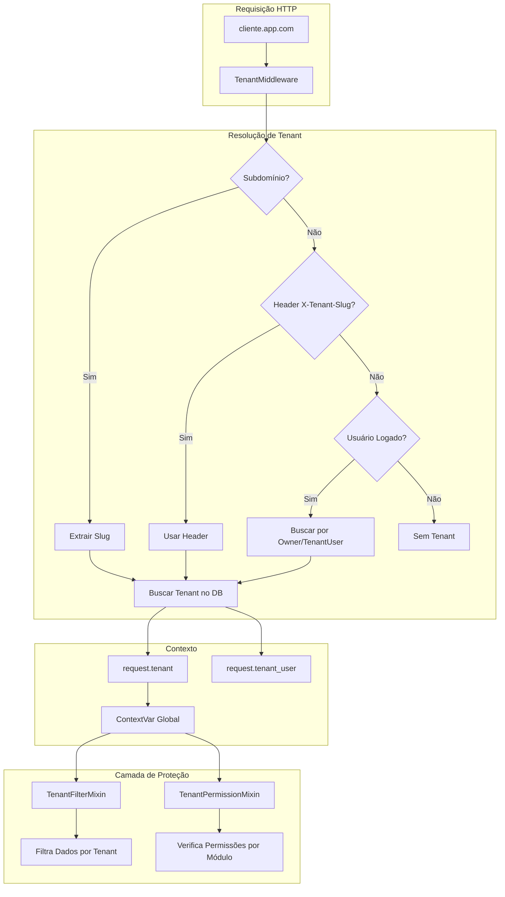
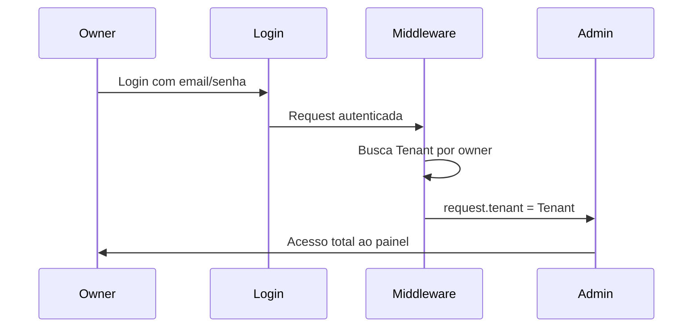
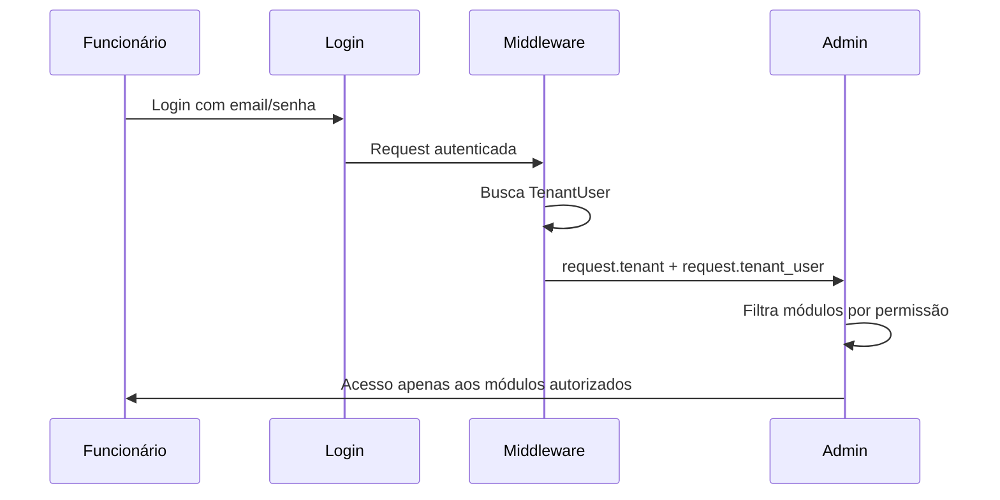

# Sistema Multi-Tenant SaaS - Documentação Completa

## Visão Geral

O Smart Core Assistant Painel implementa uma arquitetura **Multi-Tenant SaaS** que permite:
- Cada cliente (tenant) ter seu próprio ambiente isolado
- Acesso via subdomínio personalizado (ex: `cliente.smartcoreassistant.com.br`)
- Gestão de funcionários com permissões granulares por módulo
- Isolamento total de dados entre tenants

---

## Arquitetura do Sistema



---

## Componentes Principais

### 1. Modelos de Dados

| Modelo | Descrição |
|--------|-----------|
| `Tenant` | Representa um cliente (empresa) no sistema |
| `TenantUser` | Vincula um User Django a um Tenant com role e permissões |
| `TenantInvite` | Convite pendente para funcionário com token de ativação |

### 2. Middleware (`TenantMiddleware`)

Responsável por identificar o tenant em **cada requisição**:

1. **Subdomínio** (prioridade máxima): `cliente.app.com` → tenant "cliente"
2. **Header HTTP**: `X-Tenant-Slug: cliente`
3. **Sessão do Usuário**: Busca por owner ou TenantUser

### 3. Mixins de Proteção

| Mixin | Uso | Função |
|-------|-----|--------|
| `TenantFilterMixin` | Django Admin | Filtra queryset por `tenant=request.tenant` |
| `TenantPermissionMixin` | Django Admin | Verifica permissões por módulo |
| `BaseTenantModelAdmin` | Django Admin | Combina ambos os mixins |
| `TenantQuerysetMixin` | API DRF | Filtra queryset + verifica permissões |
| `TenantCreateMixin` | API DRF | Injeta tenant ao criar objetos |

---

## Módulos e Permissões

O sistema possui 5 módulos com permissões granulares:

| Módulo | Modelos | Permissões |
|--------|---------|------------|
| `clientes` | Cliente, Contato | view, edit, delete |
| `operacional` | Departamento, Atendente, AppInstance, Fluxos | view, edit, delete |
| `treinamento` | Treinamento, Documento, QueryCompose | view, edit, delete |
| `atendimentos` | Atendimento, Mensagem | view, edit, delete |
| `configuracoes` | TenantConfig, Integrações | view, edit, delete |

### Tipos de Role

| Role | Descrição | Permissões |
|------|-----------|------------|
| `admin` | Administrador | Acesso total a todos os módulos |
| `manager` | Gerente | Acesso aos módulos atribuídos |
| `staff` | Funcionário | Acesso limitado aos módulos atribuídos |
| `viewer` | Visualizador | Apenas visualização |

---

## Fluxo de Acesso

### Para o Owner (Dono do Tenant)



### Para Funcionário (TenantUser)



---

## Guia do Usuário

### Para o Owner: Como Gerenciar Funcionários

#### Passo 1: Acessar Gerenciamento de Usuários

1. Faça login no painel administrativo
2. No menu lateral, clique em **"Gerenciar Usuários"**
3. Você verá a lista de funcionários ativos e convites pendentes

#### Passo 2: Convidar Novo Funcionário

1. Clique no botão **"Convidar Funcionário"**
2. Preencha os campos:
   - **Nome completo**: Nome do funcionário
   - **Email**: Email corporativo do funcionário
   - **Tipo de Acesso (Role)**:
     - *Administrador*: Acesso total
     - *Gerente*: Gerencia equipes
     - *Funcionário*: Operações do dia-a-dia
     - *Visualizador*: Apenas consultas
3. Selecione os **módulos** que o funcionário terá acesso:
   - ☑️ Clientes
   - ☑️ Operacional
   - ☑️ Treinamento
   - ☑️ Atendimentos
   - ☑️ Configurações
4. Clique em **"Enviar Convite"**

> ⚠️ O funcionário receberá um email com link de ativação válido por **7 dias**.

#### Passo 3: Acompanhar Convites

- Convites pendentes aparecem na seção **"Convites Pendentes"**
- Você pode **reenviar** convites expirados
- Convites usados são removidos automaticamente da lista

---

### Para o Funcionário: Como Ativar sua Conta

#### Passo 1: Receber o Convite

1. Verifique sua caixa de entrada (e spam/lixo eletrônico)
2. Procure um email com assunto: **"Convite para [Nome da Empresa]"**
3. Clique no **link de ativação** contido no email

#### Passo 2: Definir sua Senha

1. Na página de ativação, você verá:
   - Nome da empresa que o convidou
   - Seu nome cadastrado
2. Preencha os campos:
   - **Nova senha**: Mínimo 8 caracteres
   - **Confirmar senha**: Repita a senha
3. Clique em **"Ativar minha conta"**

#### Passo 3: Fazer Login

1. Após ativação, você será redirecionado para a tela de login
2. Entre com:
   - **Email**: O email para o qual recebeu o convite
   - **Senha**: A senha que você definiu
3. Você terá acesso apenas aos módulos autorizados pelo owner

---

## Acesso via Subdomínio

### Como Funciona

Cada tenant pode ter seu próprio subdomínio:

| URL | Tenant |
|-----|--------|
| `empresa1.smartcoreassistant.com.br` | empresa1 |
| `empresa2.smartcoreassistant.com.br` | empresa2 |
| `www.smartcoreassistant.com.br` | Página pública (sem tenant) |

### Configuração (Administrador de Sistema)

1. No `.env`, configure:
```bash
TENANT_BASE_DOMAIN=smartcoreassistant.com.br
```

2. Configure DNS wildcard no provedor:
```
*.smartcoreassistant.com.br → IP do servidor
```

3. Configure SSL wildcard (Let's Encrypt ou similar)

---

## Segurança

### Isolamento de Dados

- ✅ Queries filtradas automaticamente por tenant
- ✅ Criação de objetos injeta tenant automaticamente
- ✅ Validação de ForeignKeys cross-tenant
- ✅ Contexto limpo após cada requisição

### Proteção contra Vazamento

- Acesso a ID de outro tenant retorna **404** (não 403)
- Tenant inexistente via subdomínio mostra página de erro amigável
- Superusers têm acesso irrestrito (apenas para debug/suporte)

---

## Troubleshooting

| Problema | Solução |
|----------|---------|
| "Link expirado" ao ativar conta | Solicitar novo convite ao owner |
| Não vejo todos os módulos | Verificar permissões com o owner |
| "Tenant não encontrado" | Verificar se o subdomínio está correto |
| "Acesso negado" | Verificar se o tenant está ativo |
