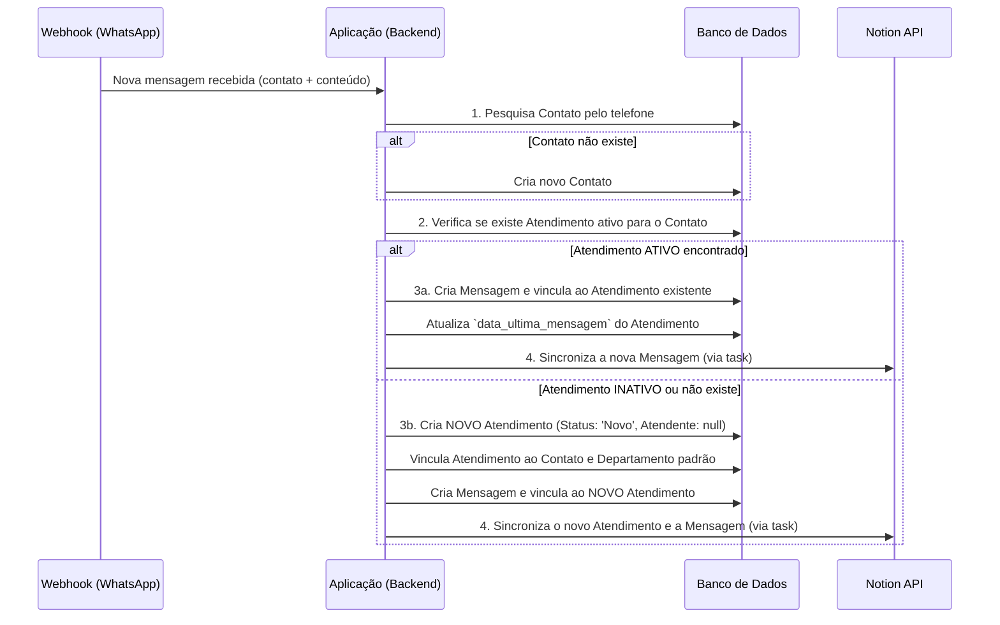

# Plano de Fluxo de Atendimento com Integração Notion

**Versão:** 1.0  
**Status:** ✅ Proposta de Fluxo  
**Data:** 28/10/2025

---

## 1. Visão Geral

Este documento descreve o fluxo de trabalho para o gerenciamento de atendimentos, desde o recebimento de uma mensagem via WhatsApp até sua resolução, utilizando o **Notion como interface principal** para os atendentes.

O objetivo é criar um sistema coeso onde o backend gerencia a lógica de negócio (criação, vinculação) e o Notion serve como a plataforma visual (Kanban) para a gestão e manipulação dos atendimentos pelos agentes.

---

## 2. Fluxo de Dados: Mensagem → Atendimento

Este é o fluxo automatizado que ocorre no backend quando uma nova mensagem é recebida.



**Etapas Detalhadas:**

1.  **Recepção (Webhook):** A aplicação recebe uma nova mensagem.
2.  **Identificação do Contato:** O sistema busca ou cria um `Contato` com base no número de telefone.
3.  **Verificação de Atendimento:** O sistema verifica se há um `Atendimento` com status "aberto" (ex: `Novo`, `Em Andamento`, `Aguardando Cliente`) para aquele `Contato`.
4.  **Lógica de Vinculação:**
    *   **Caso A (Atendimento existente):** A nova `Mensagem` é simplesmente adicionada ao `Atendimento` existente.
    *   **Caso B (Sem atendimento ativo):** Um novo `Atendimento` é criado com o status inicial `Novo`, sem nenhum atendente (`atendente_humano = NULL`). A `Mensagem` é então vinculada a este novo ticket.
5.  **Sincronização:** A criação/atualização dos registros no banco de dados dispara os `signals` que, através de uma task assíncrona (Celery), enviam os dados para as bases de dados correspondentes no Notion.

---

## 3. Estrutura e Uso do Notion pelos Atendentes

O Notion será a central de operações dos atendentes. A gestão será feita em uma única base de dados principal, visualizada em formato Kanban.

### 3.1. Base de Dados: "Atendimentos" (Kanban)

Esta base de dados conterá todos os atendimentos como páginas (cards). As colunas do Kanban serão baseadas na propriedade `Status`.

**Propriedades Essenciais da Base:**

| Campo Notion | Tipo Notion | Mapeamento Django | Observações |
| :--- | :--- | :--- | :--- |
| **Protocolo** | `Title` | `atendimento.protocolo` | Título do card no Kanban. |
| **Status** | `Status` | `atendimento.status` | **Coluna do Kanban**. Define a etapa do fluxo. |
| **Atendente** | `Relation` | `atendimento.atendente_humano` | Relacionado à base de "Atendentes". |
| **Contato** | `Relation` | `atendimento.contato` | Relacionado à base de "Contatos". |
| **Departamento**| `Relation` | `atendimento.departamento` | Relacionado à base de "Departamentos". |
| **Prioridade** | `Select` | `atendimento.prioridade` | Ex: Baixa, Normal, Alta, Urgente. |
| **Última Mensagem**| `Date` | `atendimento.data_ultima_mensagem`| Ajuda a priorizar atendimentos mais antigos. |
| **Data de Abertura**| `Date` | `atendimento.data_inicio` | Data de criação do ticket. |
| **Canal** | `Select` | `atendimento.canal` | Ex: WhatsApp, E-mail. |
| **Tags** | `Multi-select`| `atendimento.tags` | Para categorização (Ex: "Vendas", "Suporte N1"). |

### 3.2. Fluxo de Trabalho do Atendente no Notion

O atendente usará visualizações (Views) filtradas para gerenciar seu trabalho.

**Visualizações Principais:**

1.  **Fila do Departamento:**
    *   **Filtro:** `Departamento` é o do atendente **E** `Atendente` está **vazio**.
    *   **Objetivo:** Mostrar todos os novos atendimentos que precisam de um responsável.

2.  **Meus Atendimentos:**
    *   **Filtro:** `Atendente` **contém** "Eu" (atendente logado).
    *   **Objetivo:** Foco total nos atendimentos que são de responsabilidade do atendente.

---

### 3.3. Ações do Atendente (Jornada do Atendimento)

O fluxo é projetado para ser intuitivo, baseado em arrastar e soltar os cards no Kanban.

```mermaid
graph TD
    subgraph "Fila do Departamento (Status: Novo)"
        A[Atendimento #123<br>Contato: Maria<br>Atendente: (Vazio)]
    end

    subgraph "Em Atendimento (Status: Em Andamento)"
        B(Atendimento #124<br>Contato: João<br>Atendente: Carlos)
    end
    
    subgraph "Aguardando Cliente (Status: Aguardando)"
        C(Atendimento #125<br>Contato: Ana<br>Atendente: Carlos)
    end

    subgraph "Finalizados"
        D[Status: Resolvido]
        E[Status: Cancelado]
    end

    A -- 1. Atendente assume --> B;
    B -- 2. Aguardando resposta --> C;
    C -- 3. Cliente responde --> B;
    B -- 4. Problema resolvido --> D;
    C -- 4. Problema resolvido --> D;
    B -- 5. Sem solução --> E;

```

**Jornada Detalhada:**

1.  **Assumir um Atendimento (Pegar da Fila):**
    *   **Ação:** O atendente vai na view "Fila do Departamento". Ele arrasta um card da coluna `Novo` para a coluna `Em Andamento`.
    *   **Gatilho Alternativo:** O atendente clica no card e atribui seu próprio nome ao campo `Atendente`.
    *   **Reação do Sistema (via Webhook):**
        *   O backend recebe a notificação de mudança.
        *   O `Atendimento` correspondente é atualizado:
            *   `status` muda para `em_andamento`.
            *   `atendente_humano` é vinculado ao atendente que fez a ação.

2.  **Gerenciar o Atendimento:**
    *   **Ação:** Conforme a conversa flui, o atendente pode mover o card entre `Em Andamento` e `Aguardando Cliente`.
    *   **Reação do Sistema:** O status do `Atendimento` no banco de dados é atualizado a cada mudança, mantendo um histórico preciso.

3.  **Finalizar um Atendimento:**
    *   **Ação:** Ao concluir o suporte, o atendente arrasta o card para a coluna `Resolvido` (ou `Cancelado`).
    *   **Reação do Sistema:**
        *   O status do `Atendimento` é atualizado para `resolvido`.
        *   O campo `data_fim` é preenchido.
        *   O atendimento é considerado "fechado" e não será mais reaberto por novas mensagens do cliente (uma nova mensagem criará um novo atendimento).

Este fluxo garante que a gestão seja visual, intuitiva e que o backend reflita com precisão as ações realizadas no Notion, mantendo a integridade e o histórico dos dados.
