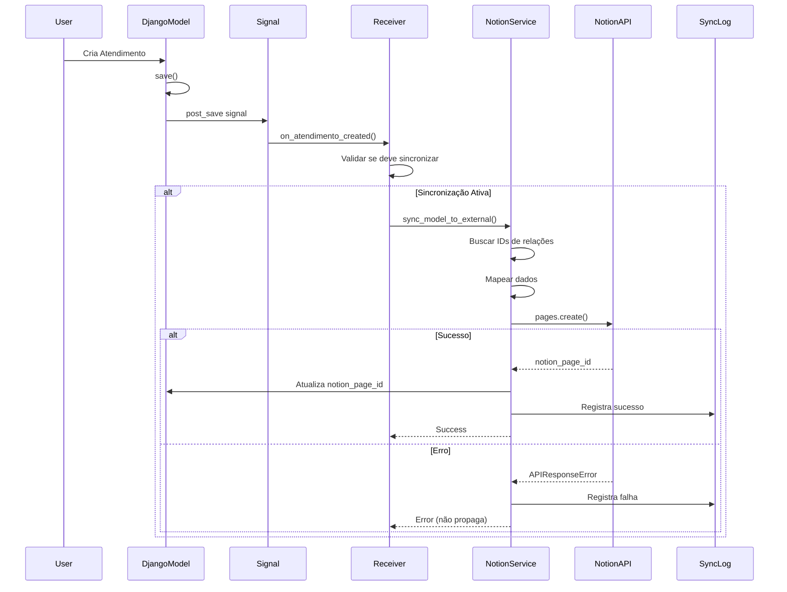
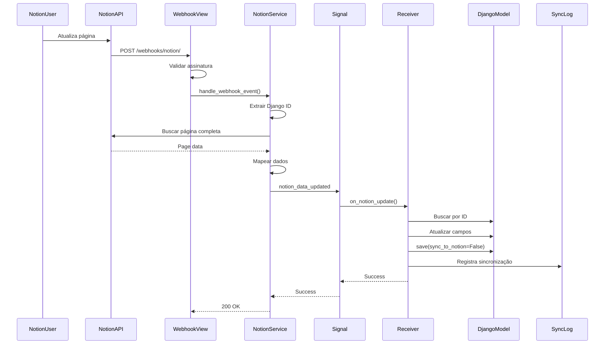

# Plano Final de Integração: Django com Notion (v3.0) - PARTE 2

## 5.5. Database: 🎫 Atendimentos (Continuação)

```javascript
    // ===== MÉTRICAS (FÓRMULAS) - CONTINUAÇÃO =====
    "Tempo Total": {
      "formula": {
        "expression": "if(empty(prop(\"Data Finalização\")), dateBetween(now(), prop(\"Data Abertura\"), \"hours\"), dateBetween(prop(\"Data Finalização\"), prop(\"Data Abertura\"), \"hours\"))"
      }
    },
    "SLA Status": {
      "formula": {
        "expression": "if(prop(\"Tempo Total\") > 24, \"🔴 Atrasado\", if(prop(\"Tempo Total\") > 12, \"🟡 Atenção\", \"🟢 No Prazo\"))"
      }
    },
    
    // ===== MENSAGENS =====
    "Mensagens": {
      "relation": {
        "database_id": "<MENSAGENS_DB_ID>",
        "type": "dual_property"
      }
    },
    "Qtd Mensagens": {
      "rollup": {
        "relation_property_name": "Mensagens",
        "rollup_property_name": "Django ID",
        "function": "count"
      }
    },
    "Última Msg": {
      "rollup": {
        "relation_property_name": "Mensagens",
        "rollup_property_name": "Data Envio",
        "function": "latest_date"
      }
    },
    
    // ===== SATISFAÇÃO =====
    "Avaliação": {
      "select": {
        "options": [
          {"name": "⭐⭐⭐⭐⭐ Excelente", "color": "green"},
          {"name": "⭐⭐⭐⭐ Ótimo", "color": "blue"},
          {"name": "⭐⭐⭐ Bom", "color": "yellow"},
          {"name": "⭐⭐ Regular", "color": "orange"},
          {"name": "⭐ Ruim", "color": "red"}
        ]
      }
    },
    "Feedback": {
      "rich_text": {}
    },
    
    // ===== OBSERVAÇÕES =====
    "Notas Internas": {
      "rich_text": {}
    },
    
    // ===== TAGS =====
    "Tags": {
      "multi_select": {
        "options": []  // Preenchido dinamicamente
      }
    }
  }
}
```

---

### 5.6. Database: 💬 Mensagens

**Estrutura no Notion:**

```javascript
{
  "title": [{"text": {"content": "💬 Mensagens"}}],
  "properties": {
    // ===== IDENTIFICAÇÃO =====
    "Prévia": {
      "title": {}  // Primeiros 50 chars do conteúdo
    },
    "Django ID": {
      "number": {"format": "number"}
    },
    
    // ===== RELAÇÃO COM ATENDIMENTO =====
    "Atendimento": {
      "relation": {
        "database_id": "<ATENDIMENTOS_DB_ID>",
        "type": "dual_property"
      }
    },
    
    // ===== TIPO E REMETENTE =====
    "Tipo": {
      "select": {
        "options": [
          {"name": "📝 Texto", "color": "blue"},
          {"name": "🖼️ Imagem", "color": "green"},
          {"name": "📄 Documento", "color": "orange"},
          {"name": "🎵 Áudio", "color": "purple"},
          {"name": "🎥 Vídeo", "color": "red"},
          {"name": "📍 Localização", "color": "yellow"},
          {"name": "👤 Contato", "color": "gray"},
          {"name": "📎 Sticker", "color": "pink"}
        ]
      }
    },
    "Remetente": {
      "select": {
        "options": [
          {"name": "👤 Cliente", "color": "blue"},
          {"name": "🤖 Bot", "color": "purple"},
          {"name": "👨‍💼 Atendente", "color": "green"},
          {"name": "🔔 Sistema", "color": "gray"}
        ]
      }
    },
    
    // ===== CONTEÚDO =====
    "Conteúdo": {
      "rich_text": {}
    },
    
    // ===== DADOS TÉCNICOS =====
    "ID WhatsApp": {
      "rich_text": {}
    },
    "Mídia URL": {
      "url": {}
    },
    
    // ===== DATAS =====
    "Data Envio": {
      "date": {}
    },
    "Data Recebimento": {
      "date": {}
    },
    
    // ===== ROLLUPS DO ATENDIMENTO =====
    "Cliente": {
      "rollup": {
        "relation_property_name": "Atendimento",
        "rollup_property_name": "Contato",
        "function": "show_original"
      }
    },
    "Status Atendimento": {
      "rollup": {
        "relation_property_name": "Atendimento",
        "rollup_property_name": "Status",
        "function": "show_original"
      }
    }
  }
}
```

---

## 6. Detalhamento dos Campos e Integrações

### 6.1. Contato → Notion

**Código de Mapeamento:**

```python
# app/integrations/notion_sync/services/mappers/contato_mapper.py
from typing import Any, Dict, List
from datetime import datetime

class ContatoNotionMapper:
    """Mapeia dados entre Contato (Django) e Notion."""
    
    @staticmethod
    def to_notion_properties(contato_data: Dict[str, Any]) -> Dict[str, Any]:
        """
        Converte dados do Contato Django para propriedades Notion.
        
        Args:
            contato_data: Dados serializados do Contato
            
        Returns:
            Dict com propriedades formatadas para Notion API
        """
        properties = {
            "Nome": {
                "title": [
                    {
                        "text": {
                            "content": contato_data.get("nome_contato") or "Sem nome"
                        }
                    }
                ]
            },
            "Django ID": {
                "number": contato_data.get("id")
            },
            "Telefone": {
                "phone_number": contato_data.get("telefone")
            },
            "Ativo": {
                "checkbox": contato_data.get("ativo", True)
            },
        }
        
        # Email (opcional)
        if contato_data.get("email"):
            properties["Email"] = {
                "email": contato_data["email"]
            }
        
        # Nome WhatsApp (opcional)
        if contato_data.get("nome_perfil_whatsapp"):
            properties["Nome WhatsApp"] = {
                "rich_text": [
                    {
                        "text": {
                            "content": contato_data["nome_perfil_whatsapp"]
                        }
                    }
                ]
            }
        
        # Datas
        if contato_data.get("data_cadastro"):
            properties["Data Cadastro"] = {
                "date": {
                    "start": contato_data["data_cadastro"]
                }
            }
        
        if contato_data.get("ultima_interacao"):
            properties["Última Interação"] = {
                "date": {
                    "start": contato_data["ultima_interacao"]
                }
            }
        
        # Metadados → Observações
        if contato_data.get("metadados"):
            import json
            observacoes = json.dumps(contato_data["metadados"], ensure_ascii=False, indent=2)
            properties["Observações"] = {
                "rich_text": [
                    {
                        "text": {
                            "content": observacoes[:2000]  # Limite Notion
                        }
                    }
                ]
            }
        
        return properties
    
    @staticmethod
    def from_notion_properties(notion_properties: Dict[str, Any]) -> Dict[str, Any]:
        """
        Converte propriedades Notion para formato Django.
        
        Args:
            notion_properties: Propriedades da página Notion
            
        Returns:
            Dict com dados para atualizar o Contato Django
        """
        django_data = {}
        
        # Nome
        if "Nome" in notion_properties and notion_properties["Nome"]["title"]:
            django_data["nome_contato"] = notion_properties["Nome"]["title"][0]["plain_text"]
        
        # Email
        if "Email" in notion_properties and notion_properties["Email"]["email"]:
            django_data["email"] = notion_properties["Email"]["email"]
        
        # Ativo
        if "Ativo" in notion_properties:
            django_data["ativo"] = notion_properties["Ativo"]["checkbox"]
        
        # Nome WhatsApp
        if "Nome WhatsApp" in notion_properties and notion_properties["Nome WhatsApp"]["rich_text"]:
            django_data["nome_perfil_whatsapp"] = notion_properties["Nome WhatsApp"]["rich_text"][0]["plain_text"]
        
        return django_data
```

### 6.2. Atendimento → Notion (Complexo)

**Código de Mapeamento:**

```python
# app/integrations/notion_sync/services/mappers/atendimento_mapper.py
from typing import Any, Dict, Optional
from datetime import datetime

class AtendimentoNotionMapper:
    """Mapeia dados entre Atendimento (Django) e Notion."""
    
    @staticmethod
    def to_notion_properties(
        atendimento_data: Dict[str, Any],
        contato_notion_id: Optional[str] = None,
        cliente_notion_id: Optional[str] = None,
        atendente_notion_id: Optional[str] = None,
        departamento_notion_id: Optional[str] = None
    ) -> Dict[str, Any]:
        """
        Converte dados do Atendimento Django para propriedades Notion.
        
        Args:
            atendimento_data: Dados serializados do Atendimento
            contato_notion_id: ID da página Contato no Notion
            cliente_notion_id: ID da página Cliente no Notion
            atendente_notion_id: ID da página Atendente no Notion
            departamento_notion_id: ID da página Departamento no Notion
            
        Returns:
            Dict com propriedades formatadas para Notion API
        """
        # Status mapping
        status_map = {
            "aguardando_inicial": "🕐 Aguardando Inicial",
            "em_andamento": "⚡ Em Andamento",
            "aguardando_contato": "⏸️ Aguardando Contato",
            "aguardando_atendente": "👤 Aguardando Atendente",
            "transferido": "↗️ Transferido",
            "resolvido": "✅ Resolvido",
            "cancelado": "❌ Cancelado"
        }
        
        # Prioridade mapping
        prioridade_map = {
            "alta": "🔴 Alta",
            "media": "🟡 Média",
            "baixa": "🟢 Baixa"
        }
        
        # Canal mapping
        canal_map = {
            "whatsapp": "💬 WhatsApp",
            "email": "📧 Email",
            "telefone": "📞 Telefone",
            "web": "🌐 Web"
        }
        
        properties = {
            "Assunto": {
                "title": [
                    {
                        "text": {
                            "content": atendimento_data.get("assunto") or "Novo Atendimento"
                        }
                    }
                ]
            },
            "Django ID": {
                "number": atendimento_data.get("id")
            },
            "Status": {
                "select": {
                    "name": status_map.get(atendimento_data.get("status"), "🕐 Aguardando Inicial")
                }
            },
        }
        
        # Prioridade
        if atendimento_data.get("prioridade"):
            properties["Prioridade"] = {
                "select": {
                    "name": prioridade_map.get(atendimento_data["prioridade"], "🟡 Média")
                }
            }
        
        # Canal
        if atendimento_data.get("canal"):
            properties["Canal"] = {
                "select": {
                    "name": canal_map.get(atendimento_data["canal"], "💬 WhatsApp")
                }
            }
        
        # Relações (apenas se IDs forem fornecidos)
        if contato_notion_id:
            properties["Contato"] = {
                "relation": [{"id": contato_notion_id}]
            }
        
        if cliente_notion_id:
            properties["Cliente"] = {
                "relation": [{"id": cliente_notion_id}]
            }
        
        if atendente_notion_id:
            properties["Atendente"] = {
                "relation": [{"id": atendente_notion_id}]
            }
        
        if departamento_notion_id:
            properties["Departamento"] = {
                "relation": [{"id": departamento_notion_id}]
            }
        
        # Datas
        if atendimento_data.get("data_abertura"):
            properties["Data Abertura"] = {
                "date": {"start": atendimento_data["data_abertura"]}
            }
        
        if atendimento_data.get("data_primeira_resposta"):
            properties["Data Primeira Resposta"] = {
                "date": {"start": atendimento_data["data_primeira_resposta"]}
            }
        
        if atendimento_data.get("data_finalizacao"):
            properties["Data Finalização"] = {
                "date": {"start": atendimento_data["data_finalizacao"]}
            }
        
        if atendimento_data.get("ultima_mensagem_em"):
            properties["Última Mensagem"] = {
                "date": {"start": atendimento_data["ultima_mensagem_em"]}
            }
        
        # Notas Internas
        if atendimento_data.get("notas_internas"):
            properties["Notas Internas"] = {
                "rich_text": [
                    {
                        "text": {
                            "content": atendimento_data["notas_internas"][:2000]
                        }
                    }
                ]
            }
        
        # Tags
        if atendimento_data.get("tags"):
            properties["Tags"] = {
                "multi_select": [
                    {"name": tag} for tag in atendimento_data["tags"]
                ]
            }
        
        return properties
    
    @staticmethod
    def from_notion_properties(notion_properties: Dict[str, Any]) -> Dict[str, Any]:
        """
        Converte propriedades Notion para formato Django.
        
        Args:
            notion_properties: Propriedades da página Notion
            
        Returns:
            Dict com dados para atualizar o Atendimento Django
        """
        # Status reverse mapping
        status_reverse = {
            "🕐 Aguardando Inicial": "aguardando_inicial",
            "⚡ Em Andamento": "em_andamento",
            "⏸️ Aguardando Contato": "aguardando_contato",
            "👤 Aguardando Atendente": "aguardando_atendente",
            "↗️ Transferido": "transferido",
            "✅ Resolvido": "resolvido",
            "❌ Cancelado": "cancelado"
        }
        
        django_data = {}
        
        # Status
        if "Status" in notion_properties and notion_properties["Status"]["select"]:
            notion_status = notion_properties["Status"]["select"]["name"]
            django_data["status"] = status_reverse.get(notion_status)
        
        # Notas Internas
        if "Notas Internas" in notion_properties and notion_properties["Notas Internas"]["rich_text"]:
            django_data["notas_internas"] = notion_properties["Notas Internas"]["rich_text"][0]["plain_text"]
        
        # Avaliação (se houver)
        if "Avaliação" in notion_properties and notion_properties["Avaliação"]["select"]:
            avaliacao_text = notion_properties["Avaliação"]["select"]["name"]
            # Extrair número de estrelas
            num_estrelas = avaliacao_text.count("⭐")
            django_data["avaliacao"] = num_estrelas
        
        # Feedback
        if "Feedback" in notion_properties and notion_properties["Feedback"]["rich_text"]:
            django_data["feedback"] = notion_properties["Feedback"]["rich_text"][0]["plain_text"]
        
        return django_data
```

---

## 7. Fluxos de Sincronização

### 7.1. Fluxo: Django → Notion (Criação)



### 7.2. Fluxo: Notion → Django (Webhook)



### 7.3. Prevenção de Loops Infinitos

```python
# app/integrations/notion_sync/models.py
from django.db import models
from contextlib import contextmanager
import threading

# Thread-local storage para controle de sincronização
_sync_state = threading.local()

@contextmanager
def skip_notion_sync():
    """Context manager para pular sincronização com Notion."""
    old_value = getattr(_sync_state, 'skip_sync', False)
    _sync_state.skip_sync = True
    try:
        yield
    finally:
        _sync_state.skip_sync = old_value

def should_sync_to_notion() -> bool:
    """Verifica se deve sincronizar para Notion."""
    return not getattr(_sync_state, 'skip_sync', False)


# Uso nos receivers:
# app/integrations/notion_sync/receivers.py
from django.db.models.signals import post_save
from django.dispatch import receiver
from smart_core_assistant_painel.app.ui.atendimentos.models import Atendimento
from .models import should_sync_to_notion, skip_notion_sync

@receiver(post_save, sender=Atendimento)
def sync_atendimento_to_notion(sender, instance, created, **kwargs):
    """Sincroniza Atendimento para Notion quando criado ou atualizado."""
    if not should_sync_to_notion():
        return  # Evita loop infinito
    
    # Lógica de sincronização...


# No receiver que processa webhook do Notion:
@receiver(notion_data_updated)
def update_django_from_notion(sender, **kwargs):
    """Atualiza Django a partir de dados do Notion."""
    with skip_notion_sync():
        # Atualizar modelo Django sem disparar novo sync para Notion
        instance.save()
```

---

## 8. Estratégias de Sincronização

### 8.1. Sincronização Imediata vs. Assíncrona

**Recomendação:** Usar **Celery** para sincronização assíncrona.

```python
# app/integrations/notion_sync/tasks.py
from celery import shared_task
from typing import Dict, Any
from loguru import logger

@shared_task(
    bind=True,
    max_retries=3,
    retry_backoff=True,
    retry_backoff_max=600,
    retry_jitter=True
)
def sync_to_notion_task(
    self,
    model_name: str,
    instance_id: int,
    operation: str
) -> Dict[str, Any]:
    """
    Task assíncrona para sincronizar dados para Notion.
    
    Args:
        model_name: Nome do modelo
        instance_id: ID da instância
        operation: Operação (create, update, delete)
    """
    from .services.notion_service import NotionSyncService
    from .models import SyncLog
    
    try:
        service = NotionSyncService()
        
        # Buscar instância
        model_class = get_model_class(model_name)
        instance = model_class.objects.get(id=instance_id)
        
        # Serializar dados
        instance_data = serialize_instance(instance)
        
        # Sincronizar
        result = service.sync_model_to_external(
            model_name=model_name,
            instance_id=instance_id,
            instance_data=instance_data,
            operation=operation
        )
        
        logger.info(f"Sync to Notion successful: {model_name}:{instance_id}")
        return result
        
    except Exception as exc:
        logger.error(f"Sync to Notion failed: {model_name}:{instance_id} - {exc}")
        
        # Registrar falha
        SyncLog.objects.create(
            model_name=model_name,
            instance_id=instance_id,
            direction="to_external",
            status="failed",
            error_message=str(exc)
        )
        
        # Retry com backoff exponencial
        raise self.retry(exc=exc, countdown=60 * (2 ** self.request.retries))


# No receiver:
@receiver(post_save, sender=Atendimento)
def sync_atendimento_to_notion(sender, instance, created, **kwargs):
    if not should_sync_to_notion():
        return
    
    operation = "create" if created else "update"
    
    # Dispatch para task assíncrona
    sync_to_notion_task.apply_async(
        args=["Atendimento", instance.id, operation],
        countdown=2  # Aguarda 2s para garantir commit do DB
    )
```

### 8.2. Sincronização em Lote (Batch)

```python
# app/integrations/notion_sync/management/commands/sync_to_notion.py
from django.core.management.base import BaseCommand
from smart_core_assistant_painel.app.ui.atendimentos.models import Atendimento
from ...services.notion_service import NotionSyncService
from loguru import logger

class Command(BaseCommand):
    help = 'Sincroniza dados em lote para Notion'

    def add_arguments(self, parser):
        parser.add_argument(
            '--model',
            type=str,
            required=True,
            choices=['Contato', 'Cliente', 'Atendimento', 'all'],
            help='Modelo a sincronizar'
        )
        parser.add_argument(
            '--limit',
            type=int,
            default=100,
            help='Número máximo de registros por lote'
        )
        parser.add_argument(
            '--force',
            action='store_true',
            help='Forçar ressincronização de itens já sincronizados'
        )

    def handle(self, *args, **options):
        model_name = options['model']
        limit = options['limit']
        force = options['force']
        
        service = NotionSyncService()
        
        # Filtrar registros a sincronizar
        if force:
            queryset = Atendimento.objects.all()
        else:
            queryset = Atendimento.objects.filter(notion_page_id__isnull=True)
        
        total = queryset.count()
        self.stdout.write(f"Sincronizando {total} registros...")
        
        success = 0
        failed = 0
        
        for instance in queryset[:limit]:
            try:
                instance_data = serialize_instance(instance)
                result = service.sync_model_to_external(
                    model_name="Atendimento",
                    instance_id=instance.id,
                    instance_data=instance_data,
                    operation="create"
                )
                success += 1
                self.stdout.write(self.style.SUCCESS(f"✓ {instance.id}"))
            except Exception as e:
                failed += 1
                self.stdout.write(self.style.ERROR(f"✗ {instance.id}: {e}"))
        
        self.stdout.write(
            self.style.SUCCESS(f"\nConcluído: {success} sucesso, {failed} falhas")
        )
```

---

## 9. Tratamento de Erros e Resiliência

### 9.1. Modelo de Log de Sincronização

```python
# app/integrations/notion_sync/models.py
from django.db import models
from typing import Any

class SyncLog(models.Model):
    """Registro de logs de sincronização."""
    
    DIRECTION_CHOICES = [
        ('to_external', 'Django → External'),
        ('from_external', 'External → Django'),
    ]
    
    STATUS_CHOICES = [
        ('pending', 'Pendente'),
        ('in_progress', 'Em Progresso'),
        ('success', 'Sucesso'),
        ('failed', 'Falha'),
        ('partial', 'Parcial'),
    ]
    
    model_name = models.CharField(max_length=100)
    instance_id = models.IntegerField()
    external_id = models.CharField(max_length=100, null=True, blank=True)
    
    direction = models.CharField(max_length=20, choices=DIRECTION_CHOICES)
    status = models.CharField(max_length=20, choices=STATUS_CHOICES, default='pending')
    operation = models.CharField(max_length=20)  # create, update, delete
    
    error_message = models.TextField(null=True, blank=True)
    error_trace = models.TextField(null=True, blank=True)
    
    request_data = models.JSONField(null=True, blank=True)
    response_data = models.JSONField(null=True, blank=True)
    
    retry_count = models.IntegerField(default=0)
    max_retries = models.IntegerField(default=3)
    
    created_at = models.DateTimeField(auto_now_add=True)
    updated_at = models.DateTimeField(auto_now=True)
    completed_at = models.DateTimeField(null=True, blank=True)
    
    class Meta:
        db_table = 'notion_sync_log'
        ordering = ['-created_at']
        indexes = [
            models.Index(fields=['model_name', 'instance_id']),
            models.Index(fields=['status', 'created_at']),
            models.Index(fields=['external_id']),
        ]
    
    def __str__(self) -> str:
        return f"{self.model_name}:{self.instance_id} - {self.status}"
```

### 9.2. Estratégia de Retry

```python
# app/integrations/notion_sync/utils/retry.py
from typing import Callable, Any
import time
from functools import wraps
from loguru import logger

def retry_on_notion_error(
    max_retries: int = 3,
    backoff_factor: float = 2.0,
    exceptions: tuple = (Exception,)
):
    """
    Decorator para retry com backoff exponencial.
    
    Args:
        max_retries: Número máximo de tentativas
        backoff_factor: Fator de multiplicação para delay
        exceptions: Tupla de exceções que devem gerar retry
    """
    def decorator(func: Callable) -> Callable:
        @wraps(func)
        def wrapper(*args, **kwargs) -> Any:
            retries = 0
            while retries < max