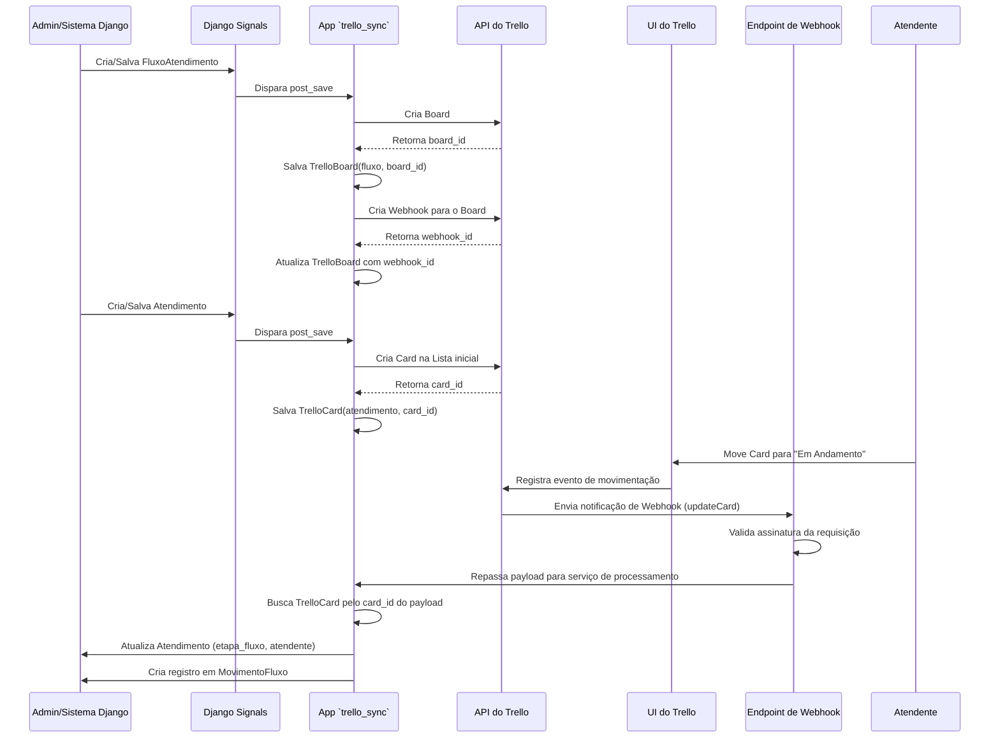

# Plano de Integração: `trello_sync` e Trello

## 1. Arquitetura da Solução

A integração entre a Central de Atendimento e o Trello será implementada através de um novo aplicativo Django, `trello_sync`, que orquestrará toda a comunicação. Esta arquitetura desacoplada garante que a lógica de negócio principal permaneça isolada das especificidades da API do Trello.

Os componentes principais da solução são:

1.  **Modelos Principais**: Os modelos existentes (`FluxoAtendimento`, `Atendimento`, etc.) permanecem inalterados.
2.  **App `trello_sync`**: Contém os modelos espelho (`TrelloBoard`, `TrelloCard`, etc.) que mapeiam os objetos do sistema para os IDs do Trello.
3.  **Django Signals (`post_save`)**: Atuam como gatilhos. A criação de um `Atendimento`, por exemplo, dispara um sinal.
4.  **Serviços de Sincronização**: Módulos de serviço dentro do `trello_sync` que contêm a lógica para chamar a API do Trello. Ex: `FlowSyncService`, `TicketSyncService`.
5.  **Endpoint de Webhook**: Uma view dedicada no Django para receber, validar e processar eventos enviados pelo Trello.
6.  **Serviço de Processamento de Webhook**: Lógica que interpreta o payload do webhook e atualiza os modelos principais do Django.

### Diagrama de Sequência (Visão Geral)

O diagrama abaixo ilustra a interação entre os componentes, desde a criação de um fluxo no Django até a movimentação de um card no Trello e a subsequente atualização no Django.

## 2. Fluxo de Trabalho Detalhado

### Etapa 1: Configuração Inicial (Django → Trello)

Esta etapa ocorre quando a estrutura do fluxo de atendimento é definida no Django.

1.  **Criação do `FluxoAtendimento`**:
    -   Um administrador cria um `FluxoAtendimento` no Django Admin.
    -   O signal `post_save` para `FluxoAtendimento` é acionado.
    -   O `FlowSyncService` (dentro de `trello_sync`) é chamado.
    -   O serviço cria um **Board** no Trello via API.
    -   Salva o `trello_board_id` no modelo `TrelloBoard`.
    -   Cria um **Webhook** no Trello apontando para o endpoint do Django, monitorando o Board recém-criado.
    -   Salva o `trello_webhook_id` no modelo `TrelloBoard`.

2.  **Criação da `EtapaFluxo`**:
    -   Um administrador cria uma `EtapaFluxo` associada ao `FluxoAtendimento`.
    -   O signal `post_save` para `EtapaFluxo` é acionado.
    -   O `FlowSyncService` busca o `TrelloBoard` correspondente.
    -   O serviço cria uma **List** no Board do Trello via API.
    -   Salva o `trello_list_id` no modelo `TrelloList`.

### Etapa 2: Entrada de um Novo Atendimento (Django → Trello)

1.  **Criação do `Atendimento`**:
    -   Um novo `Atendimento` é criado no sistema (via API, painel, etc.), associado a uma etapa inicial (ex: "Triagem").
    -   O signal `post_save` para `Atendimento` é acionado.
    -   O `TicketSyncService` (dentro de `trello_sync`) é chamado.
    -   O serviço busca a `TrelloList` correspondente à etapa inicial do atendimento.
    -   Cria um **Card** na lista apropriada no Trello via API. O nome do card pode ser o protocolo e a descrição pode conter detalhes do cliente e da solicitação.
    -   Salva o `trello_card_id` no modelo `TrelloCard`.

### Etapa 3: Gestão do Atendimento no Trello (Trello → Django)

Esta é a fase operacional, onde os atendentes interagem com o Trello.

1.  **Endpoint de Webhook**:
    -   Será criada uma URL pública no Django (ex: `/api/trello/webhook/`), registrada no Trello para cada Board.
    -   O Trello exige que o endpoint responda a uma requisição `HEAD` durante a criação do webhook para validação.

2.  **Recebimento e Validação**:
    -   Quando uma ação ocorre no Trello (ex: `updateCard` por movimentação de lista), o Trello envia uma requisição `POST` para o endpoint.
    -   A primeira etapa na view do webhook é **validar a assinatura da requisição**, garantindo que ela se origina do Trello. Isso é feito comparando um hash do payload com o `x-trello-webhook` header.

3.  **Processamento do Payload**:
    -   O `WebhookProcessingService` (dentro de `trello_sync`) recebe o payload validado.
    -   Ele analisa o `action.type` para determinar o que aconteceu (ex: `updateCard`, `addMemberToCard`, `commentCard`).
    -   **Exemplo (Movimentação de Card)**:
        -   O payload contém `action.data.card.id` e `action.data.listAfter.id`.
        -   O serviço busca o `TrelloCard` usando o `card.id`.
        -   Através da relação `OneToOne`, encontra o `Atendimento` principal.
        -   Busca a `EtapaFluxo` correspondente à `listAfter.id` (via `TrelloList`).
        -   Atualiza o campo `etapa_atual` do `Atendimento`.
        -   Se um membro foi adicionado (`addMemberToCard`), busca o `Atendente` correspondente e o atribui ao `Atendimento`.
        -   Cria um registro em `MovimentoFluxo` para historiar a mudança de etapa.

## 3. Gestão de Atendentes

-   A associação de um `Atendente` a um `Member` do Trello será feita convidando o usuário para o Board via API, usando o e-mail do `Atendente`.
-   O `trello_member_id` será armazenado no modelo `TrelloMember` para futuras atribuições de cards.

## 4. Considerações Técnicas

-   **Idempotência**: O processamento de webhooks deve ser idempotente. Verificar se a alteração já foi aplicada antes de processar novamente pode evitar estados inconsistentes.
-   **Filas e Tarefas Assíncronas**: Para garantir que a resposta ao webhook seja rápida (o Trello tem um timeout de 10 segundos), a lógica de processamento pode ser delegada a uma tarefa assíncrona (Celery/RQ).
-   **Segurança**: A validação da assinatura do webhook é **obrigatória** para prevenir ataques de CSRF e garantir a integridade dos dados.