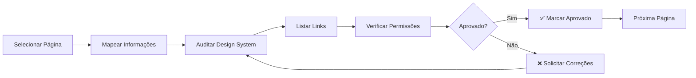

# Mapa de Navegação - Smart Core Assistant Painel

> 📋 **Projeto**: Refatoração UI Design System v2  
> 🔗 **Plano**: `.context/plans/refactor-ui-design-system-v2.md`  
> 🔗 **OpenSpec**: `.openspec/proposals/refactor-ui-design-system-v2.md`  
> 📅 **Criado**: 2026-01-16

## Objetivo

Mapear e auditar **100% das páginas navegáveis** do sistema, garantindo:

1. ✅ Conformidade com Design System
2. ✅ Documentação completa de navegação
3. ✅ Auditoria de permissões
4. ✅ Validação sequencial página a página

## Estrutura de Módulos

### Módulo 1: Páginas Públicas
📄 **Arquivo**: `01_paginas_publicas.md`  
📊 **Status**: ✅ Aprovado  
🔢 **Páginas**: 4

| # | Página | URL | Status |
|---|--------|-----|--------|
| 1 | Landing Page | `/` | ✅ Aprovado |
| 2 | Erro 403 | `/403/` | ✅ Aprovado |
| 3 | Erro 404 | `/404/` | ✅ Aprovado |
| 4 | Erro 500 | `/500/` | ✅ Aprovado |

---

### Módulo 2: Autenticação
📄 **Arquivo**: `02_autenticacao.md`  
📊 **Status**: ⏳ Pendente  
🔢 **Páginas**: 4

| # | Página | URL | Status |
|---|--------|-----|--------|
| 1 | Login | `/usuarios/login/` | ⏳ Pendente |
| 2 | Cadastro | `/usuarios/cadastro/` | ⏳ Pendente |
| 3 | Logout | `/usuarios/logout/` | ⏳ Pendente |
| 4 | Recuperação de Senha | `/usuarios/password-reset/` | ⏳ Pendente |

---

### Módulo 3: Onboarding
📄 **Arquivo**: `03_onboarding.md`  
📊 **Status**: ⏳ Pendente  
🔢 **Páginas**: 4

| # | Página | URL | Status |
|---|--------|-----|--------|
| 1 | Step 1 - Tenant | `/tenants/onboarding/` | ⏳ Pendente |
| 2 | Step 2 - Pagamento | `/tenants/onboarding/step/2/` | ⏳ Pendente |
| 3 | Step 3 - Configuração | `/tenants/onboarding/step/3/` | ⏳ Pendente |
| 4 | Step 4 - Provisionamento | `/tenants/onboarding/step/4/` | ⏳ Pendente |

---

### Módulo 4: Backoffice
📄 **Arquivo**: `04_backoffice.md`  
📊 **Status**: ⏳ Pendente  
🔢 **Páginas**: 2

| # | Página | URL | Status |
|---|--------|-----|--------|
| 1 | Dashboard Backoffice | `/tenants/bo/` | ⏳ Pendente |
| 2 | Registrar Pagamento | `/tenants/bo/tenant/<uuid>/register-payment/` | ⏳ Pendente |

---

### Módulo 5: Dashboard Tenant
📄 **Arquivo**: `05_dashboard_tenant.md`  
📊 **Status**: ⏳ Pendente  
🔢 **Páginas**: 1

| # | Página | URL | Status |
|---|--------|-----|--------|
| 1 | Dashboard Principal | `/tenants/dashboard/` | ⏳ Pendente |

---

### Módulo 6: Configurações
📄 **Arquivo**: `06_configuracoes.md`  
📊 **Status**: ⏳ Pendente  
🔢 **Páginas**: 5

| # | Página | URL | Status |
|---|--------|-----|--------|
| 1 | Config Database | `/tenants/config/database/` | ⏳ Pendente |
| 2 | Config Evolution | `/tenants/config/evolution/` | ⏳ Pendente |
| 3 | Config Trello | `/tenants/config/trello/` | ⏳ Pendente |
| 4 | Config IA | `/tenants/config/ai/` | ⏳ Pendente |
| 5 | Config Debug | `/tenants/config/debug/` | ⏳ Pendente |

---

### Módulo 7: Gestão de Usuários
📄 **Arquivo**: `07_gestao_usuarios.md`  
📊 **Status**: ⏳ Pendente  
🔢 **Páginas**: 5

| # | Página | URL | Status |
|---|--------|-----|--------|
| 1 | Listar Usuários | `/tenants/users/` | ⏳ Pendente |
| 2 | Convidar Usuário | `/tenants/users/invite/` | ⏳ Pendente |
| 3 | Reenviar Convite | `/tenants/users/invite/<uuid>/resend/` | ⏳ Pendente |
| 4 | Editar Permissões | `/tenants/users/<id>/permissions/` | ⏳ Pendente |
| 5 | Ativar Conta | `/tenants/activate/<token>/` | ⏳ Pendente |

---

### Módulo 8: Treinamento IA
📄 **Arquivo**: `08_treinamento_ia.md`  
📊 **Status**: ⏳ Pendente  
🔢 **Páginas**: 5

| # | Página | URL | Status |
|---|--------|-----|--------|
| 1 | Treinar IA | `/treinamento/treinar-ia/` | ⏳ Pendente |
| 2 | Pré-processamento | `/treinamento/pre-processamento/<id>/` | ⏳ Pendente |
| 3 | Verificar Treinamentos | `/treinamento/verificar-treinamentos/` | ⏳ Pendente |
| 4 | Query Compose - Verificar | `/treinamento/verificar-query-compose/` | ⏳ Pendente |
| 5 | Query Compose - Cadastrar | `/treinamento/cadastrar-query-compose/` | ⏳ Pendente |

---

### Módulo 9: Dashboard Gerente
📄 **Arquivo**: `09_dashboard_gerente.md`  
📊 **Status**: ⏳ Pendente  
🔢 **Páginas**: 2

| # | Página | URL | Status |
|---|--------|-----|--------|
| 1 | Dashboard Gerente | `/usuarios/dashboard-gerente/` | ⏳ Pendente |
| 2 | Permissões (Superuser) | `/usuarios/permissoes/` | ⏳ Pendente |

---

## Progresso Geral

| Módulo | Total Páginas | Mapeadas | Aprovadas | Progresso |
|--------|--------------|----------|-----------|-----------|
| 1. Páginas Públicas | 4 | 4 | 4 | ✅ 100% |
| 2. Autenticação | 4 | 0 | 0 | ⏳ 0% |
| 3. Onboarding | 4 | 0 | 0 | ⏳ 0% |
| 4. Backoffice | 2 | 0 | 0 | ⏳ 0% |
| 5. Dashboard Tenant | 1 | 0 | 0 | ⏳ 0% |
| 6. Configurações | 5 | 0 | 0 | ⏳ 0% |
| 7. Gestão de Usuários | 5 | 0 | 0 | ⏳ 0% |
| 8. Treinamento IA | 5 | 0 | 0 | ⏳ 0% |
| 9. Dashboard Gerente | 2 | 0 | 0 | ⏳ 0% |
| **TOTAL** | **32** | **4** | **4** | **⏳ 12.5%** |

---

## Legenda de Status

- ⏳ **Pendente** - Ainda não iniciado
- 🔄 **Em Progresso** - Mapeamento em andamento
- ✅ **Aprovado** - Auditoria completa e aprovada
- ❌ **Reprovado** - Necessita correções

---

## Processo de Validação



---

## Estrutura de Arquivo de Módulo

Cada arquivo de módulo (`01_*.md` a `09_*.md`) contém:

### 1. Cabeçalho do Módulo
- Nome do módulo
- Total de páginas
- Status geral

### 2. Para Cada Página

#### Informações Básicas
- URL
- View (classe ou função)
- Template
- Template Base
- App Django

#### Permissões
- Autenticação necessária
- Roles autorizados
- Módulo (TenantModule)
- Decorators/Mixins

#### Links da Página
- Tabela com todos os links encontrados
- URL de destino
- Resumo do que faz

#### Auditoria Design System
- [ ] Template base correto
- [ ] Sidebar visível (se aplicável)
- [ ] Navegação funcional
- [ ] Responsividade
- [ ] Padrões visuais (cards, forms, tables)

---

## Arquivos de Referência

### Hierarquia de Templates
```
base.html
├── base_public.html (páginas públicas)
│   ├── landing_page.html
│   ├── 403.html, 404.html, 500.html
│   ├── login.html, cadastro.html
│   └── tenants/onboarding/*.html
│
└── base_dashboard.html (área autenticada)
    ├── tenants/dashboard.html
    ├── tenants/config_*.html
    ├── tenants/users/*.html
    ├── tenants/backoffice/*.html
    └── treinamento/*.html
```

### Sistema de Permissões

| Role | Descrição | Acesso Típico |
|------|-----------|---------------|
| `ADMIN` | Administrador do Tenant | Tudo menos Backoffice |
| `MANAGER` | Gerente | Dashboard gerente, configurações |
| `STAFF` | Funcionário | Áreas operacionais |
| `VIEWER` | Visualizador | Somente leitura |
| `SUPERUSER` | Super Admin | Backoffice + All |

### Módulos de Permissão (TenantModule)
- `CLIENTES` - Gestão de clientes
- `OPERACIONAL` - Área operacional
- `TREINAMENTO` - Treinamento IA
- `ATENDIMENTOS` - Central de atendimentos
- `CONFIGURACOES` - Configurações do tenant

---

## Como Usar Este Índice

1. **Navegação Sequencial**: Comece pelo Módulo 1 e avance em ordem
2. **Acompanhamento de Progresso**: Atualize este índice conforme avança
3. **Validação**: Marque páginas como aprovadas após revisão completa
4. **Referência Rápida**: Use a tabela de progresso geral para overview

---

**Última Atualização**: 2026-01-31  
**Responsável**: Claude Code  
**Revisão**: Aguardando primeira validação
