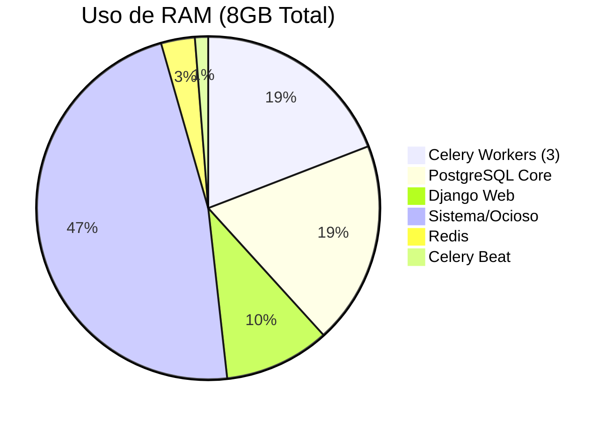

# Dimensionamento e Arquitetura de Processamento

> **Data**: 11/12/2025
> **Contexto**: Migração para Celery + Hostinger KVM 2
> **Meta**: 1-10 clientes simultâneos

---

## 1. Análise Arquitetural: Sistema de Filas

Comparativo para decisão entre manter Django Q2 ou migrar para Celery.

| Aspecto | Django Q2 | Celery ✅ |
|---------|-----------|----------|
| **Filas separadas** | Limitado (mesmo cluster) | **Nativo** (filas reais, routing keys) |
| **Rate limiting** | Manual (código) | **Decorador** (`rate_limit='100/m'`) |
| **Monitoramento** | Django Admin (DB) | **Flower** + Prometheus (Real-time) |
| **Escala** | Vertical (mais threads) | **Horizontal** (mais workers/servidores) |
| **Retry** | Básico | **Backoff exponencial** configurável |

**Decisão**: Migrar para **Celery** devido à necessidade de filas priorizadas (Webhooks vs IA) e robustez para ambiente SaaS.

---

## 2. Localização dos Workers

Análise de onde executar o processamento das tarefas pesadas.

| Opção | A) Centralizado (Core) ✅ | B) Distribuído (Cliente) |
|-------|------------------------|--------------------------|
| **Manutenção** | 1 Instalação | N Instalações |
| **Deploy** | Único (CI/CD simples) | Complexo (atualizar N containers) |
| **Segurança** | API Keys (OpenAI) no servidor | API Keys replicadas nos cilentes |
| **Monitoramento**| Centralizado | Fragmentado |
| **Latência DB** | Baixa (mesma rede/VPC) | Variável (conexão remota) |

**Decisão**: **Modelo Centralizado**.
Os workers rodam no servidor do Painel Core. Eles se conectam aos bancos dos clientes apenas quando necessário, mas a infraestrutura de computação é 100% gerida por nós.

---

## 3. Dimensionamento (Hostinger KVM 2)

Especificações e alocação de recursos para suportar até 10 clientes.

**Servidor**: Hostinger KVM 2
- **vCPU**: 2 núcleos
- **RAM**: 8 GB
- **Disco**: 100 GB NVMe

### Distribuição de Recursos (Estimada)

| Componente | RAM Alocada | CPU Load (Est.) | Notas |
|------------|-------------|-----------------|-------|
| **Django (Gunicorn)** | 800 MB | 30% | 4 workers (sync), API leve |
| **PostgreSQL** | 1.5 GB | 30% | IOPS intensivo, queries otimizadas |
| **Redis** | 256 MB | 10% | Broker + Cache. Eviction policy: allkeys-lru |
| **Celery Workers** | 1.5 GB | 80% (Pico) | Processamento de IA e Webhooks |
| **Buffer/OS** | ~3.8 GB | - | Margem para picos e cache de disco |

### Configuração Otimizada do Celery

Para evitar *CPU thrashing* (concorrência excessiva) em apenas 2 vCPUs:

- **`CELERY_WORKER_CONCURRENCY = 3`**
  - Com 2 núcleos, 3 processos permitem que um trabalhe enquanto outro espera I/O (rede/banco).
  - Mais que 3 causaria degradação de performance por troca de contexto.

- **`CELERY_WORKER_PREFETCH_MULTIPLIER = 1`**
  - Essencial para tasks longas (Geração de Texto/Embeddings).
  - Impede que um worker "sequestre" várias tasks pesadas, deixando outros ociosos.

- **Limites de Tempo**
  - `Soft Limit`: 120s (Sinal de alerta, chance de finalizar graciosamente)
  - `Hard Limit`: 300s (Kill forçado para não travar a fila)

### Capacidade de Throughput Estimada

| Tipo de Task | Tempo Médio | Capacidade (3 workers) |
|--------------|-------------|------------------------|
| Webhook (Simples) | 0.2s | ~900 / min |
| Embeddings (IA) | 3.0s | ~60 / min |
| RAG (IA Completa) | 15.0s | ~12 / min |

> **Conclusão**: Com 10 clientes enviando média de 5 mensagens/min (50 total), o servidor opera com folga confortável (~5-10% da capacidade de processamento de webhooks).
