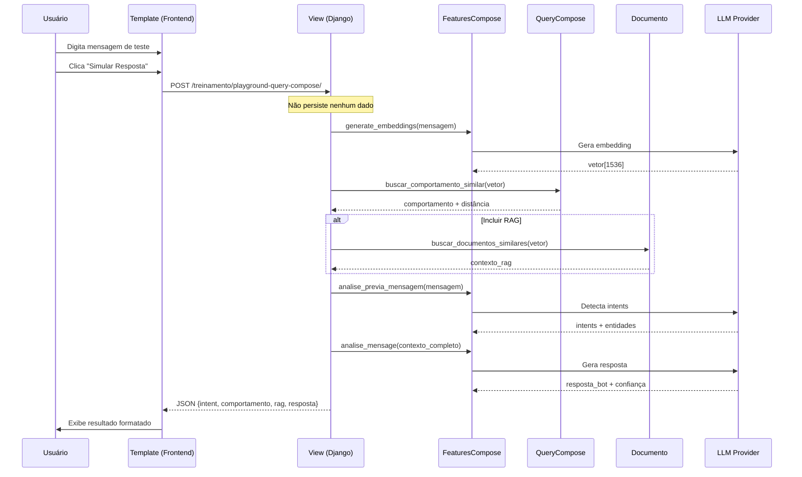

# Design Técnico - Query Compose Playground

## Arquitetura da Solução

### Visão Geral

O Playground será implementado como uma extensão da tela `verificar-query-compose` existente, utilizando:

1. **Backend**: Endpoint AJAX para processamento assíncrono
2. **Frontend**: JavaScript vanilla + Fetch API para UX fluida
3. **Processamento**: Reutilização máxima de componentes existentes

### Diagrama de Sequência



### Estrutura de Dados

#### Request (POST)

```json
{
    "mensagem": "Qual o preço do produto?",
    "incluir_rag": true
}
```

#### Response (JSON)

```json
{
    "success": true,
    "data": {
        "intent_detectado": [
            {"orcamento": "Solicitação de preço/orçamento"}
        ],
        "entidades_extraidas": [
            {"produto": "produto"}
        ],
        "comportamento": {
            "tag": "orcamento",
            "grupo": "vendas",
            "prompt": "Quando o cliente perguntar sobre preço...",
            "distancia": 0.12
        },
        "contexto_rag": [
            {
                "id": 42,
                "tag": "tabela_precos",
                "grupo": "produtos",
                "conteudo": "Produto X: R$ 99,90...",
                "distancia": 0.18
            }
        ],
        "resposta_bot": "Olá! O produto X está disponível por...",
        "confiabilidade": 0.87,
        "tempo_processamento_ms": 1234
    },
    "error": null
}
```

#### Response (Erro)

```json
{
    "success": false,
    "data": null,
    "error": "Erro ao processar: mensagem muito longa"
}
```

### Componentes de Implementação

#### 1. Nova View (views.py)

```python
@require_POST
def playground_query_compose(request: HttpRequest) -> JsonResponse:
    """
    [TRN-PLY-001] Endpoint AJAX para simulação de resposta.
    
    Playground de Simulação.
    
    - Processa mensagem de teste sem persistência
    - Retorna JSON com intents, comportamento, RAG e resposta
    - Requer mesma permissão de acesso ao treinamento
    """
```

**Responsabilidades:**
- Validar permissões (reutiliza `_can_access_training()`)
- Parsear JSON do request
- Orquestrar chamadas ao `FeaturesCompose` e models
- Medir tempo de processamento
- Retornar resposta JSON estruturada

#### 2. Service Layer (Opcional)

Se a lógica da view ficar complexa, extrair para:

```python
# treinamento/services.py ou novo arquivo
class PlaygroundService:
    @staticmethod
    def simular_resposta(
        mensagem: str,
        incluir_rag: bool
    ) -> PlaygroundResult:
        """Orquestra a simulação sem efeitos colaterais."""
```

#### 3. Template (verificar_query_compose.html)

Nova seção após as tabelas existentes:

```html
<!-- Playground Section -->
<section id="playground" class="mt-10">
    <h2>🧪 Playground - Simular Atendimento</h2>
    
    <form id="playground-form">
        <textarea id="playground-input" 
                  placeholder="Digite uma mensagem de teste..."></textarea>
        <label>
            <input type="checkbox" id="incluir-rag" checked>
            Incluir busca RAG
        </label>
        <button type="submit">▶ Simular Resposta</button>
    </form>
    
    <div id="playground-result" class="hidden">
        <!-- Resultados renderizados via JavaScript -->
    </div>
</section>

<script>
// JavaScript inline ou arquivo separado
</script>
```

#### 4. JavaScript (Fetch API)

```javascript
document.getElementById('playground-form').addEventListener('submit', async (e) => {
    e.preventDefault();
    
    const mensagem = document.getElementById('playground-input').value;
    const incluirRag = document.getElementById('incluir-rag').checked;
    
    // Mostrar loading
    showLoading();
    
    try {
        const response = await fetch('/treinamento/playground-query-compose/', {
            method: 'POST',
            headers: {
                'Content-Type': 'application/json',
                'X-CSRFToken': getCsrfToken()
            },
            body: JSON.stringify({ mensagem, incluir_rag: incluirRag })
        });
        
        const result = await response.json();
        renderResult(result);
    } catch (error) {
        showError(error.message);
    }
});
```

### Tratamento de Erros

| Cenário | Resposta |
|---------|----------|
| Mensagem vazia | `{"success": false, "error": "Mensagem é obrigatória"}` |
| Mensagem muito longa (>4000 chars) | `{"success": false, "error": "Mensagem muito longa (max 4000)"}` |
| Erro no LLM | `{"success": false, "error": "Erro ao gerar resposta: ..."}` |
| Timeout | `{"success": false, "error": "Tempo limite excedido"}` |
| Sem permissão | HTTP 403 Forbidden |

### Performance

- **Timeout**: 30 segundos (configurável)
- **Rate Limit**: Considerar 10 requisições/minuto por usuário
- **Cache**: Não aplicável (cada simulação é única)

### Segurança

1. **CSRF**: Token obrigatório no header
2. **Permissões**: Reutiliza `_can_access_training()`
3. **Sanitização**: Input é tratado como texto puro (não HTML)
4. **Sem Persistência**: Nenhum dado gravado no banco

### Extensibilidade Futura

- [ ] Opção de selecionar modelo LLM específico para teste
- [ ] Histórico de simulações em sessão (não persistido)
- [ ] Comparação lado-a-lado de diferentes prompts
- [ ] Export de resultado para análise
