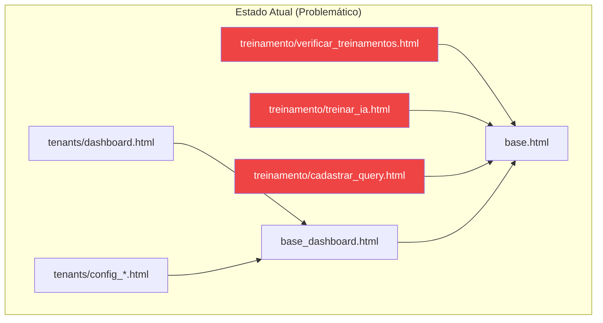
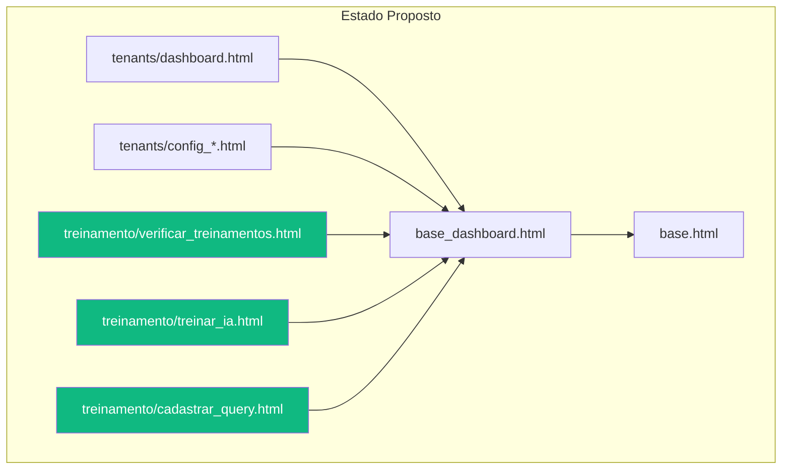
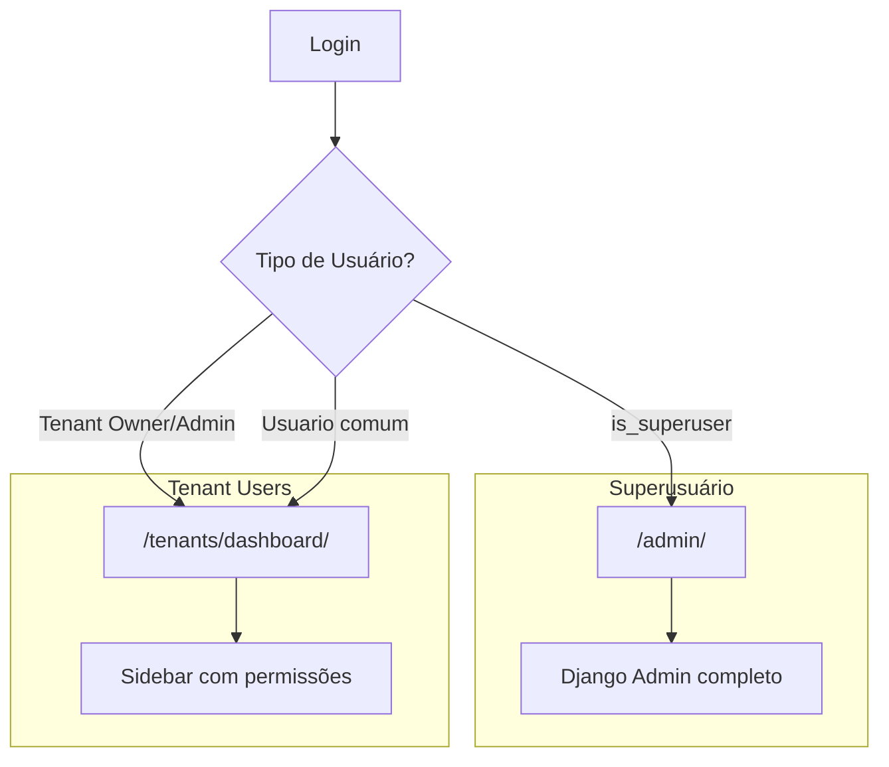

# Design: Reestruturação do Design System Smart Core

## Visão Geral da Arquitetura

O sistema possui uma arquitetura de templates em camadas:

```
base.html                    # Template raiz (Tailwind, fonts, estilos globais)
├── base_dashboard.html      # Layout interno (sidebar + topbar + content area)
├── base_public.html         # Layout público (header transparente/sólido + footer)
└── base_tenants.html        # Layout para signup/onboarding (legado, dark theme)
```

## Problema Atual: Herança de Templates



**Problema**: Templates de `treinamento` estendem `base.html` diretamente, perdendo sidebar e topbar.

## Solução: Padronização de Herança



---

## Design System "Smart Core"

### Tokens de Design

| Token | Valor | Uso |
|-------|-------|-----|
| `--color-gold-primary` | `#a98f71` | CTAs, destaques, bordas ativas |
| `--color-gold-dark` | `#8b7355` | Hover states do gold |
| `--bg-body` | `stone-50` | Background do conteúdo |
| `--sidebar-bg` | `stone-900` (#1c1917) | Background da sidebar |
| `--text-primary` | `stone-700` | Texto principal |
| `--text-secondary` | `stone-500` | Texto secundário |

### Tipografia

- **Fonte**: Outfit (Google Fonts)
- **Headings**: 600-700 weight
- **Body**: 400-500 weight

---

## Reestruturação de Navegação por Permissões

### Fluxo de Redirecionamento no Login



### Estrutura da Sidebar por Role

#### Superusuário (is_superuser=True)
- **Ação**: Redirecionar diretamente para `/admin/`
- **Motivação**: Superusuários gerenciam tenants e configurações macro via Django Admin

#### Admin/Owner de Tenant (role="admin" ou owner)
```
Dashboard
├── Painel Admin (/tenant-admin/)
│
├─── CONFIGURAÇÕES
│   ├── Banco de Dados
│   ├── WhatsApp (Evolution)
│   ├── Trello
│   ├── Inteligência Artificial
│   └── Debug
│
├─── TREINAMENTO
│   ├── Treinar IA
│   ├── Verificar Treinamentos
│   └── Query Compose
│
└─── GESTÃO
    └── Usuários
```

#### Usuário Comum (role="staff", "viewer", etc.)
```
Dashboard
│
├─── TREINAMENTO (se tem permissão)
│   ├── Treinar IA
│   ├── Verificar Treinamentos
│   └── Query Compose
│
└─── (Módulos conforme module_permissions)
```

---

## Componentes a Serem Padronizados

### Cards do Dashboard

```html
<!-- Estrutura padrão de Card -->
<div class="bg-white rounded-xl shadow-sm border border-stone-200 p-6 
            flex flex-col transition-all hover:shadow-md h-full">
    <!-- Header com ícone -->
    <div class="flex items-center mb-4">
        <div class="p-2 bg-stone-100 rounded-lg mr-3 text-stone-600">
            <!-- SVG Icon -->
        </div>
        <h3 class="text-lg font-semibold text-stone-800">Título</h3>
    </div>
    
    <!-- Descrição -->
    <p class="text-stone-500 text-sm mb-4 flex-grow">Descrição do card</p>
    
    <!-- Status -->
    <div class="mb-4 text-sm">
        <span class="text-stone-400 mr-2">Status:</span>
        <span class="text-green-600 font-medium">Conectado</span>
    </div>
    
    <!-- Action Button -->
    <a href="#" class="w-full text-center px-4 py-2 border border-stone-300 
                        rounded-lg text-stone-600 hover:bg-stone-50 
                        hover:text-stone-800 font-medium transition-colors">
        Configurar
    </a>
</div>
```

**Correção necessária**: Adicionar `h-full` para igualar altura dos cards no grid.

---

## Decisões de Design

### D1: Manter `base_tenants.html` ou Deprecar?

**Decisão**: Deprecar gradualmente. Apenas `signup.html` e `config_form.html` o utilizam.
- Migrar `signup.html` para `base_public.html`
- `config_form.html` parece ser legado não utilizado

### D2: Como tratar a rota `/dashboard/`?

**Decisão**: Rota `/dashboard/` em `core/urls.py` deve ser removida ou redirecionar para `/tenants/dashboard/`.
- Atualmente renderiza `core/dashboard.html` (template diferente do tenant dashboard)
- Causa confusão quando usuário clica em "Dashboard" na sidebar

### D3: Sidebar responsiva para mobile?

**Decisão**: Manter estrutura atual com menu hambúrguer. Foco inicial no desktop.

---

## Riscos e Mitigações

| Risco | Probabilidade | Impacto | Mitigação |
|-------|---------------|---------|-----------|
| Templates quebram após mudança de herança | Média | Alto | Testar cada template após mudança |
| Permissões não funcionam como esperado | Baixa | Alto | Usar `permission_tags` existentes |
| Redirecionamento incorreto no login | Baixa | Médio | Implementar com testes manuais |  
