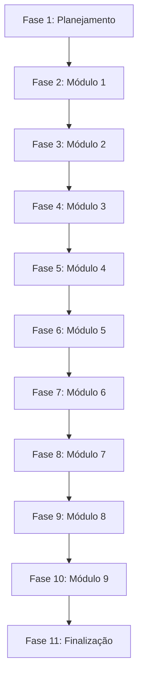

# Tasks - Refatoração UI Design System v2

> 📋 **Plano AI-Context**: [refactor-ui-design-system-v2.md](../../../.context/plans/refactor-ui-design-system-v2.md)
> 📁 **Mapa de Navegação**: [00_indice.md](../../../docs_dev/planejamento/mapa_navegacao/00_indice.md)

---

## Legenda

- `[ ]` - Pendente
- `[/]` - Em andamento
- `[x]` - Concluído
- `[!]` - Bloqueado

---

## Fase 1: Planejamento e Documentação

- [x] **Task 1.1**: Inicializar scaffolding AI-Context

  - Arquivos: `.context/plans/refactor-ui-design-system-v2.md`
  - Critério: Plano criado com escopo e tarefas

- [x] **Task 1.2**: Mapear todas as URLs e views do sistema

  - Arquivos: `app/**/urls.py`, `app/**/views.py`
  - Critério: Lista completa de 31 páginas identificadas

- [x] **Task 1.3**: Criar estrutura de mapa de navegação

  - Arquivos: `docs_dev/planejamento/mapa_navegacao/`
  - Critério: Pasta criada com índice

- [x] **Task 1.4**: Documentar Módulo 1 (Páginas Públicas)

  - Arquivos: `docs_dev/planejamento/mapa_navegacao/01_paginas_publicas.md`
  - Critério: 4 páginas documentadas com links e permissões

- [x] **Task 1.5**: Documentar Módulo 2 (Autenticação)

  - Arquivos: `docs_dev/planejamento/mapa_navegacao/02_autenticacao.md`
  - Critério: 3 páginas documentadas

- [x] **Task 1.6**: Documentar Módulo 3 (Onboarding)

  - Arquivos: `docs_dev/planejamento/mapa_navegacao/03_onboarding.md`
  - Critério: 4 páginas + 1 API documentados

- [x] **Task 1.7**: Documentar Módulo 4 (Backoffice)

  - Arquivos: `docs_dev/planejamento/mapa_navegacao/04_backoffice.md`
  - Critério: 2 páginas documentadas

- [x] **Task 1.8**: Documentar Módulo 5 (Dashboard Tenant)

  - Arquivos: `docs_dev/planejamento/mapa_navegacao/05_dashboard_tenant.md`
  - Critério: 1 página documentada

- [x] **Task 1.9**: Documentar Módulo 6 (Configurações)

  - Arquivos: `docs_dev/planejamento/mapa_navegacao/06_configuracoes.md`
  - Critério: 5 páginas + APIs documentados

- [x] **Task 1.10**: Documentar Módulo 7 (Gestão de Usuários)

  - Arquivos: `docs_dev/planejamento/mapa_navegacao/07_gestao_usuarios.md`
  - Critério: 5 páginas documentadas

- [x] **Task 1.11**: Documentar Módulo 8 (Treinamento IA)

  - Arquivos: `docs_dev/planejamento/mapa_navegacao/08_treinamento_ia.md`
  - Critério: 5 páginas documentadas

- [x] **Task 1.12**: Documentar Módulo 9 (Dashboard Gerente)

  - Arquivos: `docs_dev/planejamento/mapa_navegacao/09_dashboard_gerente.md`
  - Critério: 2 páginas documentadas

- [x] **Task 1.13**: Criar proposta OpenSpec

  - Arquivos: `openspec/changes/refactor-ui-design-system-v2/`
  - Critério: proposal.md, tasks.md, design.md criados

- [ ] **Task 1.14**: Solicitar aprovação da proposta
  - Critério: Aprovação explícita do usuário

---

## Fase 2: Implementação - Módulo 1 (Páginas Públicas)

> ⚠️ **PRÉ-REQUISITO**: Aprovação da proposta (Task 1.14)

- [ ] **Task 2.1**: Auditar template `landing_page.html`

  - Arquivos: `app/ui/core/templates/landing_page.html`
  - Critério: Verificar ``, links funcionais

- [ ] **Task 2.2**: Auditar template `403.html`

  - Arquivos: `app/ui/core/templates/403.html`
  - Critério: Avaliar migração de `base.html` para `base_public.html`

- [ ] **Task 2.3**: Auditar template `404.html`

  - Arquivos: `app/ui/core/templates/404.html`
  - Critério: Avaliar migração de `base.html` para `base_public.html`

- [ ] **Task 2.4**: Auditar template `500.html`

  - Arquivos: `app/ui/core/templates/500.html`
  - Critério: Avaliar migração de `base.html` para `base_public.html`

- [ ] **Task 2.5**: Validar redirecionamentos de `LandingPageView`

  - Arquivos: `app/ui/core/views.py:101-111`
  - Critério: Testar comportamento com usuário autenticado/não autenticado

- [ ] **Task 2.6**: Solicitar aprovação do Módulo 1
  - Critério: ✅ Aprovação do usuário

---

## Fase 3: Implementação - Módulo 2 (Autenticação)

> ⚠️ **PRÉ-REQUISITO**: Aprovação do Módulo 1

- [ ] **Task 3.1**: Auditar template `login.html`

  - Arquivos: `app/ui/usuarios/templates/login.html`
  - Critério: Template base, links, formulário

- [ ] **Task 3.2**: Auditar template `cadastro.html`

  - Arquivos: `app/ui/usuarios/templates/cadastro.html`
  - Critério: Template base, links, formulário

- [ ] **Task 3.3**: Verificar redirecionamentos pós-login

  - Arquivos: `app/ui/usuarios/views.py:76-131`
  - Critério: Testar fluxo com atendente/sem atendente

- [ ] **Task 3.4**: Solicitar aprovação do Módulo 2
  - Critério: ✅ Aprovação do usuário

---

## Fase 4: Implementação - Módulo 3 (Onboarding)

> ⚠️ **PRÉ-REQUISITO**: Aprovação do Módulo 2

- [ ] **Task 4.1**: Auditar templates de onboarding

  - Arquivos: `app/tenants/templates/tenants/onboarding/*.html`
  - Critério: Verificar wizard standalone, stepper

- [ ] **Task 4.2**: Testar fluxo completo do wizard

  - Critério: Step 1 → 2 → 3 → 4 funcional

- [ ] **Task 4.3**: Validar `OnboardingSessionMixin`

  - Arquivos: `app/tenants/views/onboarding.py:13-26`
  - Critério: Proteção de steps sem sessão

- [ ] **Task 4.4**: Solicitar aprovação do Módulo 3
  - Critério: ✅ Aprovação do usuário

---

## Fase 5: Implementação - Módulo 4 (Backoffice)

> ⚠️ **PRÉ-REQUISITO**: Aprovação do Módulo 3

- [ ] **Task 5.1**: Auditar templates de backoffice

  - Arquivos: `app/tenants/templates/tenants/backoffice/*.html`
  - Critério: Verificar template base, navegação

- [ ] **Task 5.2**: Testar acesso com usuário não-superuser

  - Critério: Acesso deve ser negado (403)

- [ ] **Task 5.3**: Solicitar aprovação do Módulo 4
  - Critério: ✅ Aprovação do usuário

---

## Fase 6: Implementação - Módulo 5 (Dashboard Tenant)

> ⚠️ **PRÉ-REQUISITO**: Aprovação do Módulo 4

- [ ] **Task 6.1**: Auditar template `dashboard.html`

  - Arquivos: `app/tenants/templates/tenants/dashboard.html`
  - Critério: Template base, sidebar, links

- [ ] **Task 6.2**: Testar acesso com diferentes roles

  - Critério: Admin, Manager, Staff, Viewer devem ter acesso

- [ ] **Task 6.3**: Solicitar aprovação do Módulo 5
  - Critério: ✅ Aprovação do usuário

---

## Fase 7: Implementação - Módulo 6 (Configurações)

> ⚠️ **PRÉ-REQUISITO**: Aprovação do Módulo 5

- [ ] **Task 7.1**: Auditar templates `config_*.html`

  - Arquivos: `app/tenants/templates/tenants/config_*.html`
  - Critério: Template base, sidebar, formulários

- [ ] **Task 7.2**: Testar permissões por role

  - Critério: Admin/Manager têm acesso, Staff/Viewer não

- [ ] **Task 7.3**: Validar APIs de teste de conexão

  - Arquivos: `test_connection`, `run_migrations`
  - Critério: Endpoints funcionais

- [ ] **Task 7.4**: Solicitar aprovação do Módulo 6
  - Critério: ✅ Aprovação do usuário

---

## Fase 8: Implementação - Módulo 7 (Gestão de Usuários)

> ⚠️ **PRÉ-REQUISITO**: Aprovação do Módulo 6

- [ ] **Task 8.1**: Auditar templates `users/*.html`

  - Arquivos: `app/tenants/templates/tenants/users/*.html`
  - Critério: Template base, formulários, ações

- [ ] **Task 8.2**: Testar fluxo de convite

  - Critério: Envio, recebimento, ativação

- [ ] **Task 8.3**: Verificar páginas públicas (ativação, expirado)

  - Critério: Acessíveis sem login

- [ ] **Task 8.4**: Solicitar aprovação do Módulo 7
  - Critério: ✅ Aprovação do usuário

---

## Fase 9: Implementação - Módulo 8 (Treinamento IA)

> ⚠️ **PRÉ-REQUISITO**: Aprovação do Módulo 7

- [ ] **Task 9.1**: Auditar templates de treinamento

  - Arquivos: `app/ui/treinamento/templates/treinamento/*.html`
  - Critério: Template base, formulários

- [ ] **Task 9.2**: Testar permissões com `_can_access_training()`

  - Critério: Admin/Manager/Staff com permissão têm acesso

- [ ] **Task 9.3**: Validar URL legado

  - Critério: `/treinamento/treinar_ia/` redireciona corretamente

- [ ] **Task 9.4**: Solicitar aprovação do Módulo 8
  - Critério: ✅ Aprovação do usuário

---

## Fase 10: Implementação - Módulo 9 (Dashboard Gerente)

> ⚠️ **PRÉ-REQUISITO**: Aprovação do Módulo 8

- [ ] **Task 10.1**: Auditar templates de gerente

  - Arquivos: `app/ui/usuarios/templates/*.html`
  - Critério: Template base, métricas

- [ ] **Task 10.2**: Testar acesso com permissão `treinar_ia`

  - Critério: Apenas usuários com permissão têm acesso

- [ ] **Task 10.3**: Solicitar aprovação do Módulo 9
  - Critério: ✅ Aprovação do usuário

---

## Fase 11: Finalização

> ⚠️ **PRÉ-REQUISITO**: Aprovação de todos os módulos

- [ ] **Task 11.1**: Criar `UI_MAP.md` consolidado

  - Arquivos: `docs/UI_MAP.md`
  - Critério: Documento final com todas as páginas

- [ ] **Task 11.2**: Atualizar README se necessário

  - Arquivos: `README.md`
  - Critério: Documentação atualizada

- [ ] **Task 11.3**: Criar PR com todas as alterações
  - Critério: PR formatado e aprovado

---

## Dependências entre Tasks

---

## Resumo

| Fase            | Tasks  | Status       |
| --------------- | ------ | ------------ |
| 1. Planejamento | 14     | ✅ Concluído |
| 2. Módulo 1     | 6      | ⏳ Pendente  |
| 3. Módulo 2     | 4      | ⏳ Pendente  |
| 4. Módulo 3     | 4      | ⏳ Pendente  |
| 5. Módulo 4     | 3      | ⏳ Pendente  |
| 6. Módulo 5     | 3      | ⏳ Pendente  |
| 7. Módulo 6     | 4      | ⏳ Pendente  |
| 8. Módulo 7     | 4      | ⏳ Pendente  |
| 9. Módulo 8     | 4      | ⏳ Pendente  |
| 10. Módulo 9    | 3      | ⏳ Pendente  |
| 11. Finalização | 3      | ⏳ Pendente  |
| **TOTAL**       | **52** |              |
