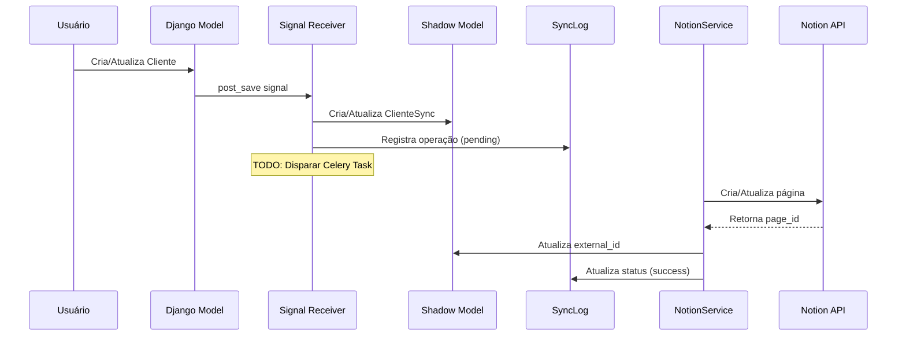
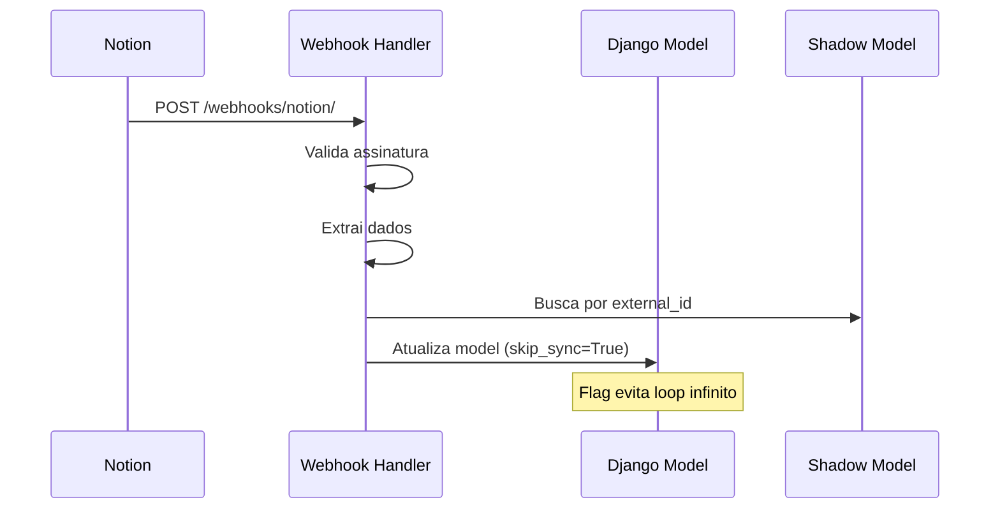

# App `notion_sync` - Sincronização com Plataformas Externas

## 📋 Visão Geral

O app `notion_sync` implementa uma arquitetura em 3 camadas para sincronização bidirecional de dados entre Django e plataformas externas (Notion, Airtable, etc), mantendo o Django como **fonte primária de verdade**.

## 🎯 Objetivos

1. **Desacoplamento Total**: Interface abstrata permite trocar de plataforma sem alterar código core
2. **Sincronização Transparente**: Mudanças nos models Django são automaticamente sincronizadas
3. **Rastreabilidade Completa**: Todos os eventos são registrados em logs detalhados
4. **Resiliência**: Falhas na sincronização não impactam operações principais
5. **Auditoria**: Sistema completo de tracking e versionamento

## 🏗️ Arquitetura

```
┌─────────────────────────────────────┐
│   APLICAÇÃO PRINCIPAL (Core)        │
│   - Cliente, Contato, etc           │
└─────────────┬───────────────────────┘
              │ Django Signals
              ↓
┌─────────────────────────────────────┐
│   INTERFACE ABSTRATA                │
│   ExternalSyncServiceInterface      │
└─────────────┬───────────────────────┘
              │ Implementação
              ↓
┌─────────────────────────────────────┐
│   APP NOTION_SYNC                   │
│   - Shadow Models (tracking)        │
│   - Signals (captura mudanças)      │
│   - Services (NotionService, etc)   │
│   - Mappers (Django ↔ Notion)       │
└─────────────┬───────────────────────┘
              │ HTTP API
              ↓
┌─────────────────────────────────────┐
│   PLATAFORMA EXTERNA                │
│   - Notion                          │
│   - Airtable                        │
│   - Outras...                       │
└─────────────────────────────────────┘
```

## 📁 Estrutura de Arquivos

```
notion_sync/
├── __init__.py              # Expõe API pública do módulo
├── README.md                # Este arquivo
├── apps.py                  # Configuração do app Django
├── models.py                # Models de tracking e configuração
├── admin.py                 # Interface Django Admin
├── signals.py               # Signal receivers para sincronização
├── interfaces.py            # Interface abstrata para serviços
├── exceptions.py            # Exceções customizadas
├── migrations/              # Migrations do Django
│   └── __init__.py
└── services/                # Implementações de serviços (a criar)
    ├── __init__.py
    ├── notion_service.py    # Implementação Notion
    └── mappers/             # Mapeadores de dados
        ├── __init__.py
        ├── cliente_mapper.py
        └── contato_mapper.py
```

## 🔄 Fluxo de Sincronização

### Django → Plataforma Externa



### Plataforma Externa → Django



## 📊 Models

### 1. SyncConfig
Armazena configurações do sistema (tokens, database IDs, etc).

```python
SyncConfig.set_value("notion_token", "secret_xxx...")
token = SyncConfig.get_value("notion_token")
```

### 2. SyncLog
Registra todas as operações de sincronização para auditoria.

```python
SyncLog.log_operation(
    model_name="Cliente",
    django_id=123,
    external_id="abc-xyz",
    operation="create",
    direction="django_to_external",
    status="success"
)
```

### 3. ContatoSync / ClienteSync (Shadow Models)
Armazenam metadados de sincronização para cada registro.

```python
# Obtém ou cria tracking
sync_meta, created = ClienteSync.objects.get_or_create(cliente=cliente)

# Marca como sincronizado
sync_meta.mark_as_synced(external_id="notion-page-id")

# Marca como falha
sync_meta.mark_as_failed(error_message="Erro na API")
```

## 🔌 Interface Abstrata

A interface `ExternalSyncServiceInterface` define o contrato que qualquer serviço de sincronização deve implementar:

```python
class ExternalSyncServiceInterface(ABC):
    @abstractmethod
    def create_record(self, model_name: str, django_id: int, data: dict) -> str:
        """Cria registro na plataforma externa."""
        pass
    
    @abstractmethod
    def update_record(self, model_name: str, external_id: str, django_id: int, data: dict) -> bool:
        """Atualiza registro na plataforma externa."""
        pass
    
    @abstractmethod
    def delete_record(self, model_name: str, external_id: str) -> bool:
        """Deleta/arquiva registro na plataforma externa."""
        pass
    
    @abstractmethod
    def validate_connection(self) -> bool:
        """Valida conexão com a plataforma."""
        pass
    
    @abstractmethod
    def handle_webhook(self, payload: dict, headers: dict) -> dict:
        """Processa webhook da plataforma."""
        pass
```

## 🚀 Como Usar

### 1. Registrar o App

O app já está registrado em `INSTALLED_APPS`:

```python
INSTALLED_APPS = [
    # ...
    "smart_core_assistant_painel.app.notion_sync",
]
```

### 2. Executar Migrations

```bash
uv run task makemigrations
uv run task migrate
```

### 3. Configurar Tokens (via Admin ou Shell)

```python
from smart_core_assistant_painel.app.notion_sync import SyncConfig

# Configurar token do Notion
SyncConfig.set_value(
    key="notion_token",
    value="secret_xxx...",
    description="Token de integração do Notion"
)

# Configurar IDs dos databases
SyncConfig.set_value(
    key="notion_database_ids",
    value={
        "Cliente": "database-id-clientes",
        "Contato": "database-id-contatos"
    },
    description="IDs dos databases no Notion"
)
```

### 4. Testar Sincronização

```python
from smart_core_assistant_painel.app.ui.clientes.models import Cliente, Contato

# Criar um contato
contato = Contato.objects.create(
    telefone="5511999999999",
    nome_contato="João Silva",
    email="joao@example.com"
)

# Verificar tracking
print(contato.sync_metadata)  # ContatoSync
print(contato.sync_metadata.is_synced)  # False (pendente)

# Criar um cliente
cliente = Cliente.objects.create(
    nome_fantasia="Empresa XYZ Ltda",
    tipo="juridica"
)

# Verificar tracking
print(cliente.sync_metadata)  # ClienteSync
print(cliente.sync_metadata.is_synced)  # False (pendente)
```

### 5. Visualizar Logs

Acesse o Django Admin:
- `/admin/notion_sync/synclog/` - Ver logs de sincronização
- `/admin/notion_sync/contatosync/` - Ver status de contatos
- `/admin/notion_sync/clientesync/` - Ver status de clientes
- `/admin/notion_sync/syncconfig/` - Gerenciar configurações

## 🎨 Próximos Passos (TODO)

### Fase 1: Serviço Notion (em andamento)
- [ ] Criar `services/notion_service.py`
- [ ] Implementar `NotionSyncService` (implementa interface)
- [ ] Criar mappers para Cliente e Contato
- [ ] Testar CRUD básico com API do Notion

### Fase 2: Integração Completa
- [ ] Integrar Celery para sincronização assíncrona
- [ ] Criar tasks do Celery:
  - `sync_contato_task`
  - `sync_cliente_task`
  - `delete_record_task`
- [ ] Implementar retry com backoff exponencial
- [ ] Implementar circuit breaker

### Fase 3: Webhook Handler
- [ ] Criar endpoint `/webhooks/notion/`
- [ ] Validar assinatura do webhook
- [ ] Processar eventos do Notion
- [ ] Atualizar Django (com `skip_sync=True`)

### Fase 4: Management Commands
- [ ] `sync_all` - Sincroniza todos os registros
- [ ] `resync_failed` - Reprocessa falhas
- [ ] `validate_sync` - Verifica inconsistências
- [ ] `cleanup_logs` - Limpa logs antigos

### Fase 5: Outros Models
- [ ] Implementar sincronização de Departamento
- [ ] Implementar sincronização de AtendenteHumano
- [ ] Implementar sincronização de Atendimento
- [ ] Implementar sincronização de Mensagem

### Fase 6: Monitoramento
- [ ] Dashboard de métricas
- [ ] Alertas de falhas
- [ ] Health checks
- [ ] Grafana + Prometheus

## 🧪 Como Testar

### Testes Unitários

```bash
# Testar apenas o app notion_sync
uv run pytest tests/app/notion_sync/ -v

# Com cobertura
uv run pytest tests/app/notion_sync/ --cov=notion_sync --cov-report=html
```

### Testes de Integração

```bash
# Rodar no Docker
uv run task test-docker
```

### Teste Manual via Shell

```bash
uv run task shell
```

```python
# No shell Django
from smart_core_assistant_painel.app.ui.clientes.models import Cliente
from smart_core_assistant_painel.app.notion_sync import ClienteSync, SyncLog

# Criar cliente
cliente = Cliente.objects.create(nome_fantasia="Teste Corp")

# Verificar se tracking foi criado
sync = ClienteSync.objects.get(cliente=cliente)
print(f"Sincronizado: {sync.is_synced}")

# Verificar logs
logs = SyncLog.objects.filter(model_name="Cliente", django_id=cliente.id)
for log in logs:
    print(f"{log.operation} - {log.status} - {log.created_at}")
```

## 🐛 Troubleshooting

### Signal não está disparando
- Verificar se o app está em `INSTALLED_APPS`
- Verificar se `apps.py` tem `ready()` importando signals
- Restart do servidor Django

### Tracking não está sendo criado
- Verificar migrations aplicadas
- Verificar logs no console (loguru)
- Verificar tabela `notion_sync_log`

### Erro "skip_sync flag"
- Essa flag é usada para evitar loops infinitos
- Quando atualizamos via webhook, usamos `skip_sync=True`

## 📚 Documentação Adicional

- [Plano Completo de Integração](../../../../docs_dev/planejamento/integracao_notion/RESUMO_EXECUTIVO.md)
- [Arquitetura Detalhada](../../../../docs_dev/planejamento/integracao_notion/ARQUITETURA_REVISADA_V4.md)
- [Notion API Documentation](https://developers.notion.com/)

## 🤝 Contribuindo

1. Seguir padrões do projeto (PEP8, type hints completos)
2. Adicionar testes para novos recursos
3. Documentar mudanças significativas
4. Usar commits convencionais

## 📝 Licença

Este código é parte do projeto Smart Core Assistant Painel.